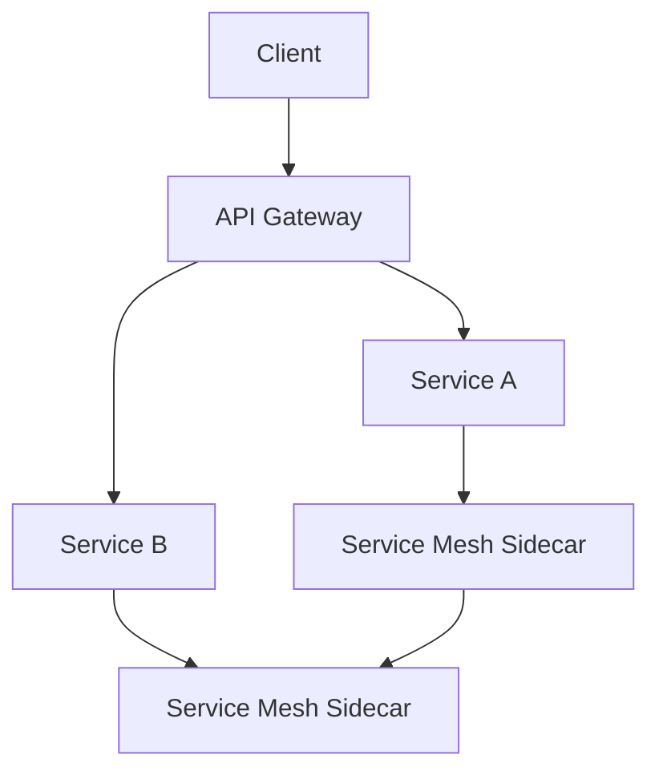

# API Gateway vs Service Mesh

## Overview

API Gateway and Service Mesh are both essential components in microservices architectures, but they serve different purposes. API Gateway acts as a single entry point for external clients, handling routing, authentication, and rate limiting. Service Mesh, on the other hand, manages communication between services within the cluster, providing features like load balancing, observability, and security at the network level.

## Detailed Explanation

### API Gateway

An API Gateway is a server that acts as an API front-end, receiving API requests, enforcing throttling and security policies, passing requests to the back-end service, and then passing the response back to the requester.

Key features:
- Request routing
- Authentication and authorization
- Rate limiting and throttling
- Request/response transformation
- Caching
- Logging and monitoring

### Service Mesh

A Service Mesh is a dedicated infrastructure layer for handling service-to-service communication. It typically consists of a control plane and data plane (sidecar proxies).

Key features:
- Service discovery
- Load balancing
- Traffic management (circuit breaking, retries)
- Mutual TLS encryption
- Observability (metrics, tracing, logging)
- Policy enforcement

### Comparison

| Aspect | API Gateway | Service Mesh |
|--------|-------------|--------------|
| Scope | External traffic (north-south) | Internal traffic (east-west) |
| Deployment | Typically one per cluster | Per service (sidecar) |
| Focus | API management | Service communication |
| Examples | Kong, Apigee, AWS API Gateway | Istio, Linkerd, Consul |



## Real-world Examples & Use Cases

### API Gateway Use Cases
- E-commerce platform: Handle user authentication, route to product catalog or order services
- Mobile app backend: Rate limit API calls, transform responses for different client versions

### Service Mesh Use Cases
- Large-scale microservices: Ensure secure communication between hundreds of services
- Multi-cloud deployments: Consistent traffic management across environments

## Code Examples

### API Gateway Configuration (Kong)

```yaml
services:
  - name: example-service
    url: http://example.com
    routes:
      - name: example-route
        paths:
          - /api/v1
    plugins:
      - name: rate-limiting
        config:
          minute: 100
```

### Service Mesh Configuration (Istio)

```yaml
apiVersion: networking.istio.io/v1alpha3
kind: VirtualService
metadata:
  name: reviews
spec:
  http:
  - route:
    - destination:
        host: reviews
```

## References

- [API Gateway Pattern](https://microservices.io/patterns/apigateway.html)
- [Service Mesh Pattern](https://microservices.io/patterns/observability/service-mesh.html)
- [Istio Documentation](https://istio.io/)
- [Kong Gateway](https://konghq.com/kong/)

## Github-README Links & Related Topics

- [api-gateway-design](../api-gateway-design/README.md)
- [microservices-architecture](../microservices-architecture/README.md)
- [service-mesh-patterns](../service-mesh-patterns/README.md)