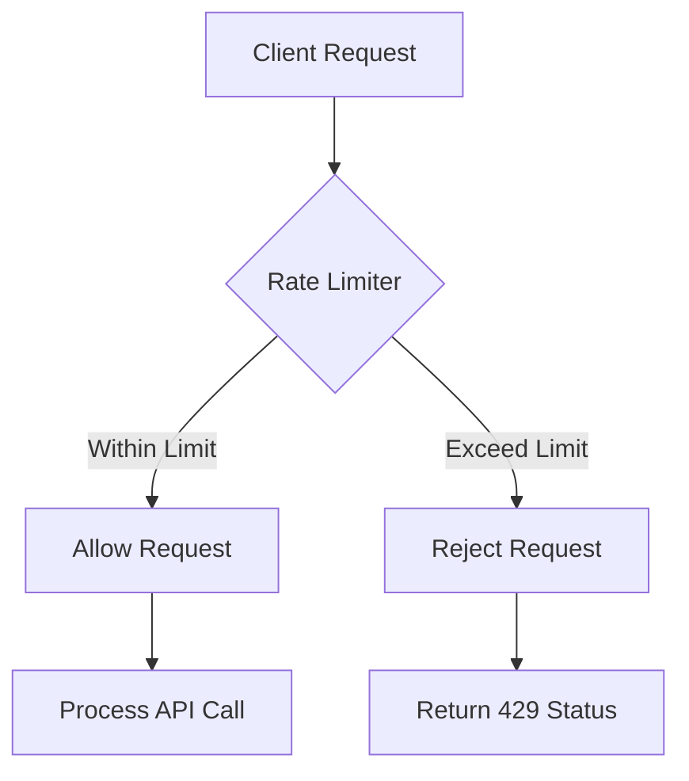

# API Rate Limiting

## Overview

API rate limiting is a technique to control the number of requests a client can make to an API within a specified time window. It prevents abuse, ensures fair resource allocation, protects against denial-of-service attacks, and maintains system performance and availability. Rate limiting can be applied at various levels: per user, per IP, per endpoint, or globally.

## Detailed Explanation

Rate limiting works by tracking request counts and enforcing limits using algorithms that determine whether to allow or reject incoming requests. Common algorithms include:

### 1. Fixed Window
Divides time into fixed intervals (e.g., 1 minute) and counts requests per window. Simple but allows bursts at window boundaries.

### 2. Sliding Window
Uses a rolling time window to smooth out bursts, providing more consistent limiting.

### 3. Token Bucket
Tokens are added to a bucket at a fixed rate; requests consume tokens. Allows bursts up to bucket capacity.

### 4. Leaky Bucket
Requests are added to a queue and processed at a constant rate; excess requests are dropped.



### Implementation Considerations
- **Storage**: In-memory for single instances; Redis for distributed systems.
- **Headers**: Use `X-RateLimit-Remaining`, `X-RateLimit-Reset` for client feedback.
- **Response Codes**: 429 Too Many Requests for rejections.

## Real-world Examples & Use Cases

- **Social Media**: Twitter limits tweet posts to prevent spam; LinkedIn caps connection requests.
- **Cloud Services**: AWS API Gateway throttles requests to manage costs and prevent overload.
- **E-commerce**: Shopify rate-limits checkout APIs during flash sales to ensure stability.
- **Payment Gateways**: Stripe limits transaction attempts per user to reduce fraud.
- **Content Delivery**: CDN providers like Cloudflare use rate limiting to mitigate DDoS attacks.

| Use Case | Algorithm | Benefit |
|----------|-----------|---------|
| Preventing spam | Token Bucket | Allows legitimate bursts while capping abuse |
| Smooth traffic | Leaky Bucket | Consistent processing rate |
| Billing control | Fixed Window | Predictable usage tracking |
| Real-time apps | Sliding Window | Fine-grained control |

## Code Examples

### Java with Bucket4j (Token Bucket)

```java
import io.github.bucket4j.Bucket;
import io.github.bucket4j.Bandwidth;
import java.time.Duration;

public class RateLimiter {
    private final Bucket bucket;

    public RateLimiter() {
        this.bucket = Bucket.builder()
            .addLimit(Bandwidth.simple(100, Duration.ofMinutes(1))) // 100 requests per minute
            .build();
    }

    public boolean allowRequest() {
        return bucket.tryConsume(1);
    }
}

// Usage in controller
@PostMapping("/api/data")
public ResponseEntity<?> getData() {
    if (!rateLimiter.allowRequest()) {
        return ResponseEntity.status(429).body("Rate limit exceeded");
    }
    // Process request
}
```

### Python with Flask-Limiter

```python
from flask import Flask
from flask_limiter import Limiter
from flask_limiter.util import get_remote_address

app = Flask(__name__)
limiter = Limiter(app, key_func=get_remote_address)

@app.route("/api/resource")
@limiter.limit("10 per minute")
def resource():
    return {"data": "limited resource"}
```

### Nginx Configuration (Leaky Bucket)

```nginx
limit_req_zone $binary_remote_addr zone=api:10m rate=10r/s;
server {
    location /api/ {
        limit_req zone=api burst=20 nodelay;
        proxy_pass http://backend;
    }
}
```

### Distributed Rate Limiting with Redis

```java
import redis.clients.jedis.Jedis;

public class DistributedRateLimiter {
    private Jedis jedis;

    public DistributedRateLimiter() {
        this.jedis = new Jedis("localhost");
    }

    public boolean allowRequest(String key, int limit, int windowSeconds) {
        String windowKey = key + ":" + (System.currentTimeMillis() / 1000 / windowSeconds);
        Long count = jedis.incr(windowKey);
        if (count == 1) {
            jedis.expire(windowKey, windowSeconds);
        }
        return count <= limit;
    }
}
```

## Common Pitfalls & Edge Cases

- **Burst Traffic**: Fixed window allows double requests at boundaries; use sliding window.
- **Distributed Systems**: Ensure counters are shared (e.g., via Redis) to avoid per-instance limits.
- **Caching Issues**: Rate limit counters may not persist across restarts; use persistent storage.
- **Edge Case: Multi-tenant Apps**: Separate limits per tenant to prevent one tenant exhausting resources.
- **Clock Synchronization**: In distributed setups, use NTP to avoid timing discrepancies.
- **False Positives**: Legitimate users may hit limits during peak times; implement backoff strategies.

## Tools & Libraries

- **Bucket4j**: Java library for token/leaky bucket algorithms.
- **Flask-Limiter**: Python rate limiting for Flask apps.
- **Express Rate Limit**: Node.js middleware for Express.
- **Redis**: Distributed storage for counters.
- **Nginx/HAProxy**: Proxy-level rate limiting.
- **AWS API Gateway**: Built-in throttling.
- **Kong Gateway**: API gateway with rate limiting plugins.

## References

- [Rate Limiting Patterns](https://stripe.com/blog/rate-limiters)
- [API Rate Limiting Best Practices](https://cloud.google.com/api-gateway/docs/rate-limiting)
- [Token Bucket Algorithm](https://en.wikipedia.org/wiki/Token_bucket)
- [Leaky Bucket Algorithm](https://en.wikipedia.org/wiki/Leaky_bucket)
- [Bucket4j Documentation](https://bucket4j.com/)

## Github-README Links & Related Topics

- [API Design Principles](../api-design-principles/)
- [Load Balancing and Strategies](../load-balancing-and-strategies/)
- [Security Best Practices in Java](../security-best-practices-in-java/)
- [Microservices Architecture](../microservices-architecture/)
- [Monitoring and Logging](../monitoring-and-logging/)