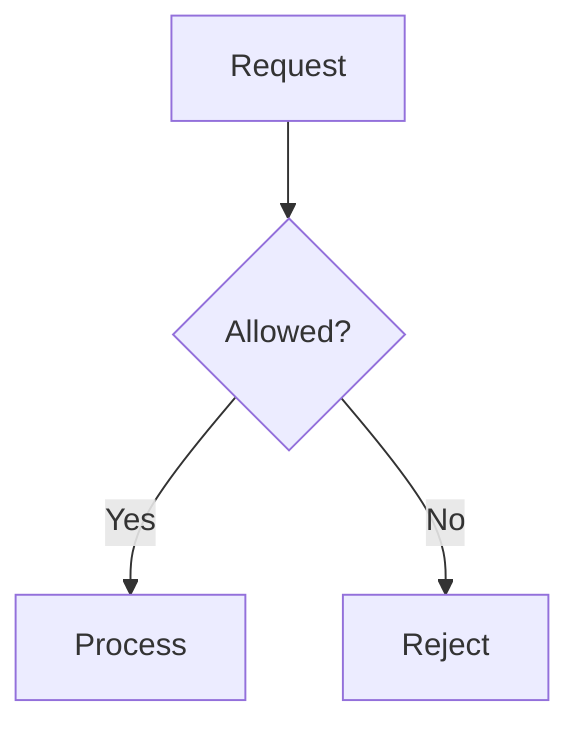

# Overview

Rate limiting controls API request rates to prevent abuse, ensure fair usage, and maintain performance.

# Detailed Explanation

Algorithms: Token Bucket, Leaky Bucket, Fixed Window, Sliding Window.



# Real-world Examples & Use Cases

- Twitter API limits tweets.
- AWS API throttling.

# Code Examples

Java with Bucket4j:

```java
Bucket bucket = Bucket.builder()
    .addLimit(Bandwidth.simple(10, Duration.ofMinutes(1)))
    .build();

if (bucket.tryConsume(1)) {
    // allow
} else {
    // reject
}
```

# References

- [Wikipedia Rate Limiting](https://en.wikipedia.org/wiki/Rate_limiting)

# Github-README Links & Related Topics

- [API Design Principles](../api-design-principles/)
- [Load Balancing and Strategies](../load-balancing-and-strategies/)

# Common Pitfalls & Edge Cases

- Burst traffic.
- Distributed systems sync.

# Tools & Libraries

- Bucket4j
- Redis
- Nginx