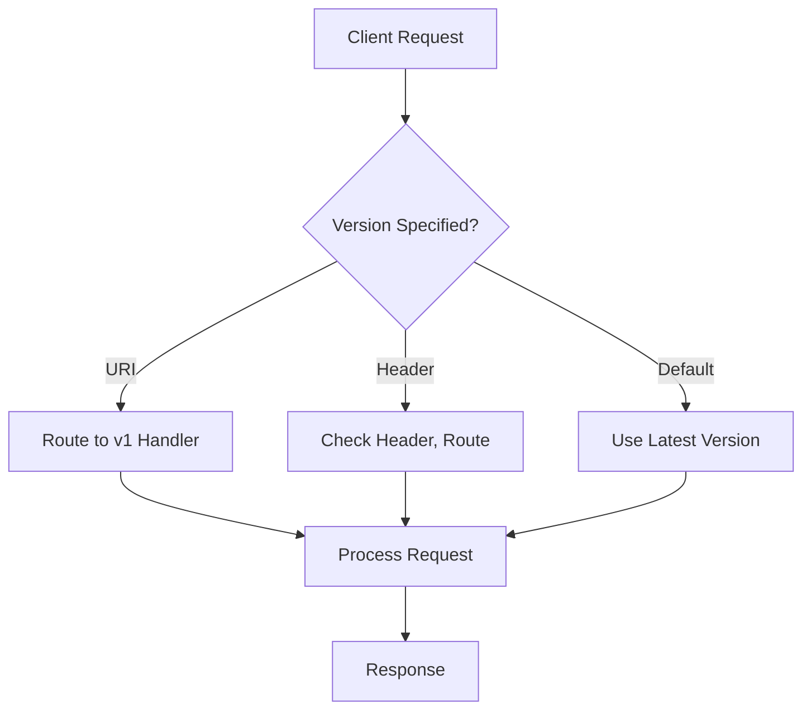

# API Versioning Strategies

## Overview

API versioning ensures backward compatibility and allows evolution of APIs without breaking existing clients. It involves strategies to indicate which version of the API is being used for requests and responses.

## Detailed Explanation

- **URI Versioning**: Include version in URL (e.g., /v1/users).
- **Header Versioning**: Use custom headers (e.g., Accept-Version: v1).
- **Query Parameter**: Version in query (e.g., /users?version=1).
- **Media Type**: Content-Type with version (e.g., application/vnd.api.v1+json).
- **Benefits**: Smooth transitions, deprecation paths.
- **Challenges**: Maintenance of multiple versions, client updates.

## Journey / Sequence



## Data Models / Message Formats

### Versioned Response
```json
{
  "apiVersion": "v1",
  "data": {
    "users": [
      {"id": 1, "name": "John"}
    ]
  }
}
```

## Real-world Examples & Use Cases

- **Social APIs**: Twitter API versions for tweet formats.
- **Payment APIs**: Stripe API versioning for new features.
- **Cloud Services**: AWS API versions for services.
- **Mobile Apps**: Version APIs to support old app versions.

## Code Examples

### Spring Boot URI Versioning

```java
@RestController
@RequestMapping("/api")
public class UserController {

    @GetMapping("/v1/users")
    public List<UserV1> getUsersV1() {
        return userService.getUsersV1();
    }

    @GetMapping("/v2/users")
    public List<UserV2> getUsersV2() {
        return userService.getUsersV2();
    }
}
```

### Header Versioning

```java
@RestController
@RequestMapping("/api/users")
public class UserController {

    @GetMapping
    public ResponseEntity<?> getUsers(@RequestHeader(value = "Api-Version", defaultValue = "v1") String version) {
        if ("v1".equals(version)) {
            return ResponseEntity.ok(userService.getUsersV1());
        } else if ("v2".equals(version)) {
            return ResponseEntity.ok(userService.getUsersV2());
        }
        return ResponseEntity.badRequest().build();
    }
}
```

## Common Pitfalls & Edge Cases

- **Version Proliferation**: Too many versions; deprecate old ones.
- **Breaking Changes**: Communicate clearly.
- **Testing**: Test all versions.
- **Documentation**: Keep docs for each version.
- **Deprecation**: Warn clients before removing versions.

## Tools & Libraries

- **Spring Boot**: Built-in versioning support.
- **Express.js**: Middleware for versioning.
- **OpenAPI**: Document versions.
- **Postman**: Test different versions.

## References

- [API Versioning Best Practices](https://restfulapi.net/versioning/)
- [Microsoft API Versioning](https://docs.microsoft.com/en-us/azure/architecture/best-practices/api-design)
- [Stripe API Versioning](https://stripe.com/docs/api/versioning)

## Github-README Links & Related Topics

- [API Design Principles](../api-design-principles/README.md)
- [API Gateway Design](../api-gateway-design/README.md)
- [Microservices Architecture](../microservices-architecture/README.md)