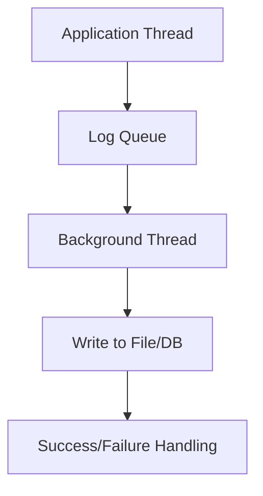

# Overview

Async logging decouples log writing from the main application thread, improving performance by preventing I/O blocking. It uses background threads or queues to handle log output asynchronously, reducing latency and increasing throughput in high-performance applications.

# Detailed Explanation

## Synchronous vs Asynchronous Logging

- **Synchronous**: Logging blocks the thread until write completes. Simple but slow for I/O-bound operations.
- **Asynchronous**: Logs are queued and processed in the background. Faster but introduces complexity (e.g., queue overflow, lost logs on crash).

## Implementation

- **Queue-Based**: Producer-consumer pattern with a blocking queue.
- **Thread Pools**: Dedicated threads for log processing.
- **Batching**: Group logs for efficient writes.

Trade-offs:
- **Pros**: Lower latency, higher throughput.
- **Cons**: Potential log loss on failure, increased memory usage, harder debugging.

| Aspect | Sync Logging | Async Logging |
|--------|--------------|---------------|
| Latency | High (blocks) | Low (non-blocking) |
| Throughput | Lower | Higher |
| Reliability | High | Medium (queue risks) |
| Complexity | Low | High |



# Real-world Examples & Use Cases

- **High-Traffic Web Apps**: Prevent logging from slowing request handling.
- **Financial Systems**: Ensure low-latency transactions aren't delayed by logging.
- **IoT Devices**: Asynchronous logging for resource-constrained environments.
- **Batch Processing**: Log large volumes without impacting processing speed.

# Code Examples

## Log4j2 Async Appender (Java)

```xml
<!-- log4j2.xml -->
<Configuration>
    <Appenders>
        <File name="File" fileName="app.log">
            <PatternLayout pattern="%d %p %c{1.} [%t] %m%n"/>
        </File>
        <Async name="AsyncFile" bufferSize="1024">
            <AppenderRef ref="File"/>
        </Async>
    </Appenders>
    <Loggers>
        <Root level="info">
            <AppenderRef ref="AsyncFile"/>
        </Root>
    </Loggers>
</Configuration>
```

## Logback Async Appender (Java)

```xml
<!-- logback.xml -->
<configuration>
    <appender name="FILE" class="ch.qos.logback.core.FileAppender">
        <file>app.log</file>
        <encoder>
            <pattern>%d{HH:mm:ss.SSS} [%thread] %-5level %logger{36} - %msg%n</pattern>
        </encoder>
    </appender>

    <appender name="ASYNC" class="ch.qos.logback.classic.AsyncAppender">
        <queueSize>512</queueSize>
        <appender-ref ref="FILE"/>
    </appender>

    <root level="INFO">
        <appender-ref ref="ASYNC"/>
    </root>
</configuration>
```

## Custom Async Logger (Python)

```python
import logging
import queue
import threading
import time

class AsyncLogger:
    def __init__(self):
        self.queue = queue.Queue()
        self.thread = threading.Thread(target=self._worker, daemon=True)
        self.thread.start()

    def log(self, message):
        self.queue.put(message)

    def _worker(self):
        while True:
            message = self.queue.get()
            # Simulate async write
            time.sleep(0.01)  # I/O delay
            print(message)
            self.queue.task_done()

# Usage
logger = AsyncLogger()
logger.log("Async log message")
```

# References

- [Log4j2 Async Logging](https://logging.apache.org/log4j/2.x/manual/async.html)
- [Logback Async Appender](https://logback.qos.ch/manual/appenders.html#AsyncAppender)
- [Async Logging Best Practices - Baeldung](https://www.baeldung.com/java-asynchronous-logging)