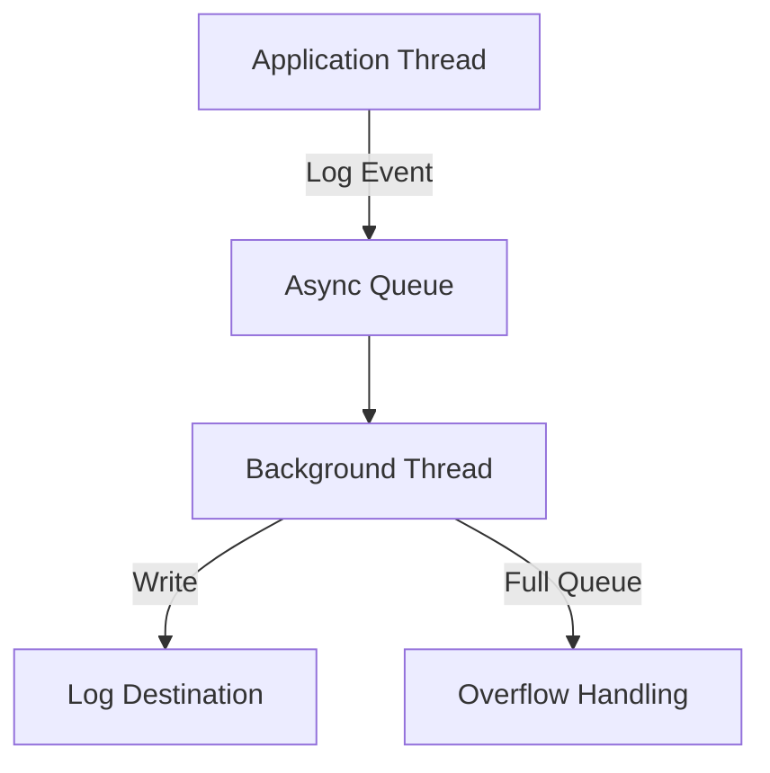
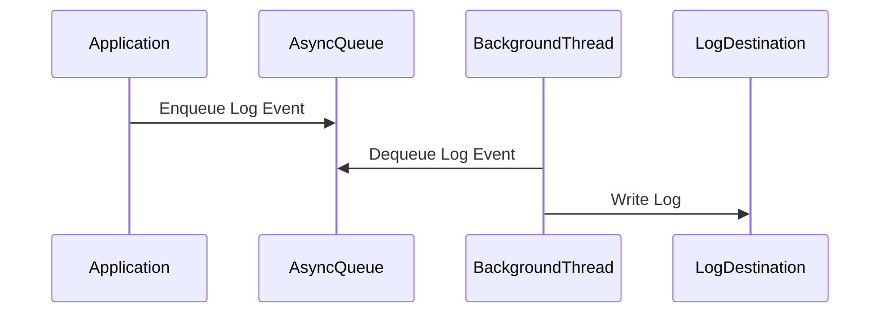

## Overview

Async logging is a technique that decouples log message generation from log message writing, allowing application threads to continue processing without waiting for I/O operations to complete. This improves performance and responsiveness, especially in high-throughput systems.

## Detailed Explanation

In traditional synchronous logging, each log statement blocks the application thread until the log is written to its destination (file, console, network). Async logging introduces a buffer (queue) and a dedicated background thread that handles the actual writing, minimizing the impact on application performance.

### Key Components

- **Queue/Buffer**: Holds log events before they are processed.
- **Background Thread**: Consumes events from the queue and writes them.
- **Overflow Policy**: Defines behavior when the queue is full (e.g., discard, block).

### Benefits

- **Reduced Latency**: Application threads are not blocked by I/O.
- **Improved Throughput**: Better performance under load.
- **Resource Efficiency**: Prevents logging from becoming a bottleneck.

### Trade-offs

- **Memory Usage**: Queue consumes heap space.
- **Potential Data Loss**: If the application crashes, queued logs may be lost.
- **Complexity**: Adds configuration and monitoring overhead.





## Real-world Examples & Use Cases

- **High-Traffic Web Services**: E-commerce platforms logging thousands of requests per second without impacting response times.
- **Real-Time Data Processing**: Streaming applications where logging delays could affect data flow.
- **Microservices**: Centralized logging in distributed systems where synchronous writes could cascade failures.
- **Financial Systems**: Trading platforms requiring low-latency operations with extensive audit logging.
- **IoT Applications**: Devices generating logs at high frequency without blocking sensor data processing.

## Code Examples

### Logback Async Appender Configuration

```xml
<configuration>
    <appender name="FILE" class="ch.qos.logback.core.rolling.RollingFileAppender">
        <file>logs/application.log</file>
        <rollingPolicy class="ch.qos.logback.core.rolling.TimeBasedRollingPolicy">
            <fileNamePattern>logs/application.%d{yyyy-MM-dd}.%i.log</fileNamePattern>
        </rollingPolicy>
        <encoder>
            <pattern>%d{HH:mm:ss.SSS} [%thread] %-5level %logger{36} - %msg%n</pattern>
        </encoder>
    </appender>

    <appender name="ASYNC" class="ch.qos.logback.classic.AsyncAppender">
        <appender-ref ref="FILE" />
        <queueSize>512</queueSize>
        <discardingThreshold>20</discardingThreshold>
        <includeCallerData>true</includeCallerData>
    </appender>

    <root level="INFO">
        <appender-ref ref="ASYNC" />
    </root>
</configuration>
```

### Java Code with Async Logging

```java
import org.slf4j.Logger;
import org.slf4j.LoggerFactory;

public class HighThroughputService {
    private static final Logger logger = LoggerFactory.getLogger(HighThroughputService.class);

    public void processRequest(Request req) {
        long startTime = System.nanoTime();

        // Business logic here - no blocking on logging
        logger.info("Processing request from user: {}", req.getUserId());

        // More processing
        performExpensiveOperation();

        long duration = System.nanoTime() - startTime;
        logger.debug("Request processed in {} ns", duration);
    }

    private void performExpensiveOperation() {
        // Simulate work
        try {
            Thread.sleep(10);
        } catch (InterruptedException e) {
            Thread.currentThread().interrupt();
        }
    }
}
```

### Log4j2 Async Logger

```xml
<Configuration>
    <Appenders>
        <File name="File" fileName="logs/app.log">
            <PatternLayout pattern="%d %p %c{1.} [%t] %m%n"/>
        </File>
        <Async name="AsyncFile">
            <AppenderRef ref="File"/>
        </Async>
    </Appenders>
    <Loggers>
        <Root level="info">
            <AppenderRef ref="AsyncFile"/>
        </Root>
    </Loggers>
</Configuration>
```

### Python with QueueHandler

```python
import logging
import logging.handlers
import queue

# Create a logger
logger = logging.getLogger('async_logger')
logger.setLevel(logging.DEBUG)

# Create a queue
log_queue = queue.Queue(-1)  # Unlimited size

# Create a queue handler
queue_handler = logging.handlers.QueueHandler(log_queue)
logger.addHandler(queue_handler)

# Create a listener with file handler
file_handler = logging.FileHandler('app.log')
listener = logging.handlers.QueueListener(log_queue, file_handler)
listener.start()

# Log messages
logger.info('Application started')
logger.error('An error occurred')

# Stop listener on shutdown
listener.stop()
```

### Node.js with Winston Async Transport

```javascript
const winston = require('winston');

const logger = winston.createLogger({
  level: 'info',
  format: winston.format.json(),
  defaultMeta: { service: 'user-service' },
  transports: [
    new winston.transports.File({ filename: 'error.log', level: 'error' }),
    new winston.transports.File({ filename: 'combined.log' }),
  ],
});

// Async logging with custom transport
class AsyncFileTransport extends winston.Transport {
  constructor(opts) {
    super(opts);
  }

  log(info, callback) {
    setImmediate(() => {
      this.emit('logged', info);
    });
    callback();
  }
}

logger.add(new AsyncFileTransport());
```

## Tools & Libraries

| Library | Language | Description |
|---------|----------|-------------|
| Logback AsyncAppender | Java | Async appender for Logback |
| Log4j2 Async Appender | Java | Async logging in Log4j2 |
| NLog AsyncWrapper | .NET | Asynchronous logging wrapper |
| Serilog Async Sink | .NET | Async sink for Serilog |
| Winston with async transports | Node.js | Async logging in Node.js |
| Python logging.handlers.QueueHandler and QueueListener | Python | Asynchronous logging with queues |
| Bunyan with streams | Node.js | Structured logging with async streams |
| Logrus with hooks | Go | Async logging in Go applications |

## Common Pitfalls & Edge Cases

| Pitfall | Description | Mitigation |
|---------|-------------|------------|
| Queue Overflow | Logs discarded when queue is full | Monitor queue size; increase capacity or reduce logging |
| Thread Starvation | Background thread can't keep up | Tune queue size and thread priority |
| Memory Leaks | Unbounded queues consume all heap | Set maximum queue size |
| Log Loss on Crash | Queued logs not written if JVM exits abruptly | Use synchronous logging for critical errors |
| Performance Monitoring | Hard to debug async logging issues | Add metrics for queue depth and drop rates |
| Ordering Issues | Logs may not be written in order due to async nature | Use sequence numbers if order is critical |
| Blocking on Full Queue | If queue is full and blocking is enabled, threads may wait | Configure overflow policy to discard or use bounded queues |

## References

- [Logback AsyncAppender Documentation](https://logback.qos.ch/manual/appenders.html#AsyncAppender)
- [Log4j2 Async Logging](https://logging.apache.org/log4j/2.x/manual/async.html)
- [SLF4J Overview](https://www.slf4j.org/)
- [Async Logging Best Practices](https://www.baeldung.com/java-asynchronous-logging)
- [Python Logging QueueHandler](https://docs.python.org/3/library/logging.handlers.html#queuehandler)
- [Winston Async Logging](https://github.com/winstonjs/winston)
- [NLog Async Logging](https://nlog-project.org/)
- [Serilog Async Sink](https://github.com/serilog/serilog-sinks-async)

## Github-README Links & Related Topics

- [Monitoring and Logging](./monitoring-and-logging/README.md)
- [Logging Frameworks](./logging-frameworks/README.md)
- [Concurrency and Parallelism](./concurrency-and-parallelism/README.md)
- [Event Driven Architecture](./event-driven-architecture/README.md)
- [High Scalability Patterns](./high-scalability-patterns/README.md)
- [Java Multithreading and Concurrency](./java-multithreading-and-concurrency/README.md)
