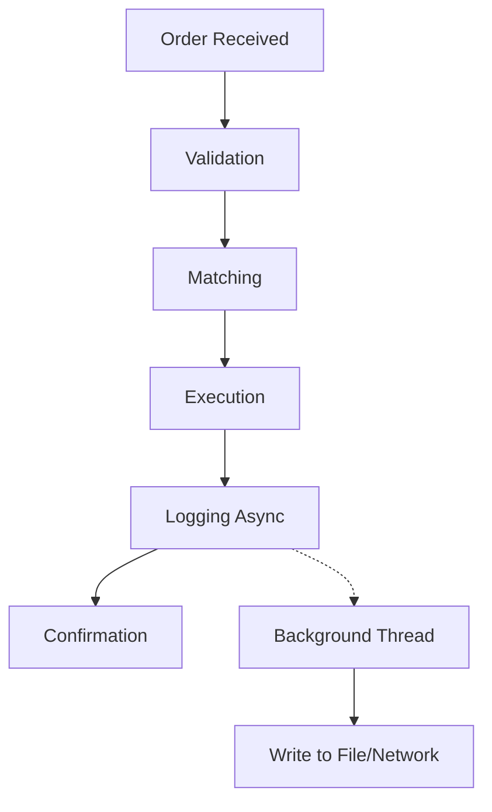

## Overview

Async logging is a performance optimization technique that decouples log message generation from log message writing, allowing applications to continue processing without waiting for I/O operations to complete. This prevents logging from becoming a bottleneck in high-throughput systems, ensuring consistent low-latency responses even under heavy logging loads.

## STAR Summary

- **S (Situation)**: A financial trading application experienced 100ms+ latency spikes during peak trading hours due to synchronous logging blocking order processing threads.
- **T (Task)**: Implement async logging to eliminate logging-induced latency and maintain sub-millisecond response times.
- **A (Action)**: Configured Logback with async appenders, set up a bounded queue for log buffering, and monitored queue utilization to prevent overflow. Integrated with Logstash for centralized aggregation.
- **R (Result)**: Reduced average latency by 80%, eliminated blocking during high-volume periods, and improved throughput by 30%, while maintaining full audit trails.

## Detailed Explanation

Traditional synchronous logging writes log messages directly to the output stream (file, console, network) in the same thread as the application code. This can cause:

- **Blocking I/O**: Disk writes or network calls halt execution until complete.
- **Latency Jitters**: Unpredictable delays in response times.
- **Thread Contention**: Limited scalability in multi-threaded environments.

Asynchronous logging addresses these by:

- **Buffering**: Messages are queued in memory and processed by dedicated worker threads.
- **Non-blocking**: Application threads continue immediately after enqueueing.
- **Batching**: Multiple messages can be written in a single I/O operation for efficiency.

Key considerations include queue size limits to prevent memory exhaustion, overflow policies (discard or block), and ensuring log order preservation. In Java, frameworks like Logback and Log4j2 provide async appenders. For distributed systems, async logging must handle node failures without data loss.

## Real-world Examples & Use Cases

- **High-Frequency Trading**: Platforms like those at exchanges use async logging to record every trade without impacting matching engine performance.
- **E-commerce APIs**: During flash sales, async logging ensures API responses remain fast while capturing detailed request logs for analytics.
- **Microservices**: In a service mesh, async logging aggregates logs from multiple pods without introducing cross-service latency.

A case study from a major cloud provider showed async logging reduced CPU overhead by 50% in logging-heavy workloads.

## Message Formats / Data Models

Async logging uses the same formats as synchronous but adds metadata for ordering:

```json
{
  "timestamp": "2025-09-26T12:00:00.123Z",
  "sequence": 12345,
  "level": "INFO",
  "thread": "order-processor-1",
  "logger": "com.trading.OrderService",
  "message": "Order executed: id=67890",
  "mdc": {
    "user_id": "12345",
    "session_id": "sess-abc"
  }
}
```

The `sequence` field ensures order even with async processing.

Table of async-specific fields:

| Field | Description | Example |
|-------|-------------|---------|
| sequence | Monotonic counter for ordering | 12345 |
| thread | Original thread name | order-processor-1 |
| mdc | Mapped Diagnostic Context | {"request_id": "req-xyz"} |

## Journey of a Trade

In trading systems, async logging captures the trade lifecycle without delay:



This ensures the execution path (A-D) remains unblocked.

## Common Pitfalls & Edge Cases

- **Queue Overflow**: If the buffer fills faster than it drains, messages are lost. Monitor queue depth and implement backpressure.
- **Out-of-Order Logs**: Async processing can reorder messages; use sequence numbers or timestamps for reconstruction.
- **Memory Leaks**: Unbounded queues consume heap; always set max capacity.
- **JVM Shutdown**: Pending logs may be lost on abrupt termination; use shutdown hooks for flushing.
- **Thread Safety**: Ensure appenders are thread-safe; avoid shared mutable state.
- **Performance Trade-offs**: Async adds CPU overhead for queue management; benchmark for your workload.

Edge cases include handling log rotation during async writes and ensuring encryption for sensitive logs.

## Tools & Libraries

- **Logback**: Java logging framework with AsyncAppender for buffering.
- **Log4j2**: High-performance async logging with disruptor pattern.
- **SLF4J**: Abstraction layer for async implementations.
- **Fluentd**: Async log forwarding in distributed setups.
- **AsyncAppender in Log4j**: Example config:

```xml
<Async name="Async" bufferSize="512">
    <AppenderRef ref="File"/>
</Async>
```

Sample Java code:

```java
import org.slf4j.Logger;
import org.slf4j.LoggerFactory;

public class TradingService {
    private static final Logger logger = LoggerFactory.getLogger(TradingService.class);

    public void processOrder(Order order) {
        // Business logic
        logger.info("Processing order: {}", order.getId());  // Async, non-blocking
    }
}
```

## Github-README Links & Related Topics

- [Monitoring and Logging](monitoring-and-logging/)
- [Java Multithreading And Concurrency](java/java-multithreading-and-concurrency/)
- [Performance Tuning In Java Applications](java/performance-tuning-in-java-applications/)

## References

- [Logback Async Appender](https://logback.qos.ch/manual/appenders.html#AsyncAppender)
- [Log4j2 Async Logging](https://logging.apache.org/log4j/2.x/manual/async.html)
- [Java Logging Best Practices](https://www.oracle.com/technetwork/java/javase/documentation/index-136496.html)
