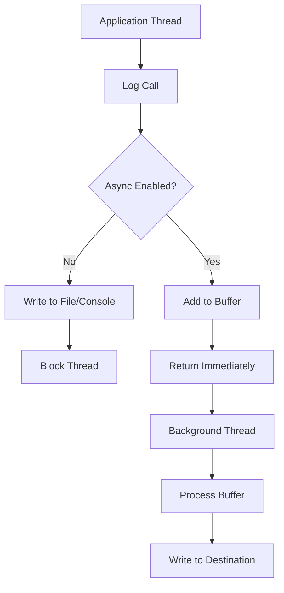

## Overview

Async logging decouples log writing from application execution, preventing logging operations from blocking main application threads. This improves performance and responsiveness, especially under high load, by buffering log messages and processing them asynchronously.

## Detailed Explanation

### Synchronous vs Asynchronous Logging

**Synchronous Logging:**
- Log operations block the calling thread
- Simple but can impact performance
- Guaranteed order of log messages

**Asynchronous Logging:**
- Log operations return immediately
- Messages buffered and processed in background
- Potential for out-of-order messages
- Better performance but more complex



### Buffer Management
- **Ring Buffer**: Fixed-size circular buffer
- **Blocking Queue**: Producer-consumer pattern
- **Memory Mapped Files**: Direct memory access

### Configuration Options
- **Buffer Size**: Number of messages to buffer
- **Flush Interval**: How often to flush buffer
- **Discard Policy**: What to do when buffer is full
- **Thread Pool**: Number of background threads

## Real-world Examples & Use Cases

### High-Throughput Applications
- **Financial Trading Systems**: Sub-millisecond response requirements
- **Real-time Analytics**: Continuous data processing
- **Gaming Servers**: Low-latency multiplayer interactions

### Microservices
- **API Gateways**: Handle thousands of requests per second
- **Event Processing**: Stream processing pipelines
- **IoT Platforms**: Ingest sensor data at scale

### Enterprise Applications
- **E-commerce Platforms**: Peak traffic handling
- **Social Media**: User activity logging
- **Content Delivery**: CDN request logging

## Code Examples

### Log4j2 Async Logging (Java)
```xml
<!-- log4j2.xml -->
<?xml version="1.0" encoding="UTF-8"?>
<Configuration>
    <Appenders>
        <RandomAccessFile name="RandomAccessFile" fileName="logs/app.log">
            <PatternLayout pattern="%d %p %c{1.} [%t] %m%n"/>
        </RandomAccessFile>
        
        <Async name="Async">
            <AppenderRef ref="RandomAccessFile"/>
        </Async>
    </Appenders>
    
    <Loggers>
        <Root level="info">
            <AppenderRef ref="Async"/>
        </Root>
    </Loggers>
</Configuration>
```

```java
import org.apache.logging.log4j.LogManager;
import org.apache.logging.log4j.Logger;

public class AsyncLoggingExample {
    private static final Logger logger = LogManager.getLogger(AsyncLoggingExample.class);
    
    public static void main(String[] args) {
        // This will be logged asynchronously
        logger.info("Application started");
        
        // Simulate work
        for (int i = 0; i < 1000; i++) {
            logger.debug("Processing item {}", i);
        }
        
        logger.info("Application finished");
    }
}
```

### Logback Async Appender
```xml
<!-- logback.xml -->
<configuration>
    <appender name="FILE" class="ch.qos.logback.core.rolling.RollingFileAppender">
        <file>logs/app.log</file>
        <rollingPolicy class="ch.qos.logback.core.rolling.TimeBasedRollingPolicy">
            <fileNamePattern>logs/app.%d{yyyy-MM-dd}.log</fileNamePattern>
        </rollingPolicy>
        <encoder>
            <pattern>%d{HH:mm:ss.SSS} [%thread] %-5level %logger{36} - %msg%n</pattern>
        </encoder>
    </appender>
    
    <appender name="ASYNC" class="ch.qos.logback.classic.AsyncAppender">
        <queueSize>512</queueSize>
        <discardingThreshold>20</discardingThreshold>
        <appender-ref ref="FILE"/>
    </appender>
    
    <root level="INFO">
        <appender-ref ref="ASYNC"/>
    </root>
</configuration>
```

### Custom Async Logger (Python)
```python
import logging
import threading
import queue
import time

class AsyncLogger:
    def __init__(self, logger_name, buffer_size=1000):
        self.logger = logging.getLogger(logger_name)
        self.queue = queue.Queue(maxsize=buffer_size)
        self.worker_thread = threading.Thread(target=self._process_queue, daemon=True)
        self.worker_thread.start()
        
    def log(self, level, message, *args, **kwargs):
        try:
            self.queue.put((level, message, args, kwargs), block=False)
        except queue.Full:
            # Discard message if queue is full
            pass
            
    def _process_queue(self):
        while True:
            try:
                level, message, args, kwargs = self.queue.get(timeout=1)
                self.logger.log(level, message, *args, **kwargs)
                self.queue.task_done()
            except queue.Empty:
                continue

# Usage
async_logger = AsyncLogger('my_app')

# Fast logging without blocking
for i in range(10000):
    async_logger.log(logging.INFO, f"Processing item {i}")
```

## Common Pitfalls & Edge Cases

- **Message Loss**: Buffer overflow or application crash
- **Out-of-Order Messages**: Async processing can reorder logs
- **Memory Usage**: Large buffers consume memory
- **Thread Safety**: Concurrent access to shared resources
- **Configuration Complexity**: Tuning buffer sizes and policies

## Tools & Libraries

- **Log4j2**: High-performance async logging for Java
- **Logback**: Async appenders with configurable buffers
- **NLog**: Async logging for .NET
- **Serilog**: Structured async logging for .NET
- **Bunyan**: Async JSON logging for Node.js

## References

- [Log4j2 Async Logging](https://logging.apache.org/log4j/2.x/manual/async.html)
- [Logback Async Appender](https://logback.qos.ch/manual/appenders.html#AsyncAppender)
- [Async Logging Performance](https://www.cockroachlabs.com/blog/asynchronous-logging/)
- [Logging Best Practices](https://12factor.net/logs)

## Github-README Links & Related Topics

- [monitoring-and-logging](../monitoring-and-logging/)
- [java-multithreading-and-concurrency](../java-multithreading-and-concurrency/)
- [concurrency-and-parallelism](../concurrency-and-parallelism/)
- [async-logging](../async-logging/)