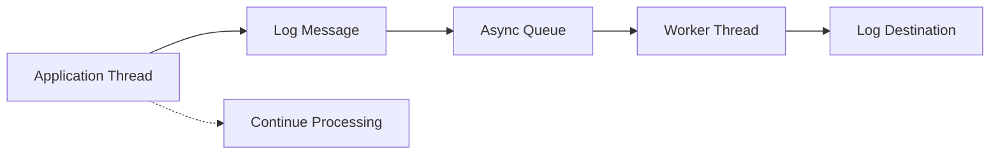

# Async Logging

## Overview

Async logging is a performance optimization technique that decouples log message generation from log message writing, allowing applications to continue processing without waiting for I/O operations to complete. This prevents logging from becoming a bottleneck in high-throughput systems.

## Detailed Explanation

### How Async Logging Works

1. **Log Message Generation**: Application threads generate log messages and place them in a queue
2. **Background Processing**: Dedicated worker threads consume messages from the queue and write them to destinations
3. **Buffering**: Messages are buffered in memory before being flushed to disk or external systems

### Key Components

- **Queue**: Bounded or unbounded queue to hold pending log messages
- **Worker Threads**: Background threads that process the queue
- **Discard Policy**: Strategy for handling queue overflow (e.g., discard oldest messages)

### Benefits

- **Reduced Latency**: Main application threads are not blocked by I/O operations
- **Improved Throughput**: Applications can handle more requests while logging
- **Better Resource Utilization**: Logging I/O is handled asynchronously

### Trade-offs

- **Memory Usage**: Queues consume memory for buffering messages
- **Message Loss Risk**: In case of application crash, queued messages may be lost
- **Complexity**: Additional configuration and monitoring required



## Real-world Examples & Use Cases

1. **High-Traffic Web Applications**: E-commerce sites during peak shopping seasons
2. **Real-time Data Processing**: Streaming platforms processing millions of events per second
3. **Microservices**: Services handling multiple concurrent requests with detailed logging requirements

## Code Examples

### Logback Async Appender Configuration

```xml
<configuration>
    <appender name="ASYNC" class="ch.qos.logback.classic.AsyncAppender">
        <queueSize>512</queueSize>
        <discardingThreshold>20</discardingThreshold>
        <appender-ref ref="FILE" />
    </appender>

    <appender name="FILE" class="ch.qos.logback.core.rolling.RollingFileAppender">
        <file>logs/application.log</file>
        <rollingPolicy class="ch.qos.logback.core.rolling.TimeBasedRollingPolicy">
            <fileNamePattern>logs/application.%d{yyyy-MM-dd}.log</fileNamePattern>
        </rollingPolicy>
        <encoder>
            <pattern>%d{HH:mm:ss.SSS} [%thread] %-5level %logger{36} - %msg%n</pattern>
        </encoder>
    </appender>

    <root level="INFO">
        <appender-ref ref="ASYNC" />
    </root>
</configuration>
```

### Java Code with Async Logging

```java
import org.slf4j.Logger;
import org.slf4j.LoggerFactory;

public class HighThroughputService {
    private static final Logger logger = LoggerFactory.getLogger(HighThroughputService.class);

    public void processRequest(Request request) {
        long startTime = System.nanoTime();
        
        // Process request - this should not be blocked by logging
        processBusinessLogic(request);
        
        long endTime = System.nanoTime();
        // Async logging - doesn't block the response
        logger.info("Processed request {} in {} ns", request.getId(), endTime - startTime);
        
        // Return response immediately
        return response;
    }
}
```

### Log4j2 Async Logger

```xml
<Configuration>
    <Appenders>
        <File name="File" fileName="logs/app.log">
            <PatternLayout pattern="%d %p %c{1.} [%t] %m%n"/>
        </File>
        <Async name="Async">
            <AppenderRef ref="File"/>
        </Async>
    </Appenders>
    <Loggers>
        <Root level="info">
            <AppenderRef ref="Async"/>
        </Root>
    </Loggers>
</Configuration>
```

## Common Pitfalls & Edge Cases

- **Queue Overflow**: Configure appropriate queue sizes and discard policies
- **Thread Safety**: Ensure thread-safe access to shared logging resources
- **Shutdown Handling**: Properly flush queues during application shutdown
- **Memory Leaks**: Monitor queue sizes to prevent unbounded memory growth
- **Log Loss**: Implement strategies to minimize message loss during failures

## Tools & Libraries

- **Logback**: AsyncAppender for asynchronous logging
- **Log4j2**: AsyncLogger and AsyncAppender
- **Java Util Logging**: Custom async handlers
- **Monitoring**: Tools to monitor queue sizes and worker thread health

## References

- [Logback Async Appender](https://logback.qos.ch/manual/appenders.html#AsyncAppender)
- [Log4j2 Async Logging](https://logging.apache.org/log4j/2.x/manual/async.html)
- [SLF4J Documentation](http://www.slf4j.org/docs.html)

## Github-README Links & Related Topics

- [Monitoring and Logging](monitoring-and-logging/)
- [Logging Frameworks](logging-frameworks/)
- [Java Multithreading and Concurrency](java-multithreading-and-concurrency/)
- [Performance Tuning in Java Applications](performance-tuning-in-java-applications/)
