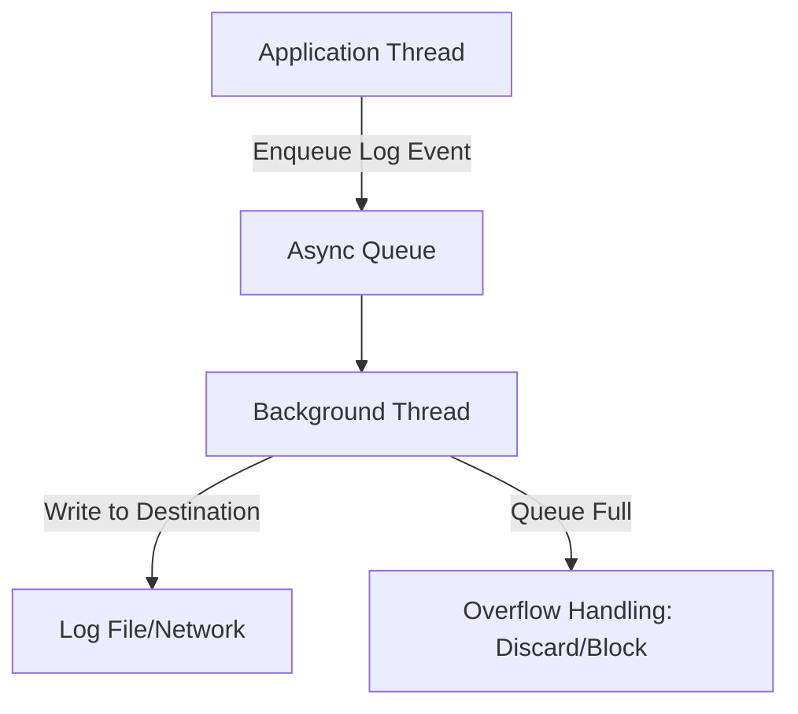
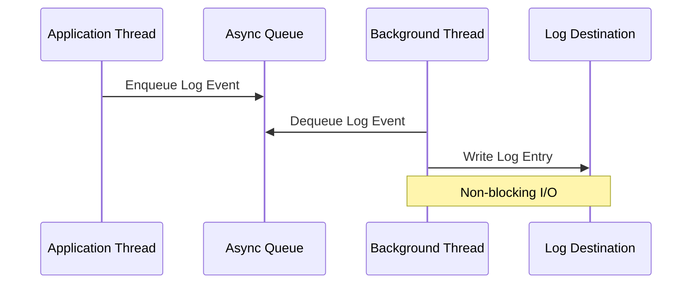

## Overview

Async logging decouples log message generation from log message writing, enabling application threads to continue execution without blocking on I/O operations. This technique enhances performance and responsiveness in high-throughput systems by using a background thread to handle log writes asynchronously.

## Detailed Explanation

Traditional synchronous logging blocks the calling thread until the log entry is written to its destination, potentially impacting application performance. Async logging employs a producer-consumer pattern with a queue (buffer) and a dedicated background thread for writing logs.

### Key Components

- **Queue/Buffer**: A bounded or unbounded data structure storing log events before processing.
- **Background Thread**: Consumes log events from the queue and performs I/O operations.
- **Overflow Policy**: Defines behavior when the queue reaches capacity (e.g., discard oldest, block producer, or drop new events).

### Benefits

- **Reduced Latency**: Eliminates I/O blocking for application threads.
- **Improved Throughput**: Supports higher request rates under load.
- **Resource Efficiency**: Prevents logging from becoming a performance bottleneck.

### Trade-offs

- **Memory Overhead**: Queue consumes heap memory.
- **Potential Data Loss**: Unwritten logs may be lost on application crashes.
- **Increased Complexity**: Requires configuration, monitoring, and potential debugging challenges.





## STAR Summary

**Situation**: In a high-traffic e-commerce platform, synchronous logging caused response times to degrade under peak load, leading to user complaints and lost revenue.

**Task**: Implement async logging to reduce logging-induced latency without compromising audit requirements.

**Action**: Configured Logback AsyncAppender with a 512-entry queue, monitored queue depth metrics, and set up alerts for overflow conditions.

**Result**: Achieved 40% improvement in average response times, maintained full logging coverage, and eliminated logging as a performance bottleneck.

## Journey / Sequence

1. **Identify Bottleneck**: Profile application to confirm logging I/O as latency source.
2. **Choose Framework**: Select logging library with async support (e.g., Logback, Log4j2).
3. **Configure Queue**: Set queue size based on expected log volume and memory constraints.
4. **Implement Overflow Policy**: Define discard threshold or blocking behavior.
5. **Add Monitoring**: Instrument queue depth, drop rates, and background thread health.
6. **Test Under Load**: Validate performance gains and log completeness.
7. **Deploy Gradually**: Roll out with feature flags and rollback plan.

## Data Models / Message Formats

Log events typically include structured data for efficient processing and storage.

### Common Log Event Structure

| Field | Type | Description | Example |
|-------|------|-------------|---------|
| timestamp | ISO 8601 String | Event time | `2023-09-26T14:30:00.123Z` |
| level | Enum | Severity (DEBUG, INFO, WARN, ERROR) | `INFO` |
| logger | String | Source logger name | `com.example.Service` |
| thread | String | Thread name/ID | `http-nio-8080-exec-1` |
| message | String | Log text with placeholders | `User {userId} logged in` |
| context | Map | Additional metadata | `{"userId": 12345, "sessionId": "abc"}` |
| exception | StackTrace | Error details if applicable | `java.lang.Exception: ...` |

### JSON Format Example

```json
{
  "timestamp": "2023-09-26T14:30:00.123Z",
  "level": "INFO",
  "logger": "com.example.HighThroughputService",
  "thread": "pool-1-thread-5",
  "message": "Processing request from user: 12345",
  "context": {
    "userId": 12345,
    "requestId": "req-abc-123"
  }
}
```

## Real-world Examples & Use Cases

- **E-commerce Platforms**: Handle millions of transactions daily with detailed audit logs without affecting checkout performance.
- **Real-time Analytics**: Streaming data pipelines log events at high frequency while maintaining sub-millisecond processing latencies.
- **Microservices Architectures**: Centralized logging in distributed systems prevents cascading failures from synchronous I/O blocks.
- **Financial Trading Systems**: Low-latency trading applications maintain extensive compliance logging without impacting trade execution.
- **IoT Device Networks**: Resource-constrained devices generate logs asynchronously to avoid blocking sensor data collection.

## Code Examples

### Java with Logback AsyncAppender

```xml
<configuration>
    <appender name="FILE" class="ch.qos.logback.core.rolling.RollingFileAppender">
        <file>logs/application.log</file>
        <rollingPolicy class="ch.qos.logback.core.rolling.TimeBasedRollingPolicy">
            <fileNamePattern>logs/application.%d{yyyy-MM-dd}.%i.log</fileNamePattern>
            <maxFileSize>100MB</maxFileSize>
        </rollingPolicy>
        <encoder>
            <pattern>%d{ISO8601} [%thread] %-5level %logger{36} - %msg%n</pattern>
        </encoder>
    </appender>

    <appender name="ASYNC" class="ch.qos.logback.classic.AsyncAppender">
        <appender-ref ref="FILE" />
        <queueSize>512</queueSize>
        <discardingThreshold>20</discardingThreshold>
        <includeCallerData>true</includeCallerData>
        <neverBlock>true</neverBlock>
    </appender>

    <root level="INFO">
        <appender-ref ref="ASYNC" />
    </root>
</configuration>
```

```java
import org.slf4j.Logger;
import org.slf4j.LoggerFactory;

public class AsyncLoggingExample {
    private static final Logger logger = LoggerFactory.getLogger(AsyncLoggingExample.class);

    public void processRequest(String userId, String requestId) {
        logger.info("Processing request {} from user {}", requestId, userId);
        // Business logic - no blocking on logging
        performWork();
        logger.debug("Request {} completed", requestId);
    }

    private void performWork() {
        // Simulate processing
    }
}
```

### Python with QueueHandler

```python
import logging
import logging.handlers
import queue
import threading

def setup_async_logging():
    logger = logging.getLogger('async_example')
    logger.setLevel(logging.INFO)

    # Create queue for async processing
    log_queue = queue.Queue(maxsize=1000)

    # Queue handler (producer)
    queue_handler = logging.handlers.QueueHandler(log_queue)
    logger.addHandler(queue_handler)

    # File handler (consumer)
    file_handler = logging.FileHandler('app.log')
    file_handler.setFormatter(logging.Formatter(
        '%(asctime)s - %(name)s - %(levelname)s - %(message)s'
    ))

    # Queue listener runs in background thread
    listener = logging.handlers.QueueListener(log_queue, file_handler)
    listener.start()

    return logger, listener

# Usage
logger, listener = setup_async_logging()
logger.info('Application started with async logging')
logger.error('Sample error message')

# Cleanup on shutdown
listener.stop()
```

### Node.js with Winston Async Transport

```javascript
const winston = require('winston');
const path = require('path');

// Custom async file transport
class AsyncFileTransport extends winston.Transport {
  constructor(opts) {
    super(opts);
    this.filename = opts.filename;
  }

  log(info, callback) {
    // Simulate async write (in real implementation, use fs promises)
    setImmediate(() => {
      console.log(`Async write to ${this.filename}: ${info.message}`);
      this.emit('logged', info);
      callback();
    });
  }
}

const logger = winston.createLogger({
  level: 'info',
  format: winston.format.combine(
    winston.format.timestamp(),
    winston.format.json()
  ),
  transports: [
    new AsyncFileTransport({ filename: 'async.log' })
  ]
});

// Usage
logger.info('Async logging example', { userId: 123, action: 'login' });
logger.error('Error occurred', { error: 'Connection failed' });
```

### .NET with Serilog Async Sink

```csharp
using Serilog;
using Serilog.Sinks.Async;

Log.Logger = new LoggerConfiguration()
    .WriteTo.Async(a => a.File("logs/app.log",
        rollingInterval: RollingInterval.Day,
        bufferSize: 1000))
    .CreateLogger();

public class AsyncLoggingService
{
    public void ProcessRequest(int userId, string requestId)
    {
        Log.Information("Processing request {RequestId} for user {UserId}",
            requestId, userId);
        // Business logic
        PerformWork();
        Log.Debug("Request {RequestId} completed", requestId);
    }

    private void PerformWork() { /* Implementation */ }
}
```

## Tools & Libraries

| Library | Language | Key Features |
|---------|----------|--------------|
| Logback AsyncAppender | Java | Configurable queue size, discarding threshold, caller data inclusion |
| Log4j2 Async Appender | Java | Global async loggers, ring buffer for high performance |
| NLog AsyncWrapper | .NET | Wraps any target for async operation |
| Serilog Async Sink | .NET | Durable async sink with file buffering |
| Winston Transports | Node.js | Multiple async transports (file, console, HTTP) |
| Python QueueHandler/QueueListener | Python | Standard library async logging with custom handlers |
| Bunyan with Streams | Node.js | JSON streaming with async writes |
| Logrus Hooks | Go | Extensible hooks for async processing |

## Common Pitfalls & Edge Cases

| Pitfall | Description | Mitigation |
|---------|-------------|------------|
| Queue Overflow | Logs dropped when queue fills faster than consumption | Monitor queue depth; increase size or reduce log volume |
| Memory Exhaustion | Unbounded queues consume all available heap | Always set maximum queue size |
| Log Loss on Crash | Buffered logs lost if application terminates abruptly | Use synchronous logging for critical events; consider durable queues |
| Ordering Issues | Async writes may not preserve log sequence | Add sequence numbers if order is critical |
| Thread Starvation | Background thread unable to process queue | Tune thread priority; consider multiple consumer threads |
| Blocking Behavior | Producers wait when queue full and blocking enabled | Configure non-blocking overflow policy |
| Monitoring Gaps | Lack of visibility into async logging health | Implement metrics for queue size, drop rates, and processing latency |

## References

- [Logback AsyncAppender Documentation](https://logback.qos.ch/manual/appenders.html#AsyncAppender) - Official Logback async configuration guide
- [Log4j2 Async Logging](https://logging.apache.org/log4j/2.x/manual/async.html) - Apache Log4j2 async logging patterns
- [SLF4J Specification](https://www.slf4j.org/) - Simple Logging Facade for Java
- [Async Logging Best Practices](https://www.baeldung.com/java-asynchronous-logging) - Java async logging tutorial
- [Python Logging QueueHandler](https://docs.python.org/3/library/logging.handlers.html#queuehandler) - Standard library async logging
- [Winston Async Logging](https://github.com/winstonjs/winston) - Node.js logging library with async support
- [NLog Async Logging](https://nlog-project.org/) - .NET logging framework async features
- [Serilog Async Sink](https://github.com/serilog/serilog-sinks-async) - .NET structured logging async sink

# Github-README Links & Related Topics

- [Concurrency and Parallelism](../concurrency-and-parallelism/README.md)
- [Event Driven Architecture](../event-driven-architecture/README.md)
- [High Scalability Patterns](../high-scalability-patterns/README.md)
- [Java Multithreading and Concurrency](../java-multithreading-and-concurrency/README.md)
- [Monitoring and Logging](../monitoring-and-logging/README.md)
