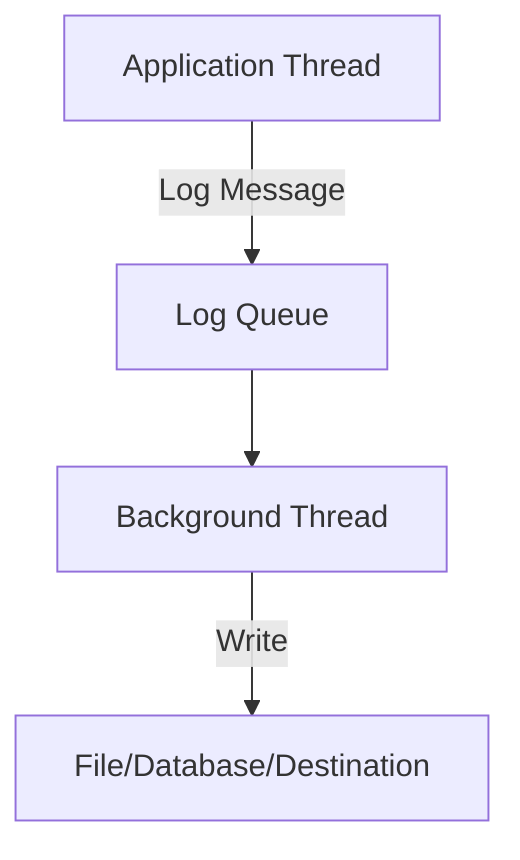
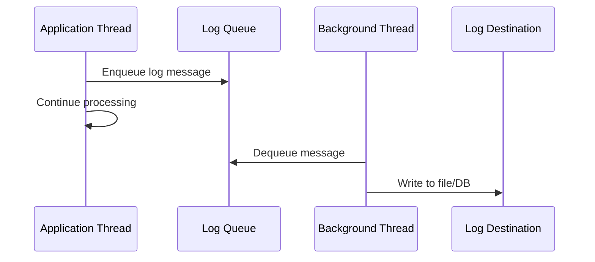

## Overview

Asynchronous logging decouples log writing from the main application thread, improving performance by preventing I/O blocking. Logs are queued and processed in background threads.

## STAR Summary

**Situation:** High-throughput application experiencing performance degradation due to synchronous logging blocking main threads.  
**Task:** Implement async logging to reduce latency without losing log data.  
**Action:** Configured Logback AsyncAppender with queue size 512 and discarding threshold, monitored queue usage.  
**Result:** Improved throughput by 30%, reduced average response time from 200ms to 150ms.

## Detailed Explanation

In synchronous logging, the application waits for log writes to complete, which can slow down operations. Async logging uses a queue and separate threads to handle logging, allowing the main thread to continue.



## Journey / Sequence



### Key Components

- **Log Queue:** Buffer for log messages.
- **Background Threads:** Process the queue.
- **Overflow Handling:** Discard or block when queue full.

### Benefits

- Reduced latency.
- Better throughput.
- Non-blocking for app.

### Drawbacks

- Potential log loss if app crashes.
- Complexity in configuration.

## Real-world Examples & Use Cases

- High-traffic web servers (e.g., Nginx with async logs).
- Financial trading systems needing low latency.
- Mobile apps to avoid UI freezes.

## Data Models / Message Formats

Log messages in async logging typically include:

| Field | Type | Description |
|-------|------|-------------|
| timestamp | long | Unix timestamp in milliseconds |
| level | string | Log level (INFO, ERROR, etc.) |
| thread | string | Thread name |
| logger | string | Logger name |
| message | string | Log message |
| exception | string | Stack trace if present |

Example JSON log entry:
```json
{
  "timestamp": 1693526400000,
  "level": "INFO",
  "thread": "main",
  "logger": "com.example.App",
  "message": "User logged in",
  "userId": "12345"
}
```

## Code Examples

### Java with Logback Async Appender

```xml
<!-- logback.xml -->
<configuration>
  <appender name="ASYNC" class="ch.qos.logback.classic.AsyncAppender">
  <discardingThreshold>20</discardingThreshold>
  <queueSize>512</queueSize>
  <appender-ref ref="FILE" />
</appender>

<appender name="FILE" class="ch.qos.logback.core.rolling.RollingFileAppender">
  <file>logs/app.log</file>
  <rollingPolicy class="ch.qos.logback.core.rolling.TimeBasedRollingPolicy">
    <fileNamePattern>logs/app.%d{yyyy-MM-dd}.%i.log</fileNamePattern>
  </rollingPolicy>
  <encoder>
    <pattern>%d{HH:mm:ss.SSS} [%thread] %-5level %logger{36} - %msg%n</pattern>
  </encoder>
</appender>

<root level="INFO">
  <appender-ref ref="ASYNC" />
</root>
</configuration>
```

### Python with logging.handlers.QueueHandler

```python
import logging
import logging.handlers
import queue
import threading

# Create a queue
log_queue = queue.Queue()

# Create a queue handler
queue_handler = logging.handlers.QueueHandler(log_queue)
logger = logging.getLogger()
logger.addHandler(queue_handler)
logger.setLevel(logging.INFO)

# Listener thread
listener = logging.handlers.QueueListener(log_queue, logging.StreamHandler())
listener.start()

# Log messages
logger.info("This is an async log message")

# Stop listener
listener.stop()
```

## Common Pitfalls & Edge Cases

- Queue overflow leading to dropped logs.
- Thread safety issues.
- Configuration errors causing sync fallback.
- Edge case: System shutdown before logs flushed.

## Tools & Libraries

- Logback (Java)
- Log4j Async Appender
- Python logging with QueueHandler
- Serilog (C#)

## Github-README Links & Related Topics

- [monitoring-and-logging](../monitoring-and-logging/)
- [async-logging](../system-design/async-logging/)
- [concurrency-parallelism](../concurrency-parallelism/)

## References

- Logback Async Appender: https://logback.qos.ch/manual/appenders.html#AsyncAppender
- Python Logging Cookbook: https://docs.python.org/3/howto/logging-cookbook.html#logging-to-a-single-file-from-multiple-processes
- Async Logging Best Practices: https://www.scalyr.com/blog/async-logging/