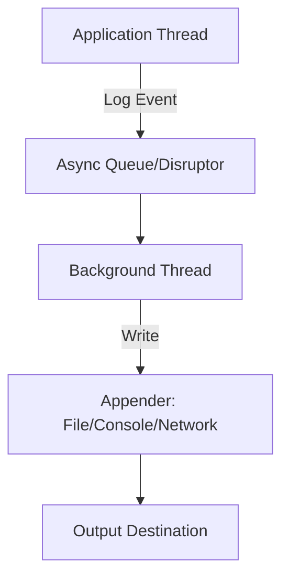

## Overview

Async logging decouples logging operations from the main application thread by using a background thread to handle I/O operations. This improves application performance by reducing latency and increasing throughput, especially in high-volume logging scenarios. Libraries like Log4j2, Logback, and Java's built-in `java.util.logging` support async logging through queues or disruptors.

## Detailed Explanation

In synchronous logging, the application thread blocks until the logging event is written to the output (e.g., file, console). Async logging buffers events in a queue and processes them in a separate thread, allowing the application to continue immediately.

### How It Works

Async logging uses a producer-consumer pattern:
- **Producer**: Application threads enqueue log events.
- **Consumer**: Background thread dequeues and writes events.

Log4j2 uses LMAX Disruptor for lock-free, high-performance buffering. Logback uses a blocking queue. Java's `java.util.logging` supports async via `MemoryHandler` and `Handler` chaining.

Benefits:
- Higher peak throughput for bursty logging.
- Lower logging latency for the application thread.

Drawbacks:
- Potential event loss if the queue overflows.
- Error handling is less direct.
- Stateful messages (e.g., mutable objects) may not reflect changes post-logging.



### Configuration

- **Log4j2**: Enable via `AsyncLoggerContextSelector` or `AsyncAppender`.
- **Logback**: Use `AsyncAppender` wrapping another appender.
- **java.util.logging**: Chain `MemoryHandler` with a target handler.

## Real-world Examples & Use Cases

- **High-throughput web servers**: E.g., Apache Tomcat or Nginx-like systems where logging thousands of requests/second without blocking.
- **Financial trading platforms**: Low-latency apps needing to log trades without impacting execution.
- **IoT data pipelines**: Devices generating logs that must be offloaded to avoid resource contention.
- **Batch processing**: Long-running jobs where sync logging could cause timeouts.

In these cases, async logging prevents logging from becoming a bottleneck, ensuring system responsiveness.

## Code Examples

### Log4j2 Async Logging

Add Disruptor dependency:

```xml
<dependency>
  <groupId>com.lmax</groupId>
  <artifactId>disruptor</artifactId>
  <version>4.0.0</version>
  <scope>runtime</scope>
</dependency>
```

Enable all async loggers:

```properties
log4j2.contextSelector=org.apache.logging.log4j.core.async.AsyncLoggerContextSelector
```

Or mix sync/async:

```xml
<Loggers>
  <AsyncLogger name="com.example" level="TRACE">
    <AppenderRef ref="DEBUG_LOG"/>
  </AsyncLogger>
</Loggers>
```

Java code:

```java
import org.apache.logging.log4j.LogManager;
import org.apache.logging.log4j.Logger;

public class AsyncLogExample {
    private static final Logger logger = LogManager.getLogger(AsyncLogExample.class);

    public static void main(String[] args) {
        logger.info("This is an async log message.");
    }
}
```

### Logback Async Logging

```xml
<appender name="ASYNC" class="ch.qos.logback.classic.AsyncAppender">
  <appender-ref ref="FILE" />
  <queueSize>256</queueSize>
  <discardingThreshold>20</discardingThreshold>
</appender>
```

Java code:

```java
import org.slf4j.Logger;
import org.slf4j.LoggerFactory;

public class AsyncLogExample {
    private static final Logger logger = LoggerFactory.getLogger(AsyncLogExample.class);

    public static void main(String[] args) {
        logger.info("Async log via Logback.");
    }
}
```

### Java util.logging Async Logging

Use `MemoryHandler` to buffer events:

```java
import java.util.logging.*;

public class AsyncLogExample {
    public static void main(String[] args) {
        Logger logger = Logger.getLogger("example");
        Handler fileHandler = new FileHandler("app.log");
        MemoryHandler memoryHandler = new MemoryHandler(fileHandler, 1000, Level.ALL);
        logger.addHandler(memoryHandler);
        logger.setLevel(Level.ALL);

        logger.info("Buffered async log.");
    }
}
```

## References

- [Log4j2 Asynchronous Loggers](https://logging.apache.org/log4j/2.x/manual/async.html)
- [Logback AsyncAppender](https://logback.qos.ch/manual/appenders.html#AsyncAppender)
- [Baeldung: Asynchronous Logging in Java](https://www.baeldung.com/java-asynchronous-logging)
- [Java util.logging Package](https://docs.oracle.com/javase/8/docs/api/java/util/logging/package-summary.html)

## Github-README Links & Related Topics

- [Concurrency and Parallelism](./concurrency-and-parallelism/)
- [Java Multithreading and Concurrency](./java-multithreading-and-concurrency/)
- [Async Logging](./async-logging/) (this topic)
- [Logging Frameworks](./java-testing-frameworks/) (related to testing, but adjust as needed)

## STAR Summary

- **Situation**: High-volume applications face logging bottlenecks.
- **Task**: Implement async logging to offload I/O.
- **Action**: Configure libraries like Log4j2 or Logback with queues/disruptors.
- **Result**: Improved throughput and reduced latency.

## Journey / Sequence

1. Identify logging performance issues (e.g., via profiling).
2. Choose library (Log4j2 for Disruptor, Logback for queues).
3. Configure async appenders with queue sizes.
4. Test for event loss and tune thresholds.
5. Monitor in production for sustained performance.

## Data Models / Message Formats

Async logging uses standard log event structures:
- **Log4j2**: `RingBufferLogEvent`
- **Logback**: `ILoggingEvent`
- **JUL**: `LogRecord`

Events include timestamp, level, message, thread, MDC/context.

## Common Pitfalls & Edge Cases

- **Queue Overflow**: Events dropped if queue full; set `discardingThreshold` to 0 to avoid loss.
- **Mutable Messages**: Avoid logging mutable objects; use snapshots.
- **Shutdown**: Ensure flush on app exit to avoid lost events.
- **CPU Overhead**: In low-resource environments, sync may be better.
- **Exception Handling**: Errors in async thread harder to propagate.

## Tools & Libraries

| Library | Key Feature | Maven Coord |
|---------|-------------|-------------|
| Log4j2 | LMAX Disruptor | `org.apache.logging.log4j:log4j-core` |
| Logback | BlockingQueue | `ch.qos.logback:logback-classic` |
| JUL | MemoryHandler | Built-in Java |