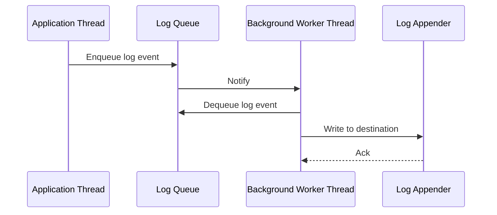

# Overview

Asynchronous logging is a performance optimization technique that decouples logging operations from the main application thread. Instead of blocking the application while writing log messages to files, databases, or other destinations, async logging uses background threads or queues to handle I/O operations. This reduces latency in the application code, allowing it to continue processing without waiting for logging to complete.

Key benefits include improved throughput during log bursts and lower response times. However, it introduces trade-offs like potential message loss if queues overflow and increased complexity in error handling.

# Detailed Explanation

In synchronous logging, each log call (e.g., `logger.info("message")`) directly performs I/O, blocking the thread until the operation completes. Asynchronous logging buffers log events in a queue and processes them in separate threads.

## How It Works

1. **Application Thread**: Logs a message, which is enqueued.
2. **Background Thread(s)**: Dequeue and write messages to appenders (files, consoles, etc.).
3. **Queue Management**: Handles bursts; if full, policies like blocking or discarding apply.

Libraries like Log4j2 use the LMAX Disruptor for high-performance, lock-free queues. Logback uses blocking queues with async appenders.

## Benefits

- **Reduced Latency**: Log calls return faster.
- **Higher Throughput**: Handles spikes without slowing the app.
- **Non-Blocking**: Ideal for real-time systems.

## Drawbacks

- **Resource Overhead**: Extra threads and memory for queues.
- **Message Loss Risk**: If queue overflows, messages may be dropped.
- **Ordering Issues**: Messages from the same thread may not be sequential.
- **Debugging Complexity**: Exceptions in async threads are harder to trace.

## Sequence Diagram



# Real-world Examples & Use Cases

- **High-Traffic Web Servers**: Frameworks like Spring Boot use async logging to handle thousands of requests without logging bottlenecks.
- **Financial Applications**: Audit logs must be fast; async ensures trades process without delay.
- **Microservices**: In distributed systems, async logging prevents cascading delays.
- **IoT Devices**: Low-power devices log sensor data asynchronously to avoid blocking data collection.

In e-commerce platforms, async logging supports logging user actions during peak sales without impacting checkout performance.

# Code Examples

## Java with Log4j2 (All Async Loggers)

Add dependency:

```xml
<dependency>
    <groupId>org.apache.logging.log4j</groupId>
    <artifactId>log4j-core</artifactId>
    <version>2.25.2</version>
</dependency>
<dependency>
    <groupId>com.lmax</groupId>
    <artifactId>disruptor</artifactId>
    <version>4.0.0</version>
    <scope>runtime</scope>
</dependency>
```

Set system property: `-Dlog4j2.contextSelector=org.apache.logging.log4j.core.async.AsyncLoggerContextSelector`

Configuration (`log4j2.xml`):

```xml
<?xml version="1.0" encoding="UTF-8"?>
<Configuration>
    <Appenders>
        <Console name="Console" target="SYSTEM_OUT">
            <PatternLayout pattern="%d{HH:mm:ss.SSS} [%t] %-5level %logger{36} - %msg%n"/>
        </Console>
    </Appenders>
    <Loggers>
        <Root level="info">
            <AppenderRef ref="Console"/>
        </Root>
    </Loggers>
</Configuration>
```

Usage:

```java
import org.apache.logging.log4j.LogManager;
import org.apache.logging.log4j.Logger;

public class Example {
    private static final Logger logger = LogManager.getLogger(Example.class);

    public static void main(String[] args) {
        logger.info("This is an async log message");
    }
}
```

## Java with Logback (Async Appender)

Add dependency:

```xml
<dependency>
    <groupId>ch.qos.logback</groupId>
    <artifactId>logback-classic</artifactId>
    <version>1.5.12</version>
</dependency>
```

Configuration (`logback.xml`):

```xml
<configuration>
    <appender name="FILE" class="ch.qos.logback.core.FileAppender">
        <file>logs/app.log</file>
        <encoder>
            <pattern>%d{HH:mm:ss.SSS} [%thread] %-5level %logger{36} - %msg%n</pattern>
        </encoder>
    </appender>

    <appender name="ASYNC" class="ch.qos.logback.classic.AsyncAppender">
        <queueSize>512</queueSize>
        <discardingThreshold>20</discardingThreshold>
        <appender-ref ref="FILE" />
    </appender>

    <root level="INFO">
        <appender-ref ref="ASYNC" />
    </root>
</configuration>
```

Usage:

```java
import org.slf4j.Logger;
import org.slf4j.LoggerFactory;

public class Example {
    private static final Logger logger = LoggerFactory.getLogger(Example.class);

    public static void main(String[] args) {
        logger.info("Async log via Logback");
    }
}
```

## Python with asyncio (Conceptual)

For comparison, Python's `logging` with handlers:

```python
import logging
import asyncio

logger = logging.getLogger('async_logger')
handler = logging.StreamHandler()
logger.addHandler(handler)
logger.setLevel(logging.INFO)

async def async_log():
    # Simulate async logging
    loop = asyncio.get_event_loop()
    await loop.run_in_executor(None, logger.info, "Async message")

asyncio.run(async_log())
```

# Tools & Libraries

| Library | Language | Key Features |
|---------|----------|--------------|
| Log4j2 | Java | Disruptor-based, high performance, configurable policies |
| Logback | Java | AsyncAppender, queue-based, SLF4J compatible |
| Serilog | .NET | Async sinks, structured logging |
| Winston | Node.js | Async transports, multiple appenders |
| Python logging | Python | Async handlers via executors |

# Common Pitfalls & Edge Cases

- **Queue Overflow**: Set appropriate `queueSize`; monitor for discarded messages.
- **Message Ordering**: Async may reorder logs; use synchronous for critical sequences.
- **Exception Handling**: Async exceptions don't propagate; configure handlers.
- **Memory Leaks**: Large queues consume memory; tune based on load.
- **Testing**: Unit tests may not capture async behavior; use integration tests.
- **Shutdown**: Ensure queues drain on app exit to avoid lost logs.

# Journey / Sequence

1. **Initialization**: Configure async logger with queue size and policies.
2. **Logging Call**: App thread enqueues event.
3. **Processing**: Worker thread dequeues and formats message.
4. **Output**: Appender writes to destination.
5. **Error Handling**: If queue full, apply policy (block/discard).
6. **Monitoring**: Track queue depth and dropped messages.

# References

- [Log4j2 Asynchronous Loggers](https://logging.apache.org/log4j/2.x/manual/async.html)
- [Logback AsyncAppender](https://logback.qos.ch/manual/appenders.html#AsyncAppender)
- [LMAX Disruptor](https://lmax-exchange.github.io/disruptor/)
- [Java Logging Best Practices](https://www.oracle.com/technetwork/java/javase/documentation/index-136484.html)

# Github-README Links & Related Topics

- [Concurrency Parallelism](./concurrency-parallelism/README.md)
- [Java Multithreading and Concurrency](./java-multithreading-and-concurrency/README.md)
- [Event Driven Architecture](./event-driven-architecture/README.md)
- [Distributed Tracing](./distributed-tracing/README.md)

# STAR Summary

**Situation**: A high-throughput trading application experienced performance degradation during market volatility, with logging operations blocking trade processing threads.

**Task**: Implement asynchronous logging to eliminate I/O bottlenecks without losing audit trails.

**Action**: Configured Log4j2 with async loggers using the Disruptor library, set queue size to 1024, and added monitoring for queue depth.

**Result**: Application throughput increased by 30%, latency reduced from 50ms to 10ms, and no log messages were lost during peak loads.

# Data Models / Message Formats

## Log Event Structure

Async logging typically uses structured log events with the following components:

- **Timestamp**: ISO 8601 format for precise timing
- **Level**: Severity (DEBUG, INFO, WARN, ERROR, FATAL)
- **Logger Name**: Class or component identifier
- **Thread Name**: For correlation in multi-threaded apps
- **Message**: The log content, often parameterized
- **Exception**: Stack trace if applicable
- **Context Data**: Key-value pairs for additional metadata

Example JSON format:
```json
{
  "timestamp": "2025-09-26T10:00:00.123Z",
  "level": "INFO",
  "logger": "com.example.AsyncLogger",
  "thread": "worker-1",
  "message": "Processed request {} in {} ms",
  "params": ["req-123", 45],
  "mdc": {
    "requestId": "abc-123",
    "userId": "user-456"
  }
}
```

## Queue Message Format

Internally, log events are wrapped in queue messages containing:
- Log event data
- Sequence number for ordering
- Priority flags