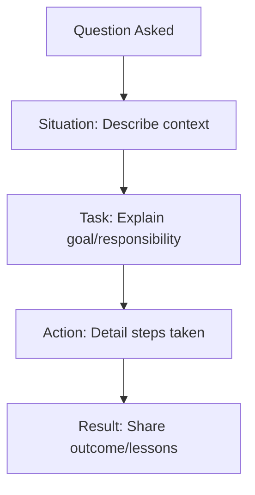

## Overview

Behavioral interview questions assess a candidate's past experiences to predict future performance. They focus on how you've handled situations in previous roles, revealing soft skills like communication, problem-solving, and teamwork.

## Detailed Explanation

These questions typically start with "Tell me about a time when..." or "Describe a situation where...". Interviewers use them to evaluate cultural fit and behavioral competencies. The STAR method (Situation, Task, Action, Result) is a structured way to answer them effectively.

Behavioral questions cover categories like:
- Leadership and teamwork
- Problem-solving and decision-making
- Communication and conflict resolution
- Adaptability and learning
- Time management and prioritization

## STAR Summary

The STAR method provides a framework for answering behavioral questions:

- **Situation**: Set the context. Describe the background briefly.
- **Task**: Explain your responsibility or goal.
- **Action**: Detail the steps you took.
- **Result**: Share the outcome and what you learned.

## Real-world Examples & Use Cases

### Example 1: Team Conflict
**Question:** Tell me about a time you had a conflict with a colleague.

**Answer using STAR:**
- Situation: In my previous role, a team member disagreed with my approach to a project deadline.
- Task: I needed to resolve the conflict while meeting the deadline.
- Action: I scheduled a one-on-one meeting to discuss concerns, listened actively, and proposed a compromise solution.
- Result: We agreed on a revised plan, completed the project on time, and improved team collaboration.

### Example 2: Handling Failure
**Question:** Describe a time when you failed and how you handled it.

**Answer:**
- Situation: A feature I developed had a critical bug in production.
- Task: Fix the issue quickly and prevent recurrence.
- Action: I analyzed the code, identified the root cause, implemented a fix, and added comprehensive tests.
- Result: The bug was resolved within hours, and I established a new testing protocol reducing future issues by 30%.

### Use Cases
- Assessing leadership: Questions about mentoring juniors or leading projects.
- Evaluating problem-solving: Scenarios involving technical challenges or deadlines.
- Gauging adaptability: Experiences with change or learning new technologies.

## Code Examples

N/A - Behavioral questions focus on experiences rather than coding.

## References

- [How to Answer Behavioral Interview Questions](https://www.thebalancecareers.com/behavioral-interview-questions-2061235)
- [STAR Method Explained](https://www.indeed.com/career-advice/interviewing/star-interview-method)
- [Common Behavioral Interview Questions](https://www.glassdoor.com/blog/common-behavioral-interview-questions/)

## Github-README Links & Related Topics

- [System Design Interview Tips](../system-design-interview-tips/README.md)
- [Coding Interview Strategies](../coding-interview-strategies/README.md)
- [STAR Method for Interviews](../star-method-for-interviews/README.md)