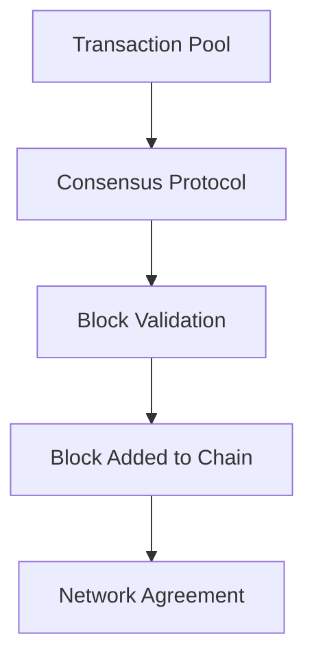

# Blockchain Consensus Mechanisms

## Overview

Consensus mechanisms are protocols that enable distributed nodes in a blockchain network to agree on the validity of transactions and the state of the ledger. They solve the Byzantine Generals' Problem, ensuring security and immutability without a central authority. Common mechanisms include Proof of Work (PoW), Proof of Stake (PoS), and Delegated Proof of Stake (DPoS). They balance security, scalability, and energy efficiency, with trade-offs in decentralization and performance.

## Detailed Explanation

Consensus ensures all honest nodes maintain a consistent view of the blockchain. It involves validating transactions, ordering them, and adding blocks.

### Key Mechanisms
- **Proof of Work (PoW)**: Nodes compete to solve computational puzzles. First to solve adds the block. Energy-intensive but secure.
- **Proof of Stake (PoS)**: Validators are chosen based on staked coins. Less energy but requires initial stake.
- **Delegated Proof of Stake (DPoS)**: Stakeholders vote for delegates who validate. Faster but more centralized.
- **Proof of Authority (PoA)**: Trusted validators approve blocks. Used in private chains.
- **Practical Byzantine Fault Tolerance (PBFT)**: Voting-based for small networks.

### Trade-offs
| Mechanism | Security | Scalability | Energy | Decentralization |
|-----------|----------|-------------|--------|------------------|
| PoW | High | Low | High | High |
| PoS | High | Medium | Low | Medium |
| DPoS | Medium | High | Low | Low |



## Real-world Examples & Use Cases

- **Bitcoin**: PoW for secure, decentralized currency.
- **Ethereum**: Transitioned from PoW to PoS for efficiency.
- **EOS**: DPoS for high-throughput dApps.
- **Hyperledger**: PBFT for enterprise blockchains.

## Code Examples

### Simple PoW Simulation (Python)

```python
import hashlib
import time

class Block:
    def __init__(self, index, previous_hash, data, timestamp=None):
        self.index = index
        self.previous_hash = previous_hash
        self.data = data
        self.timestamp = timestamp or time.time()
        self.nonce = 0
        self.hash = self.calculate_hash()

    def calculate_hash(self):
        return hashlib.sha256(f"{self.index}{self.previous_hash}{self.data}{self.timestamp}{self.nonce}".encode()).hexdigest()

    def mine_block(self, difficulty):
        target = "0" * difficulty
        while self.hash[:difficulty] != target:
            self.nonce += 1
            self.hash = self.calculate_hash()
        print(f"Block mined: {self.hash}")

# Usage
block = Block(1, "0", "Transaction data")
block.mine_block(4)
```

## References

- [Bitcoin Whitepaper](https://bitcoin.org/bitcoin.pdf)
- [Ethereum PoS](https://ethereum.org/en/developers/docs/consensus-mechanisms/pos/)
- [Consensus Mechanisms Overview](https://www.investopedia.com/terms/c/consensus-mechanism-cryptocurrency.asp)

## Github-README Links & Related Topics

- [Blockchain Basics](blockchain-basics/README.md)
- [Consensus Algorithms](consensus-algorithms/README.md)
- [Distributed Consensus](distributed-consensus/README.md)