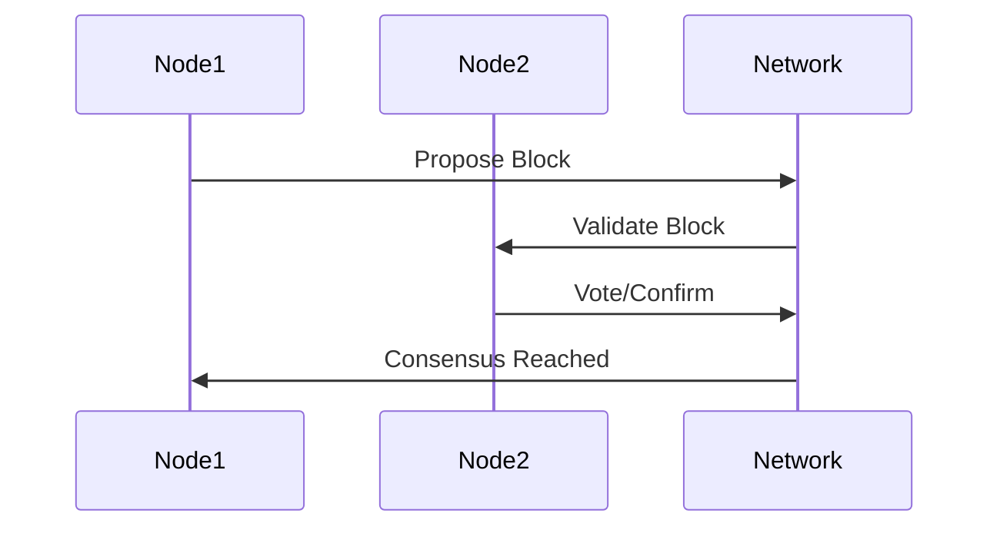

# Blockchain Consensus

## Overview

Blockchain consensus mechanisms are protocols that ensure all participants in a decentralized network agree on the validity of transactions and the state of the blockchain, maintaining security and integrity without a central authority.

## Detailed Explanation

Consensus in blockchain prevents double-spending and ensures immutability. Common mechanisms include:

- **Proof of Work (PoW)**: Miners solve computational puzzles (e.g., Bitcoin).
- **Proof of Stake (PoS)**: Validators are chosen based on stake (e.g., Ethereum 2.0).
- **Delegated Proof of Stake (DPoS)**: Stakeholders vote for delegates.
- **Proof of Authority (PoA)**: Trusted validators.

Challenges: Scalability, energy consumption, security.

### Consensus Flow Diagram



## Real-world Examples & Use Cases

- **Cryptocurrencies**: Bitcoin uses PoW for secure transactions.
- **Supply Chain**: Track goods with immutable records.
- **Voting Systems**: Decentralized elections.
- **Smart Contracts**: Ethereum's PoS for dApp execution.

## Code Examples

### Simplified Proof of Work (Python)

```python
import hashlib
import time

def proof_of_work(previous_hash, difficulty):
    nonce = 0
    target = '0' * difficulty
    while True:
        hash_result = hashlib.sha256(f"{previous_hash}{nonce}".encode()).hexdigest()
        if hash_result.startswith(target):
            return nonce, hash_result
        nonce += 1

# Example usage
prev_hash = "0000000000000000000000000000000000000000000000000000000000000000"
difficulty = 4
nonce, hash_val = proof_of_work(prev_hash, difficulty)
print(f"Nonce: {nonce}, Hash: {hash_val}")
```

### Proof of Stake Simulation (Pseudo Code)

```javascript
class Validator {
    constructor(stake) {
        this.stake = stake;
    }
    
    validate(block) {
        // Validation logic
        return Math.random() < (this.stake / totalStake); // Simplified selection
    }
}

// Usage
const validator = new Validator(100);
const isSelected = validator.validate(newBlock);
```

## References

- [Consensus Mechanism - Investopedia](https://www.investopedia.com/terms/c/consensus-mechanism-cryptocurrency.asp)
- [Bitcoin Proof of Work](https://bitcoin.org/bitcoin.pdf)
- [Ethereum Proof of Stake](https://ethereum.org/en/developers/docs/consensus-mechanisms/pos/)
- [Blockchain Consensus Algorithms](https://www.coindesk.com/learn/blockchain-101/what-is-blockchain-consensus/)

## Github-README Links & Related Topics

- [Blockchain Basics](blockchain-basics/README.md)
- [Consensus Algorithms](consensus-algorithms/README.md)
- [Distributed Systems](cap-theorem-and-distributed-systems/README.md)
- [Byzantine Fault Tolerance](byzantine-fault-tolerance/README.md)