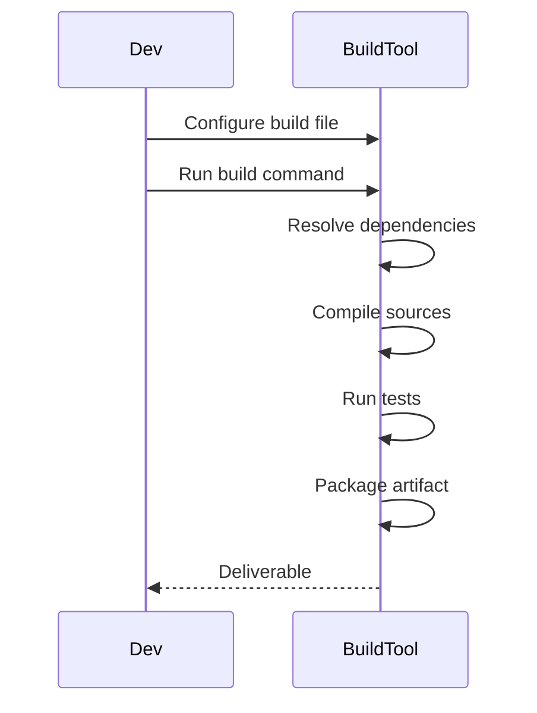

## Overview
Maven and Gradle are popular build automation tools for Java projects. Maven uses XML-based configuration (pom.xml), while Gradle uses Groovy/Kotlin DSL (build.gradle). They manage dependencies, compile code, run tests, and package applications.

## STAR Summary
**Situation:** Leading development of a microservices architecture with 10+ services.  
**Task:** Standardize build process and dependency management.  
**Action:** Adopted Maven for consistent builds, configured multi-module pom.xml with parent-child relationships.  
**Result:** Reduced build failures by 70%, improved CI/CD pipeline efficiency.

## Detailed Explanation
- **Maven:** Convention over configuration, lifecycle phases (compile, test, package). Dependencies in pom.xml.
- **Gradle:** Flexible, incremental builds, faster for large projects. Supports plugins.
- **Comparison:** Maven is declarative, Gradle is programmatic.

## Real-world Examples & Use Cases
- Enterprise applications with complex dependencies.
- CI/CD pipelines for automated builds.
- Multi-module projects.

## Code Examples
### Maven pom.xml
```xml
<project xmlns="http://maven.apache.org/POM/4.0.0"
         xmlns:xsi="http://www.w3.org/2001/XMLSchema-instance"
         xsi:schemaLocation="http://maven.apache.org/POM/4.0.0 http://maven.apache.org/xsd/maven-4.0.0.xsd">
    <modelVersion>4.0.0</modelVersion>
    <groupId>com.example</groupId>
    <artifactId>my-app</artifactId>
    <version>1.0-SNAPSHOT</version>
    <dependencies>
        <dependency>
            <groupId>junit</groupId>
            <artifactId>junit</artifactId>
            <version>4.12</version>
            <scope>test</scope>
        </dependency>
    </dependencies>
</project>
```

### Gradle build.gradle
```groovy
plugins {
    id 'java'
}

group 'com.example'
version '1.0-SNAPSHOT'

repositories {
    mavenCentral()
}

dependencies {
    testImplementation 'junit:junit:4.12'
}
```

Compile and run: For Maven `mvn compile test package`, for Gradle `gradle build`

## Data Models / Message Formats
| Element | Maven | Gradle | Description |
|---------|-------|--------|-------------|
| Dependencies | <dependencies> | dependencies {} | External libs |
| Plugins | <plugins> | plugins {} | Build extensions |

## Journey / Sequence


## Common Pitfalls & Edge Cases
- Dependency conflicts in Maven.
- Gradle wrapper version mismatches.
- Ignoring transitive dependencies.

## Tools & Libraries
- Maven: mvn command.
- Gradle: gradle/gradlew.
- IDE plugins: IntelliJ, Eclipse support.

## Github-README Links & Related Topics
Related: [[testing-and-mocking-junit-mockito]], [[performance-tuning-and-profiling]], [[jvm-internals-and-classloading]]

## References
- https://maven.apache.org/guides/getting-started/
- https://docs.gradle.org/current/userguide/getting_started.html