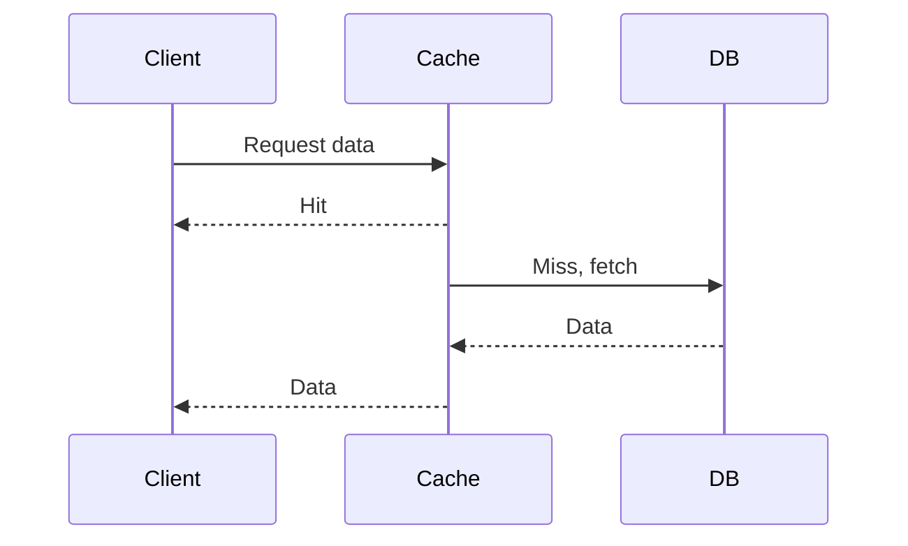

## Overview
Caching stores frequently accessed data to reduce latency and load on backend systems. Strategies include cache-aside, write-through, and invalidation policies.

## STAR Summary
**Situation:** Database queries slowed down the app.  
**Task:** Speed up data retrieval.  
**Action:** Implemented cache-aside with Redis.  
**Result:** 70% faster response times.

## Detailed Explanation
- **Cache-Aside:** Load data on miss.
- **Write-Through:** Update cache and DB together.
- **Write-Behind:** Update cache first, DB later.
- **Invalidation:** TTL, LRU eviction.

## Real-world Examples
- Browser caching for static assets.
- Redis in e-commerce for product data.

## Code Examples
### Cache-Aside with Map
```java
import java.util.HashMap;
import java.util.Map;

class CacheAside {
    private Map<String, String> cache = new HashMap<>();

    public String get(String key) {
        if (cache.containsKey(key)) return cache.get(key);
        String data = fetchFromDB(key); // Simulate
        cache.put(key, data);
        return data;
    }

    private String fetchFromDB(String key) { return "data"; }
}
```

## Data Models


## Journey Sequence
1. Identify cacheable data.
2. Choose strategy (e.g., cache-aside).
3. Implement with a cache store (Redis).
4. Set eviction policies.
5. Monitor hit rates.

## Common Pitfalls
- Cache inconsistency.
- Thundering herd on cache miss.
- Over-caching leading to memory issues.

## Tools & Libraries
- Redis: In-memory cache.
- Caffeine: Java caching library.

## Related Topics
- [database-design-and-indexing](../database-design-and-indexing/)
- [performance-tuning-and-profiling](../performance-tuning-and-profiling/)

## References
- Redis documentation.
- "Caching in Distributed Systems" articles.
- https://redis.io/