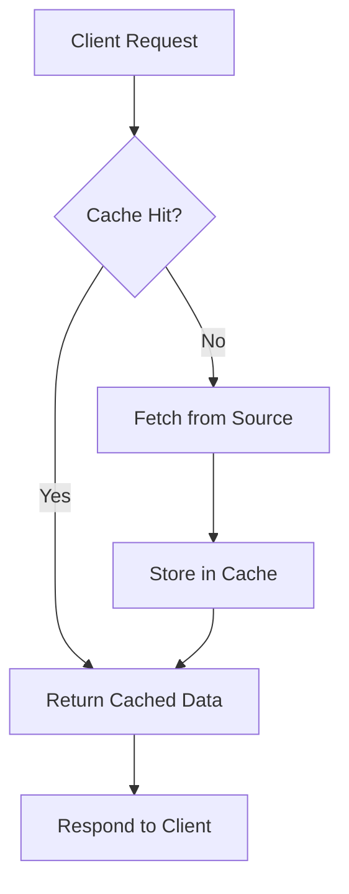

# Caching

## Overview

Caching is a fundamental technique in computer systems that stores copies of frequently accessed data in a temporary storage layer, known as a cache, to reduce access time and improve overall system performance. By minimizing the need to recompute results or fetch data from slower sources like databases, disks, or external APIs, caching enhances scalability, reduces latency, and lowers resource utilization. Caches can be implemented in hardware (e.g., CPU caches), software (e.g., in-memory stores), or distributed across networks.

Key benefits include faster response times, decreased load on backend systems, and improved user experience. However, effective caching requires addressing challenges such as cache invalidation, eviction policies, data consistency, and handling cache misses. In distributed systems, caching must balance performance gains with coherence protocols to prevent stale data issues.

## Detailed Explanation

### What is Caching?

A cache acts as an intermediary layer between the client and the primary data source. When data is requested:

- **Cache Hit**: Data is found in the cache and returned quickly.
- **Cache Miss**: Data is not in the cache, so it's fetched from the source, stored in the cache, and then returned.

Caches exploit locality of reference: temporal (recently accessed data is likely to be accessed again) and spatial (nearby data is likely to be accessed together).

### Cache Types

| Type          | Description                                                                 | Examples                  | Pros                          | Cons                          |
|---------------|-----------------------------------------------------------------------------|---------------------------|-------------------------------|-------------------------------|
| In-Memory    | Stores data in RAM for ultra-fast access.                                   | Redis, Memcached          | Low latency, high throughput  | Volatile, memory-limited      |
| Disk-Based   | Persists data to disk or SSD.                                              | Browser cache, OS page cache | Durable, large capacity       | Slower access                 |
| Distributed  | Spread across multiple nodes for scalability.                              | Redis Cluster, Cassandra  | Fault-tolerant, scalable      | Network overhead, complexity  |
| Client-Side  | Cached on the client (e.g., browser).                                      | HTTP cache headers        | Reduces server load           | Limited control               |
| Server-Side  | Cached on servers (e.g., reverse proxies).                                 | Varnish, Nginx            | Centralized management        | Requires server resources     |

### Cache Strategies (Write Policies)

- **Write-Through**: Writes go to both cache and primary storage simultaneously. Ensures consistency but increases write latency.
- **Write-Back (Write-Behind)**: Writes to cache first, then asynchronously to primary storage. Improves performance but risks data loss on failure.
- **Write-Around**: Writes bypass the cache, going directly to primary storage. Cache is populated only on reads.

### Cache Eviction Policies

When the cache reaches capacity, data must be evicted. Common policies:

- **LRU (Least Recently Used)**: Evicts the least recently accessed item.
- **LFU (Least Frequently Used)**: Evicts the least frequently accessed item.
- **FIFO (First In, First Out)**: Evicts the oldest item.
- **Random**: Evicts a random item.
- **TTL (Time To Live)**: Evicts items after expiration.

### Cache Invalidation

Ensures cached data remains fresh:

- **Explicit Invalidation**: Manually remove entries on updates.
- **Implicit Invalidation**: Use TTL or version checks.
- **Cache Busting**: Append parameters (e.g., `?v=123`) to URLs for fresh fetches.

### Cache Coherence

In multi-cache environments, protocols like MESI ensure consistency, but add complexity.

### Cache Flow Diagram



This diagram shows the basic hit/miss flow.

## Real-world Examples & Use Cases

- **Web Browsers**: Cache static assets (HTML, CSS, JS, images) using HTTP headers like `Cache-Control`, `ETag`, and `Last-Modified` to reduce page load times.
- **Content Delivery Networks (CDNs)**: Globally distribute cached content (e.g., Amazon CloudFront, Cloudflare) to minimize latency for users worldwide.
- **Databases**: Cache query results or frequently accessed data (e.g., MySQL query cache, Redis as a database cache) to reduce I/O.
- **APIs and Microservices**: Cache responses in gateways (e.g., Kong with Redis) to handle high traffic and reduce backend load.
- **Session Management**: Store user sessions in distributed caches (e.g., Redis) for scalability across servers.
- **E-commerce**: Cache product catalogs and user carts (e.g., during flash sales) to handle spikes.
- **Social Media**: Cache feeds and user data (e.g., Facebook's TAO) for real-time updates.
- **Gaming**: Cache game state and leaderboards for low-latency interactions.
- **IoT**: Cache sensor data in edge caches for real-time processing.

In a CDN, caching reduces origin server requests by 70-90%, improving global performance.

## Code Examples

### Simple LRU Cache in Python

```python
from collections import OrderedDict

class LRUCache:
    def __init__(self, capacity: int):
        self.cache = OrderedDict()
        self.capacity = capacity

    def get(self, key):
        if key in self.cache:
            self.cache.move_to_end(key)
            return self.cache[key]
        return -1

    def put(self, key, value):
        if key in self.cache:
            self.cache.move_to_end(key)
        self.cache[key] = value
        if len(self.cache) > self.capacity:
            self.cache.popitem(last=False)

# Usage
cache = LRUCache(2)
cache.put(1, 1)
cache.put(2, 2)
print(cache.get(1))  # 1
cache.put(3, 3)      # Evicts 2
print(cache.get(2))  # -1
```

### Distributed Cache with Redis in Java

```java
import redis.clients.jedis.Jedis;

public class RedisCache {
    private Jedis jedis;

    public RedisCache(String host, int port) {
        this.jedis = new Jedis(host, port);
    }

    public String get(String key) {
        return jedis.get(key);
    }

    public void set(String key, String value, int ttlSeconds) {
        jedis.setex(key, ttlSeconds, value);
    }

    public void close() {
        jedis.close();
    }
}

// Usage
RedisCache cache = new RedisCache("localhost", 6379);
cache.set("user:123", "{\"name\":\"Alice\"}", 3600);
String data = cache.get("user:123");
System.out.println(data);  // {"name":"Alice"}
cache.close();
```

### HTTP Caching with Node.js (Express)

```javascript
const express = require('express');
const app = express();

// Middleware for caching
app.use((req, res, next) => {
    res.set('Cache-Control', 'public, max-age=300');  // Cache for 5 minutes
    next();
});

app.get('/api/data', (req, res) => {
    res.json({ message: 'Cached data' });
});

app.listen(3000, () => console.log('Server running'));
```

These examples demonstrate basic implementations; for production, use libraries like Caffeine (Java) or node-cache (Node.js).

## References

- [Wikipedia: Cache (computing)](https://en.wikipedia.org/wiki/Cache_(computing))
- [AWS Caching Overview](https://aws.amazon.com/caching/)
- [Redis Caching Guide](https://redis.io/docs/latest/develop/get-started/cache/)
- [Memcached Documentation](https://memcached.org/)
- [HTTP Caching (MDN)](https://developer.mozilla.org/en-US/docs/Web/HTTP/Caching)
- [Cache Replacement Policies](https://en.wikipedia.org/wiki/Cache_replacement_policies)

## Github-README Links & Related Topics

- [Distributed Caching with Redis](../distributed-caching-with-redis/)
- [CDN Architecture](../cdn-architecture/)
- [Database Performance Tuning](../database-performance-tuning/)
- [HTTP Caching Headers](../http-caching-headers/)
- [Load Balancing and Strategies](../load-balancing-and-strategies/)