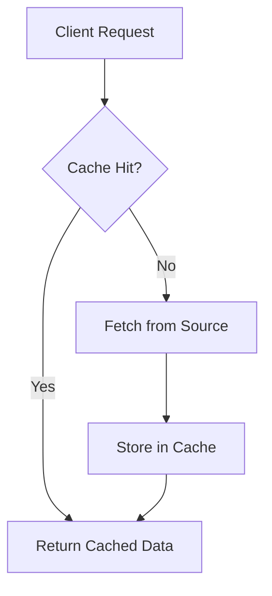

## Overview

Caching is a technique to store frequently accessed data in a fast-access storage layer to reduce latency, improve performance, and decrease load on primary data sources like databases or APIs. It acts as a temporary data store that serves requests faster than the original source, enhancing user experience and system efficiency in high-traffic applications.

## Detailed Explanation

### Cache Types
- **In-Memory Cache**: Stores data in RAM for ultra-fast access (e.g., Redis, Memcached).
- **Distributed Cache**: Spans multiple nodes for scalability and fault tolerance (e.g., Redis Cluster).
- **CDN (Content Delivery Network)**: Caches static assets like images, CSS, JS at edge locations (e.g., Cloudflare, Akamai).
- **Database Cache**: Built-in caching in databases (e.g., MySQL Query Cache, though deprecated).
- **Application-Level Cache**: Code-based caching (e.g., Caffeine in Java).

### Caching Strategies
- **Cache-Aside (Lazy Loading)**: Application checks cache first; if miss, fetches from source and populates cache.
- **Write-Through**: Writes go to both cache and source simultaneously.
- **Write-Behind (Write-Back)**: Writes to cache first, then asynchronously to source.
- **Read-Through**: Cache sits between application and source, handling misses transparently.

### Eviction Policies
- **LRU (Least Recently Used)**: Evicts least recently accessed items.
- **LFU (Least Frequently Used)**: Evicts least frequently accessed items.
- **TTL (Time-To-Live)**: Expires items after a set time.
- **Size-Based**: Evicts when cache reaches max size.

### Cache Invalidation
- **Explicit**: Manual deletion (e.g., after updates).
- **Time-Based**: Automatic expiration.
- **Event-Based**: Triggers on data changes (e.g., via pub/sub).



## Real-world Examples & Use Cases

- **E-commerce**: Product catalog cached in Redis to handle flash sales; invalidates on price changes.
- **Social Media**: User timelines cached with LRU; CDN for profile images.
- **API Rate Limiting**: Cache request counts per user/IP.
- **Search Engines**: Query results cached for popular searches.
- **Gaming**: Game state cached in-memory for real-time updates.

## Code Examples

### Caffeine In-Memory Cache (Java)
```java
import com.github.benmanes.caffeine.cache.Cache;
import com.github.benmanes.caffeine.cache.Caffeine;
import java.util.concurrent.TimeUnit;

Cache<String, String> cache = Caffeine.newBuilder()
    .expireAfterWrite(10, TimeUnit.MINUTES)
    .maximumSize(10_000)
    .build();

cache.put("key", "value");
String value = cache.getIfPresent("key");
```

### Redis Distributed Cache
```python
import redis

r = redis.Redis(host='localhost', port=6379, db=0)
r.set('key', 'value', ex=3600)  # Expire in 1 hour
value = r.get('key')
```

### Cache-Aside Pattern
```java
public String getData(String key) {
    String cached = cache.getIfPresent(key);
    if (cached != null) {
        return cached;
    }
    String data = fetchFromDatabase(key);
    cache.put(key, data);
    return data;
}
```

## Common Pitfalls & Edge Cases

- **Cache Penetration**: Frequent misses for non-existent keys; use null value caching.
- **Cache Avalanche**: Mass expiration causes load spike; stagger TTLs.
- **Stale Data**: Inconsistent cache; use versioning or event invalidation.
- **Thundering Herd**: Multiple requests for same miss; use locks or probabilistic early expiration.
- **Edge Case**: In distributed cache, network partitions can cause inconsistencies; use strong consistency or accept eventual.

## Tools & Libraries

- **In-Memory**: Caffeine (Java), Guava Cache, Ehcache.
- **Distributed**: Redis, Memcached, Hazelcast.
- **CDN**: Cloudflare, Fastly, AWS CloudFront.
- **Database**: MySQL InnoDB Buffer Pool, PostgreSQL shared buffers.

## References

- [Redis Documentation](https://redis.io/docs/)
- [Caffeine GitHub](https://github.com/ben-manes/caffeine)
- [AWS Caching Best Practices](https://aws.amazon.com/caching/)
- [Martin Fowler: Caching](https://martinfowler.com/bliki/Caching.html)

## Github-README Links & Related Topics

- [Caching Patterns](caching-patterns/)
- [Caching Strategies](caching-strategies/)
- [Latency and Throughput](latency-and-throughput/)
- [Distributed Locks](system-design/distributed-locks/)