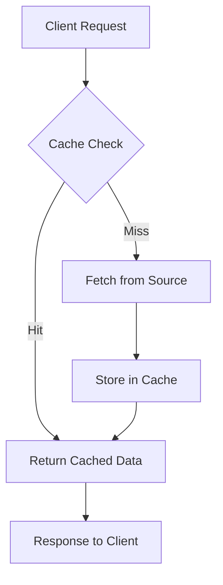

## Overview

Caching is a technique used to store frequently accessed data in a temporary storage layer (cache) to reduce access time and improve system performance. It minimizes the need to recompute or refetch data from slower sources like databases or external APIs. Caches can be in-memory, on-disk, or distributed across multiple nodes. Effective caching enhances scalability by reducing latency and load on backend systems, but requires careful management of cache invalidation, eviction policies, and consistency.

Key benefits include faster response times, lower resource usage, and better user experience. However, challenges involve cache misses, stale data, and synchronization in distributed environments.

## Detailed Explanation

### Cache Types

| Type | Description | Examples | Pros | Cons |
|------|-------------|----------|------|------|
| In-Memory | Stores data in RAM for ultra-fast access | Redis, Memcached | Low latency, high throughput | Volatile (data lost on restart), limited by memory |
| On-Disk | Persists data to disk | Filesystem caches, SSD-based | Durable, larger capacity | Slower than in-memory |
| Distributed | Spread across multiple servers | Redis Cluster, Hazelcast | Scalable, fault-tolerant | Network latency, complexity |

### Cache Strategies

- **Write-Through**: Data is written to both cache and primary storage simultaneously. Ensures consistency but increases write latency.
- **Write-Back**: Data is written to cache first, then asynchronously to primary storage. Improves write performance but risks data loss.
- **Write-Around**: Bypasses cache for writes, reading from primary storage. Simple but may lead to cache misses.

### Eviction Policies

Common algorithms for removing data when cache is full:

- **LRU (Least Recently Used)**: Evicts the least recently accessed item.
- **LFU (Least Frequently Used)**: Evicts the least frequently accessed item.
- **FIFO (First In, First Out)**: Evicts the oldest item.
- **TTL (Time To Live)**: Evicts items after a set expiration time.

### Cache Invalidation

- **Explicit**: Manually remove or update cache entries.
- **Implicit**: Use TTL or version-based invalidation.
- **Cache Busting**: Append query parameters (e.g., `?v=123`) to force fresh fetches.

### Cache Flow Diagram



This diagram illustrates the basic cache hit/miss flow, where a miss triggers data retrieval and storage.

## Real-world Examples & Use Cases

- **Web Browsers**: Cache HTML, CSS, JS, and images to reduce load times. Browsers use HTTP caching headers like `Cache-Control` and `ETag`.
- **Content Delivery Networks (CDNs)**: Distribute cached static assets globally (e.g., Cloudflare, Akamai). Reduces latency for users worldwide.
- **Databases**: Query result caching in ORM layers (e.g., Hibernate second-level cache) or database query caches.
- **API Gateways**: Cache API responses to handle high traffic (e.g., Kong with Redis).
- **Microservices**: In-memory caches for service-to-service calls to avoid repeated computations.
- **E-commerce Platforms**: Cache product catalogs and user sessions to handle flash sales.

In a high-traffic e-commerce site, caching user session data in Redis can reduce database queries by 80%, improving throughput during peak loads.

## Code Examples

### Simple In-Memory Cache in Python

```python
import time
from collections import OrderedDict

class LRUCache:
    def __init__(self, capacity: int):
        self.cache = OrderedDict()
        self.capacity = capacity

    def get(self, key: str):
        if key in self.cache:
            self.cache.move_to_end(key)
            return self.cache[key]
        return None

    def put(self, key: str, value):
        if key in self.cache:
            self.cache.move_to_end(key)
        self.cache[key] = value
        if len(self.cache) > self.capacity:
            self.cache.popitem(last=False)

# Usage
cache = LRUCache(2)
cache.put("key1", "value1")
cache.put("key2", "value2")
print(cache.get("key1"))  # value1
cache.put("key3", "value3")  # Evicts key2
print(cache.get("key2"))  # None
```

### Distributed Cache with Redis in Java

Using Jedis client:

```java
import redis.clients.jedis.Jedis;

public class RedisCache {
    private Jedis jedis;

    public RedisCache() {
        this.jedis = new Jedis("localhost", 6379);
    }

    public String get(String key) {
        return jedis.get(key);
    }

    public void set(String key, String value, int ttlSeconds) {
        jedis.setex(key, ttlSeconds, value);
    }

    public void close() {
        jedis.close();
    }
}

// Usage
RedisCache cache = new RedisCache();
cache.set("user:123", "{\"name\":\"John\"}", 3600);
String data = cache.get("user:123");
System.out.println(data);  // {"name":"John"}
cache.close();
```

Ensure Redis is running locally. For production, use connection pooling.

## Common Pitfalls

- **Cache Stampede**: Multiple requests for the same missing key. Mitigate with locks or probabilistic early expiration.
- **Thundering Herd**: Similar to stampede, but for cache warming.
- **Stale Data**: Invalidate caches on data updates.
- **Memory Leaks**: Monitor cache size and implement eviction.

## Performance Metrics

| Metric | Description | Target |
|--------|-------------|--------|
| Hit Rate | Percentage of requests served from cache | >90% |
| Miss Rate | Percentage of cache misses | <10% |
| Latency | Time to retrieve data | <10ms for in-memory |
| Throughput | Requests per second | Varies by system |

## References

- [Redis Caching Guide](https://redis.io/topics/lru-cache)
- [Memcached Documentation](https://memcached.org/)
- [HTTP Caching (MDN)](https://developer.mozilla.org/en-US/docs/Web/HTTP/Caching)
- [Cache Invalidation Strategies](https://martinfowler.com/bliki/TwoHardThings.html)
- [AWS Caching Best Practices](https://aws.amazon.com/caching/)

## Github-README Links & Related Topics

- [Distributed Caching with Redis](../distributed-caching-with-redis/)
- [CDN Architecture](../cdn-architecture/)
- [Database Performance Tuning](../database-performance-tuning/)
- [Load Balancing and Strategies](../load-balancing-and-strategies/)
- [HTTP Caching Headers](../http-caching-headers/)