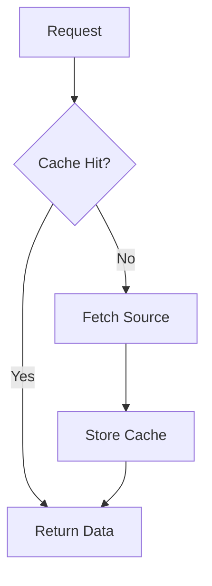

# Caching

## Overview

Caching stores frequently accessed data in fast-access storage to reduce retrieval time and system load. It improves performance by minimizing computations, database queries, or external API calls. Caches can be in-memory, disk-based, or distributed, with strategies for eviction, invalidation, and coherence. Effective caching balances speed gains against consistency and resource costs.

## Detailed Explanation

### Cache Types

| Type | Description | Examples | Pros | Cons |
|------|-------------|----------|------|------|
| In-Memory | RAM storage | Redis, Memcached | Ultra-fast, high throughput | Volatile, memory-limited |
| Disk-Based | Persistent storage | Browser cache, OS page cache | Durable, large capacity | Slower access |
| Distributed | Across nodes | Redis Cluster, Cassandra | Scalable, fault-tolerant | Network overhead |
| Client-Side | On client | HTTP cache | Reduces server load | Limited control |
| Server-Side | On servers | Varnish, Nginx | Centralized | Server resources |

### Strategies

- **Write-Through:** Writes to cache and source simultaneously; ensures consistency.
- **Write-Back:** Writes to cache first, then source; improves performance but risks loss.
- **Write-Around:** Bypasses cache for writes; cache populated on reads.

### Eviction Policies

- LRU: Least recently used.
- LFU: Least frequently used.
- FIFO: First in, first out.
- TTL: Time-to-live expiration.

### Invalidation

- Explicit: Manual removal.
- Implicit: TTL or version checks.
- Busting: Parameter appending.

### Coherence

Protocols like MESI maintain consistency in multi-cache setups.



## Real-world Examples & Use Cases

- Browsers cache assets with HTTP headers.
- CDNs distribute cached content globally.
- Databases cache queries.
- APIs cache responses.
- Sessions stored in distributed caches.

## Code Examples

### LRU Cache (Python)

```python
from collections import OrderedDict

class LRUCache:
    def __init__(self, capacity: int):
        self.cache = OrderedDict()
        self.capacity = capacity

    def get(self, key):
        if key in self.cache:
            self.cache.move_to_end(key)
            return self.cache[key]
        return -1

    def put(self, key, value):
        if key in self.cache:
            self.cache.move_to_end(key)
        self.cache[key] = value
        if len(self.cache) > self.capacity:
            self.cache.popitem(last=False)

# Usage
cache = LRUCache(2)
cache.put(1, 1)
cache.put(2, 2)
print(cache.get(1))  # 1
cache.put(3, 3)      # Evicts 2
print(cache.get(2))  # -1
```

### Redis Cache (Java)

```java
import redis.clients.jedis.Jedis;

public class RedisCache {
    Jedis jedis = new Jedis("localhost", 6379);

    public String get(String key) {
        return jedis.get(key);
    }

    public void set(String key, String value, int ttl) {
        jedis.setex(key, ttl, value);
    }
}
```

### HTTP Caching (Node.js)

```javascript
const express = require('express');
const app = express();

// Middleware for caching
app.use((req, res, next) => {
    res.set('Cache-Control', 'public, max-age=300');  // Cache for 5 minutes
    next();
});

app.get('/api/data', (req, res) => {
    res.json({ data: 'cached' });
});
```

## References

- [Cache (computing)](https://en.wikipedia.org/wiki/Cache_(computing))
- [Redis Caching](https://redis.io/docs/latest/develop/get-started/cache/)
- [HTTP Caching](https://developer.mozilla.org/en-US/docs/Web/HTTP/Caching)

## Github-README Links & Related Topics

- [Distributed Caching with Redis](../distributed-caching-with-redis/)
- [HTTP Caching Headers](../http-caching-headers/)
- [Database Performance Tuning](../database-performance-tuning/)