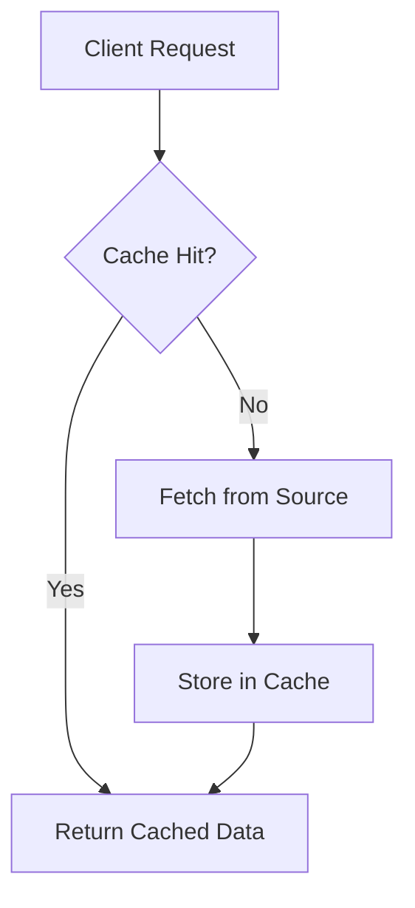

# Overview

Caching is a technique used to store frequently accessed data in a fast-access storage layer to improve performance and reduce latency. It acts as a temporary data store that sits between the application and the primary data source, such as a database or API. By serving data from cache instead of recomputing or refetching it, systems can achieve significant speedups and handle higher loads.

# Detailed Explanation

## Cache Types

- **In-Memory Cache**: Stores data in RAM for ultra-fast access (e.g., Redis, Memcached).
- **Disk Cache**: Uses local or network storage for larger datasets (e.g., browser cache, CDN).
- **Distributed Cache**: Shared across multiple servers for scalability (e.g., Redis Cluster).
- **CPU Cache**: Hardware-level caching in processors (L1, L2, L3).

## Cache Policies

- **Eviction Policies**: Determine what to remove when cache is full.
  - LRU (Least Recently Used): Removes oldest accessed items.
  - LFU (Least Frequently Used): Removes least accessed items.
  - FIFO (First In, First Out): Removes oldest items.
  - Random: Evicts randomly.

- **Write Policies**:
  - Write-Through: Writes to cache and primary storage simultaneously.
  - Write-Back: Writes to cache first, then asynchronously to storage.
  - Write-Around: Bypasses cache for writes, only reads are cached.

## Cache Invalidation

- **Time-Based**: Expire after a set time (TTL - Time To Live).
- **Event-Based**: Invalidate on data changes (e.g., via pub/sub).
- **Manual**: Explicitly remove entries.

Challenges: Cache coherence, stale data, cache misses.



# Real-world Examples & Use Cases

- **Web Applications**: Browser caches static assets; CDNs cache content globally.
- **Databases**: Query result caching in ORM layers (e.g., Hibernate second-level cache).
- **APIs**: Rate limiting with cached responses; API gateways cache frequent requests.
- **Microservices**: Shared cache for session data or computed results.
- **Gaming**: Preload assets; cache user profiles.

# Code Examples

## Redis In-Memory Cache (Python)

```python
import redis

# Connect to Redis
r = redis.Redis(host='localhost', port=6379, db=0)

# Set a key with TTL
r.set('key', 'value', ex=3600)  # Expires in 1 hour

# Get value
value = r.get('key')
print(value)  # b'value'

# Cache miss example
if not r.exists('missing_key'):
    # Fetch from DB
    data = fetch_from_database()
    r.set('missing_key', data, ex=300)
```

## Simple In-Memory Cache (Java)

```java
import java.util.concurrent.ConcurrentHashMap;
import java.util.Map;

public class SimpleCache<K, V> {
    private final Map<K, V> cache = new ConcurrentHashMap<>();

    public V get(K key) {
        return cache.get(key);
    }

    public void put(K key, V value) {
        cache.put(key, value);
    }

    public void invalidate(K key) {
        cache.remove(key);
    }
}

// Usage
SimpleCache<String, String> cache = new SimpleCache<>();
cache.put("user:123", "John Doe");
String name = cache.get("user:123");
```

# References

- [Caching - Wikipedia](https://en.wikipedia.org/wiki/Cache_(computing))
- [Redis Documentation](https://redis.io/documentation)
- [Memcached](https://memcached.org/)
- [AWS Caching Best Practices](https://aws.amazon.com/caching/best-practices/)