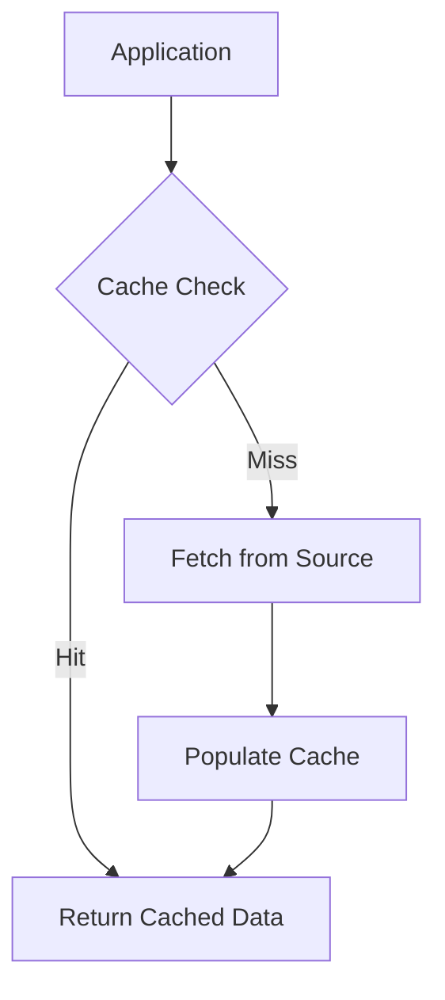

## Overview

Caching is a fundamental technique in system design that stores frequently accessed data in a high-speed storage layer to reduce latency, improve performance, and alleviate load on primary data sources. By maintaining a temporary copy of data closer to the consumer, caching minimizes expensive operations like database queries or API calls, enabling faster response times and better scalability.

## Detailed Explanation

### Types of Caches

| Type | Description | Examples | Use Cases |
|------|-------------|----------|-----------|
| In-Memory | Fastest access using RAM | Redis, Memcached | Session data, real-time analytics |
| Database | Query result caching at DB level | MySQL Query Cache, PostgreSQL | Repeated SQL queries |
| CDN | Distributed content caching | Cloudflare, Akamai | Static assets, media files |
| Browser | Client-side storage | HTTP caching headers | Web page resources |
| Application | In-app data structures | Ehcache, Caffeine | Computed results, API responses |

### Cache Strategies

Caching strategies define how data flows between cache and primary storage:

- **Cache-Aside (Lazy Loading)**: Application checks cache first; on miss, fetches from source and populates cache
- **Write-Through**: Writes go to both cache and source simultaneously, ensuring consistency
- **Write-Behind (Write-Back)**: Writes to cache first, then asynchronously to source for performance
- **Read-Through**: Cache acts as proxy, handling all reads and populating itself



### Cache Eviction Policies

Eviction policies determine which data to remove when cache is full:

| Policy | Description | Pros | Cons |
|--------|-------------|------|------|
| LRU | Least Recently Used | Simple, effective for temporal locality | Ignores access frequency |
| LFU | Least Frequently Used | Good for skewed access patterns | New items may be evicted prematurely |
| TTL | Time To Live | Automatic expiration | May evict still-useful data |
| Size-Based | FIFO or random | Simple implementation | No intelligence in eviction |

## Real-world Examples & Use Cases

### Web Applications
- **User Sessions**: Store session data in Redis to avoid repeated authentication checks
- **API Responses**: Cache public data like weather forecasts or stock prices with short TTL
- **Page Fragments**: Cache rendered HTML components to reduce server load

### E-commerce Platforms
- **Product Catalogs**: Cache product details and inventory during flash sales
- **Recommendation Engines**: Store personalized suggestions based on user behavior
- **Shopping Carts**: Maintain cart state in distributed cache for multi-device sync

### Social Media Platforms
- **Timeline Feeds**: Cache aggregated posts to handle millions of users
- **User Profiles**: Store profile data with invalidation on updates
- **Trending Topics**: Cache computed trends with periodic refresh

### Gaming Systems
- **Game State**: Real-time state synchronization in multiplayer games
- **Leaderboards**: Cached rankings with frequent updates
- **Asset Loading**: Preload game assets for faster level transitions

### IoT and Edge Computing
- **Sensor Data**: Cache recent readings for local processing
- **Device Configurations**: Store settings with version control

## Code Examples

### Redis In-Memory Caching (Java)

```java
import redis.clients.jedis.Jedis;

public class RedisCacheExample {
    private final Jedis jedis;

    public RedisCacheExample() {
        this.jedis = new Jedis("localhost", 6379);
    }

    public String getUserData(String userId) {
        String cacheKey = "user:" + userId;
        String cachedData = jedis.get(cacheKey);

        if (cachedData != null) {
            return cachedData; // Cache hit
        }

        // Cache miss - fetch from database
        String userData = fetchUserFromDatabase(userId);
        if (userData != null) {
            jedis.setex(cacheKey, 3600, userData); // Expire in 1 hour
        }
        return userData;
    }

    public void updateUserData(String userId, String data) {
        String cacheKey = "user:" + userId;
        // Update database first
        updateUserInDatabase(userId, data);
        // Invalidate cache
        jedis.del(cacheKey);
    }

    private String fetchUserFromDatabase(String userId) {
        // Simulate DB call
        return "{\"id\":\"" + userId + "\",\"name\":\"John Doe\"}";
    }

    private void updateUserInDatabase(String userId, String data) {
        // Simulate DB update
        System.out.println("Updated user " + userId + " in database");
    }
}
```

### Spring Boot Caching with Annotations

```java
import org.springframework.cache.annotation.Cacheable;
import org.springframework.cache.annotation.CacheEvict;
import org.springframework.cache.annotation.CachePut;
import org.springframework.stereotype.Service;

@Service
public class UserService {

    @Cacheable(value = "users", key = "#id")
    public User getUserById(Long id) {
        return userRepository.findById(id).orElseThrow();
    }

    @CachePut(value = "users", key = "#user.id")
    public User updateUser(User user) {
        return userRepository.save(user);
    }

    @CacheEvict(value = "users", key = "#id")
    public void deleteUser(Long id) {
        userRepository.deleteById(id);
    }

    @CacheEvict(value = "users", allEntries = true)
    public void clearCache() {
        // Clear all user cache entries
    }
}
```

### Python Cache-Aside with TTL

```python
import time
from typing import Dict, Any, Optional

class TTLCache:
    def __init__(self, ttl_seconds: int = 300):
        self.cache: Dict[str, tuple[Any, float]] = {}
        self.ttl = ttl_seconds

    def get(self, key: str) -> Optional[Any]:
        if key in self.cache:
            value, timestamp = self.cache[key]
            if time.time() - timestamp < self.ttl:
                return value
            else:
                del self.cache[key]
        return None

    def set(self, key: str, value: Any) -> None:
        self.cache[key] = (value, time.time())

    def invalidate(self, key: str) -> None:
        self.cache.pop(key, None)

class DataService:
    def __init__(self):
        self.cache = TTLCache(ttl_seconds=600)  # 10 minutes

    def get_data(self, key: str) -> str:
        cached = self.cache.get(key)
        if cached:
            return cached

        # Simulate expensive operation
        data = self._fetch_from_source(key)
        self.cache.set(key, data)
        return data

    def _fetch_from_source(self, key: str) -> str:
        # Simulate database/API call
        return f"Data for {key}"
```

### Node.js with Memory Cache

```javascript
const NodeCache = require('node-cache');
const cache = new NodeCache({ stdTTL: 600 }); // 10 minutes default TTL

class CacheService {
    async getData(key) {
        let data = cache.get(key);
        if (data) {
            console.log('Cache hit for', key);
            return data;
        }

        console.log('Cache miss for', key);
        data = await this.fetchFromDatabase(key);
        cache.set(key, data);
        return data;
    }

    async setData(key, value) {
        await this.saveToDatabase(key, value);
        cache.set(key, value);
    }

    async invalidate(key) {
        cache.del(key);
    }

    async fetchFromDatabase(key) {
        // Simulate async DB call
        return new Promise(resolve => {
            setTimeout(() => resolve(`Data: ${key}`), 100);
        });
    }

    async saveToDatabase(key, value) {
        // Simulate async save
        return new Promise(resolve => {
            setTimeout(() => resolve(), 50);
        });
    }
}

module.exports = CacheService;
```

## References

- [Redis Caching Best Practices](https://redis.io/topics/lru-cache)
- [Martin Fowler - Caching](https://martinfowler.com/bliki/Caching.html)
- [AWS Caching Strategies](https://aws.amazon.com/caching/)
- [Google Cloud Caching Overview](https://cloud.google.com/caching)
- [MDN Web Docs - HTTP Caching](https://developer.mozilla.org/en-US/docs/Web/HTTP/Caching)
- [Cache Eviction Policies Explained](https://en.wikipedia.org/wiki/Cache_replacement_policies)

## Github-README Links & Related Topics

- [Distributed Caching with Redis](../distributed-caching-with-redis/README.md)
- [CDN Architecture](../cdn-architecture/README.md)
- [Database Performance Tuning](../database-performance-tuning/README.md)
- [High Scalability Patterns](../high-scalability-patterns/README.md)
- [Eventual Consistency](../eventual-consistency/README.md)