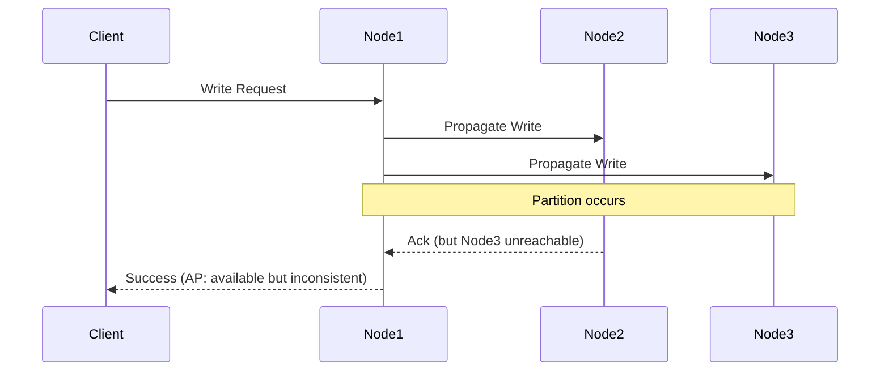
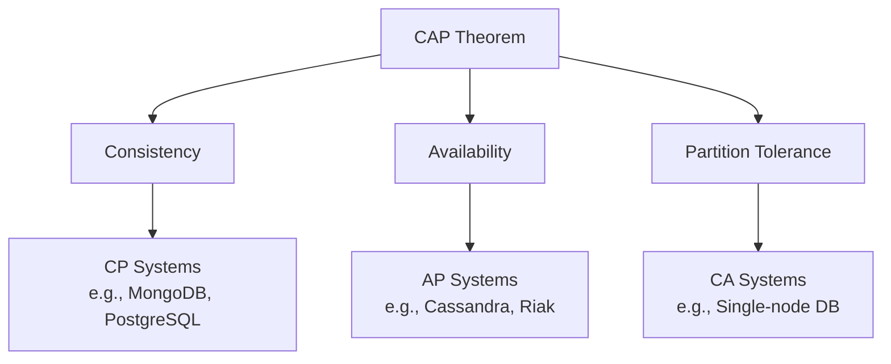

## Overview
The CAP theorem, formulated by Eric Brewer, asserts that in a distributed data store, it's impossible to simultaneously provide more than two out of three guarantees: Consistency (C), Availability (A), and Partition Tolerance (P). This theorem is crucial for understanding trade-offs in distributed systems design.

## Detailed Explanation
Distributed systems consist of multiple nodes communicating over a network, making them susceptible to partitions. The CAP theorem highlights the inherent trade-offs.

### Definitions
- **Consistency (C):** Every read receives the most recent write or an error. All nodes see the same data at the same time.
- **Availability (A):** Every request receives a (non-error) response, without guarantee that it contains the most recent write.
- **Partition Tolerance (P):** The system continues to operate despite arbitrary message loss or failure of part of the system.

### Trade-offs
- **CA (Consistency + Availability):** Possible only in systems without partitions (e.g., single-node databases).
- **CP (Consistency + Partition Tolerance):** Sacrifices availability during partitions (e.g., blocking writes).
- **AP (Availability + Partition Tolerance):** Sacrifices consistency (e.g., eventual consistency).

In practice, most systems choose AP or CP, as partitions are unavoidable in distributed environments.

### PACELC Theorem Extension
An extension stating that in the absence of partitions (P), there's a trade-off between latency (L) and consistency (C): PC/EC (low latency with eventual consistency) or PC/EL (low latency with strong consistency).

## Real-world Examples & Use Cases
- **Banking Systems (CP):** Require strong consistency for transactions; may sacrifice availability during failures.
- **Social Media Platforms (AP):** Prioritize availability and low latency; use eventual consistency for timelines.
- **E-commerce Inventory (CP):** Ensure consistent stock levels across nodes.
- **DNS Systems (AP):** Highly available, with eventual propagation of updates.
- **File Storage like Dropbox (AP):** Files sync eventually across devices.

## Code Examples
### Eventual Consistency in a Distributed Key-Value Store (AP System)
```python
import time

class EventualConsistencyKV:
    def __init__(self):
        self.data = {}  # Local data
        self.version = {}  # Version vectors
        self.peers = []  # Other nodes

    def put(self, key, value):
        self.data[key] = value
        self.version[key] = time.time()  # Simple timestamp
        # Asynchronously propagate to peers
        for peer in self.peers:
            peer.receive_update(key, value, self.version[key])

    def get(self, key):
        return self.data.get(key, None)  # May be stale

    def receive_update(self, key, value, version):
        if version > self.version.get(key, 0):
            self.data[key] = value
            self.version[key] = version
```

### Strong Consistency with Quorum (CP System)
```java
// Simplified quorum-based write/read
class QuorumSystem {
    private List<Node> nodes;
    private int writeQuorum = nodes.size() / 2 + 1;

    void write(String key, String value) {
        int successCount = 0;
        for (Node node : nodes) {
            if (node.write(key, value)) successCount++;
            if (successCount >= writeQuorum) break;
        }
        if (successCount < writeQuorum) throw new Exception("Write failed");
    }

    String read(String key) {
        // Similar quorum read logic
        return null; // Implement
    }
}
```

## Journey / Sequence


## Data Models / Message Formats
### CAP Trade-off Table
| System Type | Examples | Strengths | Weaknesses |
|-------------|----------|-----------|------------|
| CA | Single-node RDBMS | Strong consistency, high availability | No partition tolerance |
| CP | HBase, ZooKeeper | Strong consistency | May block during partitions |
| AP | Cassandra, DynamoDB | High availability | Eventual consistency |

### CAP Theorem Diagram


## Common Pitfalls & Edge Cases
- **Misinterpreting CAP:** Thinking you can achieve all three; focus on trade-offs.
- **Ignoring Network Partitions:** Assuming perfect networks; design for failures.
- **Over-emphasizing Consistency:** For non-critical data, eventual consistency suffices.
- **Edge Case:** Network heals after partition; reconciling divergent data.

## Tools & Libraries
- **AP Systems:** Apache Cassandra, Amazon DynamoDB, Riak
- **CP Systems:** MongoDB (configurable), HBase, ZooKeeper
- **CA Systems:** Traditional RDBMS like MySQL (single instance)
- **Frameworks:** Akka for distributed actors, Consul for service discovery

## Github-README Links & Related Topics
- [consistency-models](../system-design/consistency-models/)
- [distributed-transactions](../system-design/distributed-transactions/)
- [raft-and-leader-election](../raft-and-leader-election/)

## References
- Brewer's CAP Theorem: https://www.infoq.com/articles/cap-twelve-years-later-how-the-rules-have-changed/
- PACELC Theorem: https://en.wikipedia.org/wiki/PACELC_theorem
- https://github.com/donnemartin/system-design-primer#cap-theorem
- "Designing Data-Intensive Applications" by Martin Kleppmann