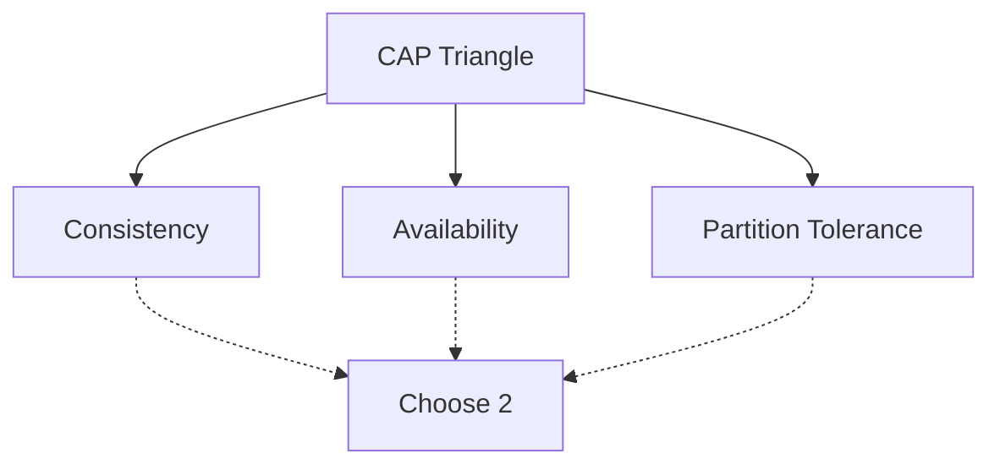

## Overview

The CAP Theorem states that in a distributed system, you can only guarantee two out of three: Consistency, Availability, and Partition Tolerance. Understanding CAP helps in designing trade-offs for distributed databases and systems.

## Detailed Explanation

### CAP Properties
- **Consistency**: All nodes see the same data simultaneously.
- **Availability**: System remains operational despite failures.
- **Partition Tolerance**: System continues despite network partitions.

### Implications
- CA: Possible in single-node systems.
- CP: Sacrifices availability (e.g., MongoDB).
- AP: Sacrifices consistency (e.g., Cassandra).



## Real-world Examples & Use Cases

- **Banking**: Prioritizes consistency over availability.
- **Social Media**: Favors availability for user experience.
- **E-commerce**: Balances all three with eventual consistency.

## Code Examples

### Simulating CAP Trade-off (Conceptual)
```java
// In a distributed system, choosing CP might involve locking
public class CPSystem {
    // Ensure consistency by waiting for all replicas
    public void write(String data) {
        // Lock and update all nodes
        // May sacrifice availability if partition occurs
    }
}
```

## References

- [CAP Theorem Explained](https://www.brianstorti.com/cap-theorem/)
- [Brewer's CAP Theorem](https://www.infoq.com/articles/cap-twelve-years-later/)

## Github-README Links & Related Topics

- [System Design Basics](../system-design-basics/)
- [Distributed Consensus](../distributed-consensus/)
- [Eventual Consistency](../eventual-consistency/)
