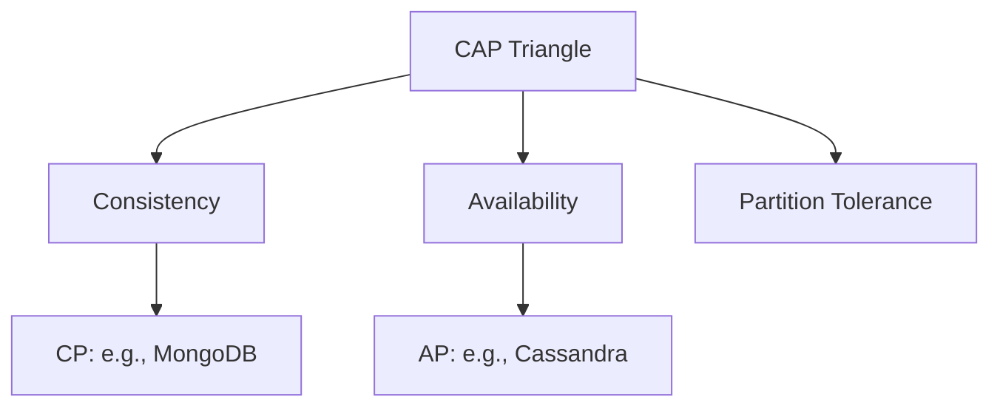

## Overview
The CAP theorem states that in a distributed system, you can only guarantee two out of three: Consistency, Availability, and Partition Tolerance. It's fundamental for designing distributed databases and services.

## Detailed Explanation
- **Consistency:** All nodes see the same data simultaneously.
- **Availability:** System remains operational despite failures.
- **Partition Tolerance:** System continues despite network partitions.
- **Trade-offs:** CA (no partitions), CP (sacrifices availability), AP (sacrifices consistency).

## Real-world Examples & Use Cases
- **CP Systems:** Banking (consistency over availability).
- **AP Systems:** Social media (availability over consistency).
- **CA Systems:** Single-node databases.

## Code Examples
### Simulating CAP in a Distributed Cache
```java
// Pseudo-code for eventual consistency (AP)
class DistributedCache {
    void put(String key, String value) {
        // Write to local, propagate asynchronously
    }
    String get(String key) {
        // Return local value, may be stale
    }
}
```

## Data Models / Message Formats


## Common Pitfalls & Edge Cases
- Assuming CA in real networks (partitions happen).
- Over-relying on eventual consistency for critical data.

## Tools & Libraries
- Apache Cassandra (AP).
- MongoDB (CP with tunable consistency).

## Github-README Links & Related Topics
Related: [consistency-models](../system-design/consistency-models/), [distributed-transactions](../system-design/distributed-transactions/)

## References
- "Brewer's CAP Theorem" paper.
- https://en.wikipedia.org/wiki/CAP_theorem
- https://github.com/donnemartin/system-design-primer#cap-theorem