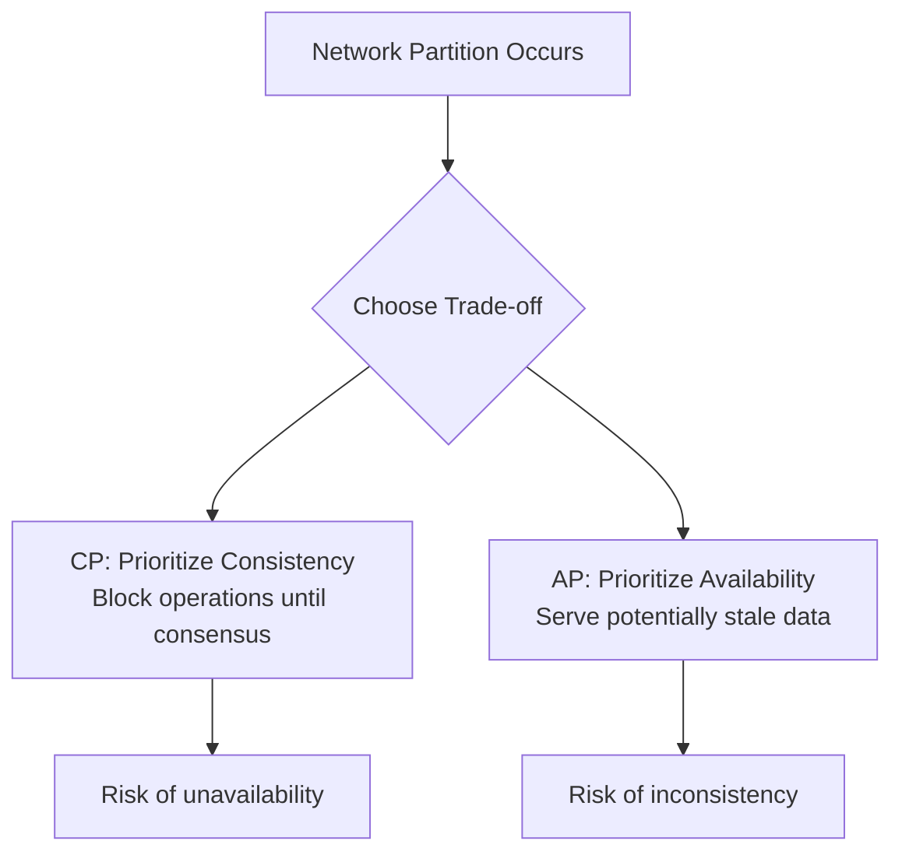

# Overview

The CAP Theorem, proposed by Eric Brewer in 2000 and formally proven by Seth Gilbert and Nancy Lynch in 2002, states that it is impossible for a distributed data store to simultaneously provide more than two out of the following three guarantees: **Consistency (C)**, **Availability (A)**, and **Partition Tolerance (P)**. Distributed systems consist of multiple independent computers that communicate over a network to appear as a single coherent system. This theorem is crucial for designing scalable, fault-tolerant systems, as it forces engineers to make informed trade-offs based on application needs, such as prioritizing consistency in financial systems or availability in social media.

In practice, network partitions are inevitable in large-scale distributed systems due to hardware failures, network congestion, or geographic distribution. The CAP Theorem helps architects choose between CP (consistency with partition tolerance) or AP (availability with partition tolerance) systems, while CA systems are only viable in non-partitioned environments.

## Detailed Explanation

## CAP Theorem Components

- **Consistency (C)**: Every read receives the most recent write or an error. All nodes see the same data simultaneously, ensuring linearizability where operations appear in a global order. This differs from ACID consistency, focusing on data uniformity across replicas.
- **Availability (A)**: Every request to a non-failing node receives a response, even if it's not the latest data. The system remains operational, prioritizing responsiveness over data freshness.
- **Partition Tolerance (P)**: The system continues functioning despite network partitions, where messages between nodes may be lost or delayed. This is essential for distributed systems spanning multiple data centers.

The theorem proves that in the presence of a partition (P), you cannot achieve both C and A. You must sacrifice one: CP systems ensure consistency by potentially rejecting requests during partitions, while AP systems ensure availability by allowing stale data.

## Trade-offs in CAP

| Combination | Description | Examples | Trade-offs |
|-------------|-------------|----------|------------|
| CP | Consistency + Partition Tolerance | HBase, ZooKeeper, MongoDB (with majority reads) | May reject requests to maintain consistency; higher latency during partitions. |
| AP | Availability + Partition Tolerance | Cassandra, DynamoDB, Riak | Allows stale reads; requires conflict resolution for eventual consistency. |
| CA | Consistency + Availability | Single-node RDBMS, traditional SQL databases | Assumes no partitions; not scalable for distributed environments. |



## Related Concepts

- **Eventual Consistency**: A weak consistency model where updates propagate asynchronously, and replicas converge over time without guarantees on when.
- **ACID vs. BASE**:
  - ACID: Atomicity, Consistency, Isolation, Durability – strong guarantees for transactions.
  - BASE: Basically Available, Soft state, Eventually consistent – prioritizes availability and scalability.
- **Consensus Algorithms**: Protocols like Paxos or Raft ensure agreement on values despite failures.
- **Quorum Systems**: Require a majority of nodes for operations to ensure consistency.
- **PACELC Theorem**: Extends CAP by adding latency (L) vs. consistency trade-offs when no partition exists (E for Else).

# Real-world Examples & Use Cases

## Banking and Financial Systems
- **Use Case**: Transactions must be strongly consistent to avoid double-spending or incorrect balances.
- **CAP Choice**: CP – Use quorum-based consensus to ensure consistency during partitions.
- **Example**: Visa's payment processing uses distributed ledgers with CP guarantees, accepting brief outages for accuracy.

## Social Media Platforms (e.g., Twitter, Facebook)
- **Use Case**: High availability for posting and viewing feeds by millions of users.
- **CAP Choice**: AP – Timelines may show outdated posts, but the system stays responsive.
- **Example**: Facebook's TAO uses eventual consistency for social graphs, allowing stale data during network issues.

## E-commerce Platforms (e.g., Amazon, eBay)
- **Use Case**: Product availability and shopping carts need high uptime, with inventory eventually consistent.
- **CAP Choice**: AP – Prioritize availability; resolve conflicts via last-write-wins or user intervention.
- **Example**: Amazon's DynamoDB handles peak loads with AP trade-offs, ensuring cart persistence.

## Content Delivery Networks (CDNs)
- **Use Case**: Global content serving with low latency.
- **CAP Choice**: AP – Edge nodes serve cached, potentially stale content during partitions.
- **Example**: Akamai's CDN uses eventual consistency for DNS propagation.

## File Storage Systems (e.g., Dropbox, Google Drive)
- **Use Case**: File sync across devices with conflict resolution.
- **CAP Choice**: Hybrid – CP for metadata (e.g., file ownership), AP for content.
- **Example**: Dropbox employs vector clocks for eventual consistency in file versioning.

# Code Examples

## AP System: Eventual Consistency Counter in Python

```python
import threading
import time

class EventualCounter:
    def __init__(self, nodes=3):
        self.nodes = [0] * nodes
        self.lock = threading.Lock()

    def increment(self):
        with self.lock:
            for i in range(len(self.nodes)):
                self.nodes[i] += 1
        threading.Thread(target=self._propagate).start()

    def _propagate(self):
        time.sleep(1)  # Simulate delay
        with self.lock:
            max_val = max(self.nodes)
            for i in range(len(self.nodes)):
                self.nodes[i] = max_val

    def get_value(self):
        with self.lock:
            return self.nodes[0]  # Return one node's value (may be stale)

counter = EventualCounter()
counter.increment()
time.sleep(2)
print(counter.get_value())  # Eventually consistent
```

## CP System: Quorum Read/Write in Java

```java
import java.util.List;
import java.util.ArrayList;

class QuorumNode {
    private int value = 0;
    private List<QuorumNode> peers;

    public QuorumNode(List<QuorumNode> peers) {
        this.peers = peers;
    }

    public void write(int newValue) throws Exception {
        int quorum = peers.size() / 2 + 1;
        int success = 0;
        for (QuorumNode peer : peers) {
            peer.value = newValue;
            success++;
        }
        if (success < quorum) throw new Exception("Quorum failed");
        this.value = newValue;
    }

    public int read() throws Exception {
        List<Integer> values = new ArrayList<>();
        for (QuorumNode peer : peers) {
            values.add(peer.value);
        }
        return values.get(values.size() / 2);  // Majority value
    }
}

List<QuorumNode> nodes = new ArrayList<>();
for (int i = 0; i < 5; i++) nodes.add(new QuorumNode(nodes));
QuorumNode node = nodes.get(0);
node.write(42);
System.out.println(node.read());  // 42
```

## Raft Consensus Snippet in Go

```go
package main

import (
    "fmt"
    "sync"
    "time"
)

type RaftNode struct {
    mu       sync.Mutex
    term     int
    isLeader bool
    peers    []string
}

func (r *RaftNode) RequestVote() {
    r.mu.Lock()
    defer r.mu.Unlock()
    r.term++
    votes := 0
    for _, peer := range r.peers {
        if simulateVote(peer) {
            votes++
        }
    }
    if votes > len(r.peers)/2 {
        r.isLeader = true
        fmt.Println("Leader elected")
    }
}

func simulateVote(peer string) bool { return true }

func main() {
    node := &RaftNode{peers: []string{"p1", "p2"}}
    node.RequestVote()
}
```

# STAR Summary

- **Situation**: Designing a global e-commerce platform with inventory across regions, facing network partitions during high traffic.
- **Task**: Ensure system reliability without sacrificing user experience.
- **Action**: Adopted AP for inventory with eventual consistency and CRDTs for conflict-free merges; used CP for payment transactions via Raft.
- **Result**: 99.99% availability with resolved conflicts, balancing scalability and accuracy.

# Journey / Sequence

1. Learn fundamentals (nodes, networks, failures).
2. Master CAP properties and proof.
3. Analyze trade-offs in scenarios.
4. Implement replication, sharding, consensus.
5. Design systems with CAP in mind.
6. Test robustness with partition simulators.

# Common Pitfalls & Edge Cases

- Underestimating partitions; test with simulators.
- Clock skew; use vector clocks.
- Split-brain; enforce quorum.
- Conflicts in AP; use CRDTs.
- Over-engineering consistency.

# Tools & Libraries

- ZooKeeper for CP coordination.
- etcd for consistency.
- Consul for discovery.
- Kafka for eventual consistency.
- Riak for tunable NoSQL.
- Jepsen for testing.

# References

- [CAP Theorem - Wikipedia](https://en.wikipedia.org/wiki/CAP_theorem)
- [Brewer's Conjecture and the Feasibility of Consistent, Available, Partition-Tolerant Web Services](https://dl.acm.org/doi/10.1145/564585.564601)
- [Distributed Systems for Fun and Profit](http://book.mixu.net/distsys/)
- [Designing Data-Intensive Applications](https://dataintensive.net/)
- [Paxos Made Simple](https://lamport.azurewebsites.net/pubs/paxos-simple.pdf)
- [Raft Consensus Algorithm](https://raft.github.io/)

# Github-README Links & Related Topics

- [Consensus Algorithms](../consensus-algorithms/)
- [Distributed Caching with Redis](../distributed-caching-with-redis/)
- [Fault Tolerance in Distributed Systems](../fault-tolerance-in-distributed-systems/)
- [Database Replication Strategies](../database-replication-strategies/)
- [Eventual Consistency](../eventual-consistency/)