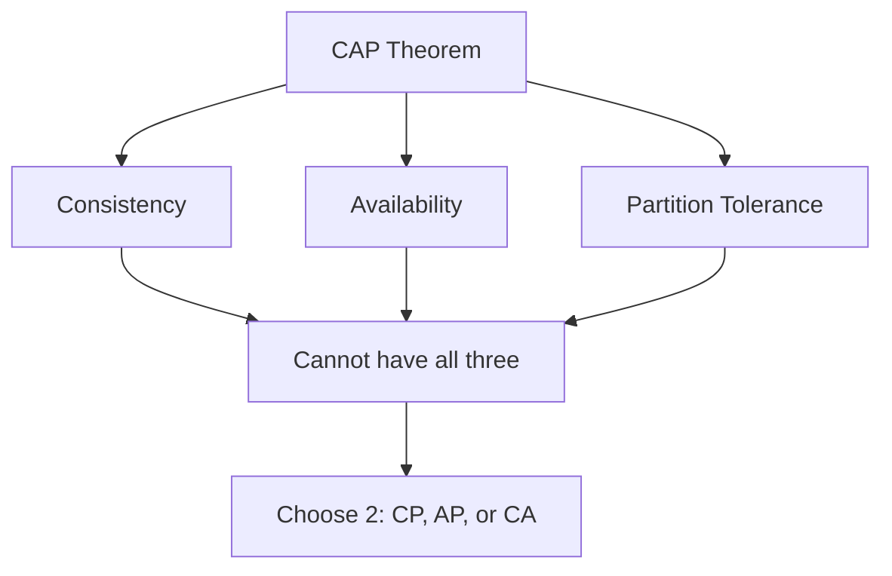

# CAP Theorem & Distributed Systems

## Overview

The CAP Theorem, formulated by Eric Brewer in 2000 and formally proven by Seth Gilbert and Nancy Lynch in 2002, states that in a distributed data store, it is impossible to simultaneously guarantee all three of the following properties: **Consistency**, **Availability**, and **Partition Tolerance**. This theorem highlights the fundamental trade-offs in designing distributed systems, where network partitions are inevitable.

In essence, when a network partition occurs, a system must choose between maintaining consistency (all nodes see the same data) or availability (every request receives a response). Partition tolerance is a given in distributed systems over asynchronous networks.

## Detailed Explanation

### The Three Properties

- **Consistency (C)**: Every read receives the most recent write or an error. In CAP terms, this refers to linearizability, ensuring that operations appear to occur in a single, global order. Note that this differs from ACID consistency, which pertains to transaction isolation.

- **Availability (A)**: Every request to a non-failing node must result in a response. This does not imply low latency; responses can be slow but must be provided.

- **Partition Tolerance (P)**: The system continues to operate despite network partitions, where messages between nodes may be lost or delayed.

### The Theorem's Implication

The CAP Theorem asserts that in the presence of a network partition (which is unavoidable in distributed systems), you can achieve at most two out of the three properties. This leads to three possible system designs:

1. **CP (Consistent + Partition Tolerant)**: Sacrifices availability during partitions to maintain consistency. Examples include traditional RDBMS with synchronous replication.

2. **AP (Available + Partition Tolerant)**: Sacrifices consistency during partitions to ensure responses. Examples include NoSQL databases like Cassandra or DynamoDB.

3. **CA (Consistent + Available)**: Assumes no partitions, which is unrealistic for distributed systems over networks.



### Criticisms and Refinements

Martin Kleppmann argues that the CAP Theorem is often misused. The strict definitions (e.g., linearizability for consistency) don't apply to many systems, and labeling databases as "CP" or "AP" oversimplifies complex trade-offs. The PACELC Theorem extends CAP by considering latency vs. consistency even without partitions: if Partition (P) occurs, trade-off between Availability (A) and Consistency (C); Else (E), trade-off between Latency (L) and Consistency (C).

## Real-world Examples & Use Cases

### Database Systems

| Database | CAP Classification | Explanation | Use Case |
|----------|-------------------|-------------|----------|
| PostgreSQL (single-leader) | CP | Synchronous replication ensures consistency; unavailable during partitions. | Financial systems requiring strong consistency. |
| Cassandra | AP | Prioritizes availability; eventual consistency via tunable quorums. | High-traffic apps like social media. |
| MongoDB | AP (with caveats) | Allows stale reads; not strictly linearizable. | Content management systems. |
| ZooKeeper | CP (with options) | Uses consensus for consistency; read-only mode adds availability. | Coordination services in distributed apps. |
| DynamoDB | AP | Designed for high availability; uses eventual consistency. | E-commerce platforms. |

### System Design Scenarios

- **Banking Systems**: Choose CP to prevent inconsistent account balances during network issues.
- **Social Networks**: Opt for AP to ensure users can always post, accepting temporary inconsistencies.
- **IoT Networks**: In intermittently connected environments, AP systems allow devices to operate offline and sync later.

## Code Examples

### Java Example: Simulating CAP Trade-offs with ZooKeeper

ZooKeeper exemplifies CP behavior. Below is a simple Java client using Apache Curator to interact with ZooKeeper, demonstrating consistency guarantees.

```java
import org.apache.curator.framework.CuratorFramework;
import org.apache.curator.framework.CuratorFrameworkFactory;
import org.apache.curator.retry.ExponentialBackoffRetry;

public class ZooKeeperExample {
    public static void main(String[] args) throws Exception {
        CuratorFramework client = CuratorFrameworkFactory.newClient(
            "localhost:2181",
            new ExponentialBackoffRetry(1000, 3)
        );
        client.start();

        // Create a znode
        client.create().forPath("/example", "data".getBytes());

        // Read with sync for linearizability
        client.sync().forPath("/example");
        byte[] data = client.getData().forPath("/example");
        System.out.println("Data: " + new String(data));

        client.close();
    }
}
```

This code ensures reads are consistent by using `sync()`, but during partitions, writes may block (CP behavior).

### Python Example: Eventual Consistency in Cassandra

Using the Cassandra Python driver to demonstrate AP trade-offs.

```python
from cassandra.cluster import Cluster

cluster = Cluster(['127.0.0.1'])
session = cluster.connect('keyspace')

# Insert data
session.execute("INSERT INTO table (id, value) VALUES (1, 'initial')")

# Read with eventual consistency
rows = session.execute("SELECT * FROM table WHERE id=1")
for row in rows:
    print(row.value)  # May not reflect latest write during partitions

cluster.shutdown()
```

Here, reads may return stale data to maintain availability.

## Common Pitfalls & Edge Cases

- **Mislabeling Systems**: Many databases don't fit neatly into CP/AP; e.g., PostgreSQL with async replication isn't strictly CP.
- **Latency vs. Availability**: CAP availability allows slow responses, but users perceive slow systems as unavailable.
- **Network Assumptions**: CAP assumes asynchronous networks; private fibers can minimize partitions but don't eliminate them.
- **Edge Case: Split-Brain**: In leader-based systems, multiple leaders can emerge, violating consistency.
- **Tunable Consistency**: Systems like Cassandra allow adjusting R/W quorums, but this can lead to non-linearizable behavior in edge cases.

## Tools & Libraries

- **ZooKeeper**: For CP coordination; provides strong consistency.
- **etcd**: Similar to ZooKeeper, used in Kubernetes for configuration.
- **Consul**: Service discovery with tunable consistency.
- **Cassandra**: AP database for high availability.
- **Riak**: AP key-value store with conflict resolution.
- **Apache Kafka**: Eventual consistency for streaming; AP in practice.

## References

- [CAP Theorem - Wikipedia](https://en.wikipedia.org/wiki/CAP_theorem)
- [Brewer's Original PODC Keynote (PDF)](https://www.brewer.org/cs262b-2004/PODC-keynote.pdf)
- [Please Stop Calling Databases CP or AP - Martin Kleppmann](https://martin.kleppmann.com/2015/05/11/please-stop-calling-databases-cp-or-ap.html)
- [A Critique of the CAP Theorem - Martin Kleppmann (arXiv)](https://arxiv.org/abs/1509.05393)
- [PACELC Theorem - Daniel Abadi](http://dbmsmusings.blogspot.com/2010/04/problems-with-cap-and-yahoos-little.html)
- [Designing Data-Intensive Applications - Martin Kleppmann (Book)](https://dataintensive.net/)

## Github-README Links & Related Topics

- [Distributed Consensus](../distributed-consensus/)
- [Database ACID Properties](../database-acid-properties/)
- [Eventual Consistency](../eventual-consistency/)
- [Fault Tolerance in Distributed Systems](../fault-tolerance-in-distributed-systems/)
- [Consensus Algorithms Overview](../consensus-algorithms-overview/)
- [Paxos Algorithm](../paxos-algorithm/)
- [Two-Phase Commit](../two-phase-commit/)