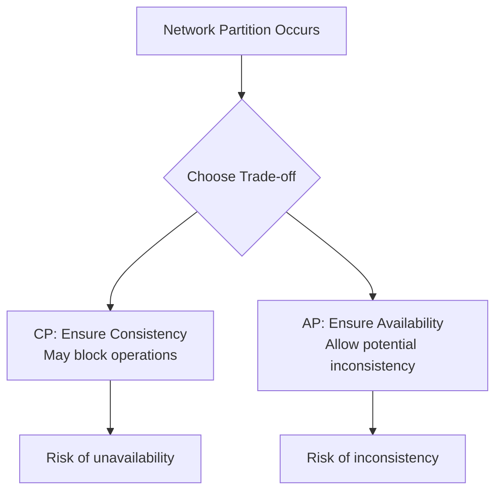

# Overview

The CAP Theorem, proposed by Eric Brewer in 2000 and formally proven by Seth Gilbert and Nancy Lynch in 2002, states that it is impossible for a distributed data store to simultaneously provide more than two out of the following three guarantees: **Consistency (C)**, **Availability (A)**, and **Partition Tolerance (P)**. Distributed systems consist of multiple independent computers that communicate over a network to appear as a single coherent system. This theorem is fundamental for designing scalable, fault-tolerant systems, as it highlights the trade-offs engineers must make based on application requirements, such as prioritizing consistency in financial transactions or availability in social media platforms.

In practice, network partitions are inevitable in large-scale distributed systems due to factors like hardware failures, network congestion, or geographic distribution. The CAP Theorem guides architects to choose between CP (consistency with partition tolerance) or AP (availability with partition tolerance) systems, while CA systems are only feasible in environments without partitions.

# Detailed Explanation

## CAP Theorem Components

- **Consistency (C)**: Every read receives the most recent write or an error. All nodes in the system reflect the same data simultaneously, ensuring linearizability where operations appear in a global order. Note that this differs from ACID consistency in databases.
- **Availability (A)**: Every request to a non-failing node receives a response, even if it's not the latest data. The system remains operational, prioritizing responsiveness over data freshness.
- **Partition Tolerance (P)**: The system continues to function despite network partitions, where messages between nodes may be lost or delayed. This is essential for distributed systems spanning multiple data centers.

The theorem asserts that in the presence of a network partition (P), you cannot achieve both C and A simultaneously. You must choose: CP systems sacrifice availability to maintain consistency, while AP systems sacrifice consistency for availability. CA systems exist only when partitions are absent.

## Trade-offs in CAP

| Combination | Description | Examples | Trade-offs |
|-------------|-------------|----------|------------|
| CP | Consistency + Partition Tolerance | ZooKeeper, etcd, HBase | May reject requests during partitions for consistency; potential latency increases. |
| AP | Availability + Partition Tolerance | Cassandra, DynamoDB, Riak | Allows stale reads; requires conflict resolution mechanisms like eventual consistency. |
| CA | Consistency + Availability | Single-node RDBMS | Assumes no partitions; not suitable for distributed environments. |



## Related Concepts

- **Eventual Consistency**: A weak consistency model where updates propagate asynchronously, and replicas converge over time without strict guarantees on timing.
- **ACID vs. BASE**:
  - ACID: Atomicity, Consistency, Isolation, Durability – strong transactional guarantees.
  - BASE: Basically Available, Soft state, Eventually consistent – favors availability and scalability.
- **Consensus Algorithms**: Protocols like Paxos or Raft ensure agreement on values despite failures.
- **Quorum Systems**: Require a majority of nodes for operations to guarantee consistency.
- **PACELC Theorem**: Extends CAP by adding latency (L) vs. consistency trade-offs when no partition exists (E for Else).

# Real-world Examples & Use Cases

## Banking and Financial Systems
- **Use Case**: Transactions require strong consistency to prevent issues like double-spending or inaccurate balances.
- **CAP Choice**: CP – Employs quorum-based consensus to maintain consistency during partitions.
- **Example**: Visa's payment network uses distributed ledgers with CP guarantees, accepting brief outages for data accuracy.

## Social Media Platforms (e.g., Twitter, Facebook)
- **Use Case**: High availability for posting and viewing content by millions of users.
- **CAP Choice**: AP – Feeds may show outdated posts, but the system stays responsive.
- **Example**: Facebook's TAO system leverages eventual consistency for social graphs, tolerating stale data during network issues.

## E-commerce Platforms (e.g., Amazon, eBay)
- **Use Case**: Product availability and shopping carts need high uptime, with inventory eventually consistent.
- **CAP Choice**: AP – Prioritizes availability; uses conflict resolution like last-write-wins.
- **Example**: Amazon DynamoDB handles peak loads with AP trade-offs, ensuring cart persistence despite partitions.

## Content Delivery Networks (CDNs)
- **Use Case**: Global content serving with low latency.
- **CAP Choice**: AP – Edge nodes serve cached, potentially stale content during partitions.
- **Example**: Akamai's CDN relies on eventual consistency for DNS propagation.

## File Storage Systems (e.g., Dropbox, Google Drive)
- **Use Case**: File synchronization across devices with conflict handling.
- **CAP Choice**: Hybrid – CP for metadata (e.g., file ownership), AP for content.
- **Example**: Dropbox uses vector clocks for eventual consistency in file versioning.

# Code Examples

## AP System: Eventual Consistency Counter in Python

```python
import threading
import time

class EventualCounter:
    def __init__(self, nodes=3):
        self.nodes = [0] * nodes
        self.lock = threading.Lock()

    def increment(self):
        with self.lock:
            for i in range(len(self.nodes)):
                self.nodes[i] += 1
        threading.Thread(target=self._propagate).start()

    def _propagate(self):
        time.sleep(1)  # Simulate delay
        with self.lock:
            max_val = max(self.nodes)
            for i in range(len(self.nodes)):
                self.nodes[i] = max_val

    def get_value(self):
        with self.lock:
            return self.nodes[0]  # May return stale value

counter = EventualCounter()
counter.increment()
time.sleep(2)
print(counter.get_value())  # Eventually consistent
```

## CP System: Quorum Read/Write in Java

```java
import java.util.List;
import java.util.ArrayList;

class QuorumNode {
    private int value = 0;
    private List<QuorumNode> peers;

    public QuorumNode(List<QuorumNode> peers) {
        this.peers = peers;
    }

    public void write(int newValue) throws Exception {
        int quorum = peers.size() / 2 + 1;
        int success = 0;
        for (QuorumNode peer : peers) {
            peer.value = newValue;
            success++;
        }
        if (success < quorum) throw new Exception("Quorum failed");
        this.value = newValue;
    }

    public int read() throws Exception {
        List<Integer> values = new ArrayList<>();
        for (QuorumNode peer : peers) {
            values.add(peer.value);
        }
        return values.get(values.size() / 2);  // Majority value
    }
}

List<QuorumNode> nodes = new ArrayList<>();
for (int i = 0; i < 5; i++) nodes.add(new QuorumNode(nodes));
QuorumNode node = nodes.get(0);
node.write(42);
System.out.println(node.read());  // 42
```

## Raft Consensus Snippet in Go

```go
package main

import (
    "fmt"
    "sync"
    "time"
)

type RaftNode struct {
    mu       sync.Mutex
    term     int
    isLeader bool
    peers    []string
}

func (r *RaftNode) RequestVote() {
    r.mu.Lock()
    defer r.mu.Unlock()
    r.term++
    votes := 0
    for _, peer := range r.peers {
        if simulateVote(peer) {
            votes++
        }
    }
    if votes > len(r.peers)/2 {
        r.isLeader = true
        fmt.Println("Leader elected")
    }
}

func simulateVote(peer string) bool { return true }

func main() {
    node := &RaftNode{peers: []string{"p1", "p2"}}
    node.RequestVote()
}
```

# References

- [CAP Theorem - Wikipedia](https://en.wikipedia.org/wiki/CAP_theorem)
- [Brewer's Conjecture and the Feasibility of Consistent, Available, Partition-Tolerant Web Services](https://dl.acm.org/doi/10.1145/564585.564601) by Seth Gilbert and Nancy Lynch
- [Towards Robust Distributed Systems](https://sites.cs.ucsb.edu/~rich/class/cs293b-cloud/papers/Brewer_podc_keynote_2000.pdf) by Eric Brewer
- [Distributed Systems for Fun and Profit](http://book.mixu.net/distsys/)
- [Designing Data-Intensive Applications](https://dataintensive.net/) by Martin Kleppmann
- [Paxos Made Simple](https://lamport.azurewebsites.net/pubs/paxos-simple.pdf) by Leslie Lamport
- [Raft Consensus Algorithm](https://raft.github.io/)

# Github-README Links & Related Topics

- [Consensus Algorithms](../consensus-algorithms/)
- [Distributed Caching with Redis](../distributed-caching-with-redis/)
- [Fault Tolerance in Distributed Systems](../fault-tolerance-in-distributed-systems/)
- [Database Replication Strategies](../database-replication-strategies/)
- [Eventual Consistency](../eventual-consistency/)