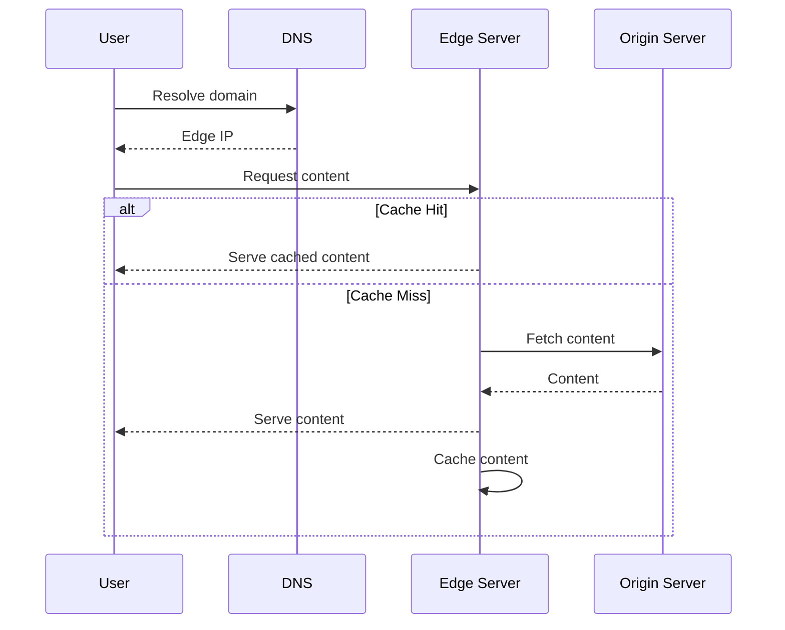

# CDN Architecture

## Overview

A Content Delivery Network (CDN) is a distributed network of servers that deliver web content to users based on their geographic location. It caches static and dynamic content closer to users, reducing latency and improving performance.

## Detailed Explanation

- **Edge Servers**: Servers at the network edge, closest to users.
- **Origin Server**: The main server hosting the content.
- **Caching**: Store copies of content at edges.
- **Routing**: DNS-based or anycast routing to nearest edge.
- **Purging**: Invalidate cached content when updated.
- **Benefits**: Faster load times, reduced bandwidth on origin, DDoS protection.
- **Challenges**: Cost, cache consistency, dynamic content handling.

## Journey / Sequence



## Data Models / Message Formats

### Cache Entry
```json
{
  "key": "/static/image.jpg",
  "value": "binary data",
  "ttl": 3600,
  "headers": {
    "Content-Type": "image/jpeg",
    "Cache-Control": "max-age=3600"
  }
}
```

## Real-world Examples & Use Cases

- **Video Streaming**: Netflix uses CDN for global distribution.
- **Static Assets**: Images, CSS, JS for websites.
- **Software Downloads**: Distribute updates efficiently.
- **E-commerce**: Product images and pages.
- **Live Events**: Streaming broadcasts.

## Code Examples

### Simple CDN Caching Logic (Pseudocode)

```java
class CDNCache {
    Map<String, CacheEntry> cache = new ConcurrentHashMap<>();

    public byte[] get(String key) {
        CacheEntry entry = cache.get(key);
        if (entry != null && !entry.isExpired()) {
            return entry.data;
        }
        // Fetch from origin
        byte[] data = fetchFromOrigin(key);
        cache.put(key, new CacheEntry(data, System.currentTimeMillis() + 3600000));
        return data;
    }

    private byte[] fetchFromOrigin(String key) {
        // HTTP request to origin
        return httpClient.get("http://origin.com" + key);
    }
}

class CacheEntry {
    byte[] data;
    long expiry;

    CacheEntry(byte[] data, long expiry) {
        this.data = data;
        this.expiry = expiry;
    }

    boolean isExpired() {
        return System.currentTimeMillis() > expiry;
    }
}
```

## Common Pitfalls & Edge Cases

- **Cache Invalidation**: Stale content; use versioning or purging.
- **Dynamic Content**: Hard to cache; use edge computing.
- **Geo-blocking**: Restrict content by region.
- **Cost Optimization**: Balance edge storage vs. origin traffic.
- **Security**: Protect against cache poisoning.

## Tools & Libraries

- **Cloudflare**: Popular CDN provider.
- **Akamai**: Enterprise CDN.
- **AWS CloudFront**: Integrated with AWS.
- **Fastly**: Programmable CDN.

## References

- [What is a CDN? - Cloudflare](https://www.cloudflare.com/learning/cdn/what-is-a-cdn/)
- [CDN Architecture - Akamai](https://www.akamai.com/us/en/resources/what-is-cdn.jsp)
- [RFC 7234 - HTTP Caching](https://tools.ietf.org/html/rfc7234)

## Github-README Links & Related Topics

- [Load Balancing and Strategies](../load-balancing-and-strategies/README.md)
- [Caching](../caching/README.md)
- [Latency and Throughput](../latency-and-throughput/README.md)