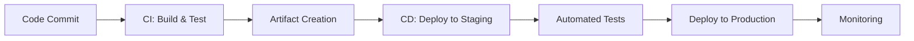

## Overview

CI/CD (Continuous Integration/Continuous Deployment) best practices ensure fast, reliable, and secure software delivery. They involve automating build, test, and deployment processes to reduce errors and improve collaboration.

## Detailed Explanation

### CI Principles
- Frequent commits and automated builds.
- Automated testing (unit, integration, e2e).
- Fast feedback loops.

### CD Principles
- Automated deployments to staging/production.
- Infrastructure as Code (IaC).
- Rollback strategies.

### Tools
- Jenkins, GitHub Actions, GitLab CI, CircleCI.



## Real-world Examples & Use Cases

- **Web Application**: Use GitHub Actions for automated testing and deployment on every PR.
- **Mobile App**: Jenkins pipeline for building, signing, and distributing iOS/Android apps.
- **Microservices**: GitLab CI for deploying services to Kubernetes with canary releases.

## Code Examples

### GitHub Actions Workflow
```yaml
name: CI/CD
on: [push]
jobs:
  build:
    runs-on: ubuntu-latest
    steps:
    - uses: actions/checkout@v2
    - name: Run tests
      run: npm test
    - name: Deploy
      run: ./deploy.sh
```

### Jenkins Pipeline
```groovy
pipeline {
    agent any
    stages {
        stage('Build') {
            steps {
                sh 'mvn clean compile'
            }
        }
        stage('Test') {
            steps {
                sh 'mvn test'
            }
        }
        stage('Deploy') {
            steps {
                sh './deploy.sh'
            }
        }
    }
}
```

## Common Pitfalls & Edge Cases

- **Flaky Tests**: Ensure tests are reliable.
- **Security**: Scan for vulnerabilities in dependencies.
- **Environment Differences**: Use consistent environments.

## Tools & Libraries

- Jenkins, GitHub Actions, GitLab CI, CircleCI, Travis CI.

## References

- [GitHub Actions Docs](https://docs.github.com/en/actions)
- [Jenkins Best Practices](https://www.jenkins.io/doc/book/pipeline/best-practices/)
- [CI/CD Guide](https://martinfowler.com/articles/continuousIntegration.html)

## Github-README Links & Related Topics

- [ci-cd-pipelines](../ci-cd-pipelines/README.md)
- [ci-cd-with-jenkins](../ci-cd-with-jenkins/README.md)
- [devops-infrastructure-as-code](../devops-infrastructure-as-code/README.md)