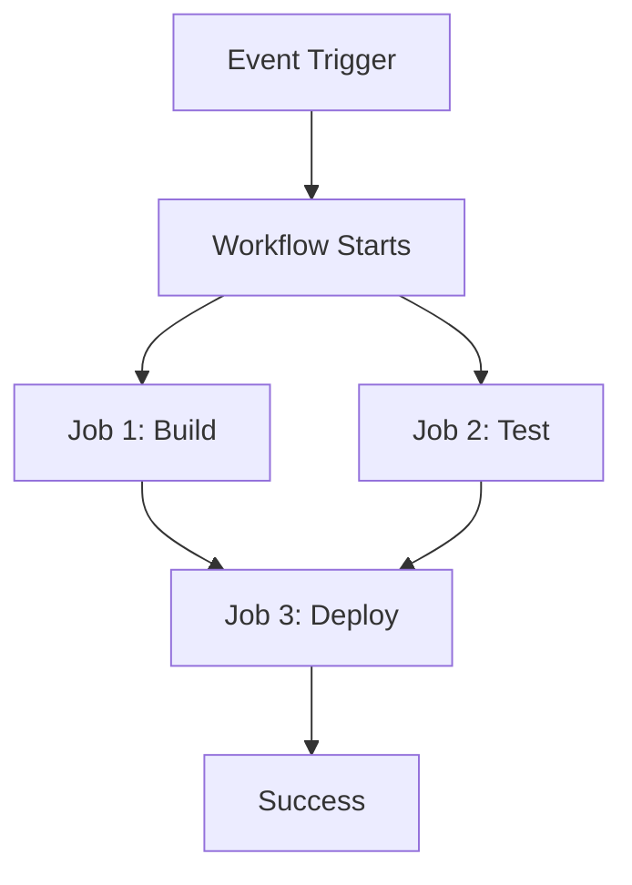

# CI/CD with GitHub Actions

## Overview

GitHub Actions is a powerful platform that automates software development workflows directly within GitHub repositories. It enables continuous integration (CI) and continuous deployment (CD) by allowing developers to build, test, and deploy code in response to events like pushes, pull requests, or scheduled times. This eliminates the need for external CI/CD tools for many projects.

## Detailed Explanation

GitHub Actions workflows are defined using YAML files stored in the `.github/workflows/` directory. A workflow consists of one or more jobs that run in parallel or sequentially. Each job executes on a runner, which can be GitHub-hosted (Ubuntu, Windows, macOS) or self-hosted.

Key components:
- **Triggers (on)**: Events that start the workflow, such as `push`, `pull_request`, `schedule`, or manual dispatch.
- **Jobs**: Independent units of work that can run on different operating systems or environments.
- **Steps**: Individual tasks within a job, including running shell commands or using pre-built actions.
- **Actions**: Reusable code snippets that perform common tasks, like checking out code or setting up Node.js.

Workflows support features like concurrency controls, artifact sharing between jobs, and integration with GitHub's security features.



## Real-world Examples & Use Cases

- **Automated Testing**: Run unit tests, integration tests, and linting on every pull request to ensure code quality.
- **Multi-Platform Builds**: Compile and test applications across different operating systems and Node.js versions.
- **Deployment Automation**: Automatically deploy to staging environments on merges to main branch, or to production on tag releases.
- **Package Publishing**: Build and publish npm packages, Docker images, or GitHub releases.
- **Security Scanning**: Integrate tools like CodeQL for vulnerability detection.

## Code Examples

### Basic CI Workflow for a Node.js Application

```yaml
name: CI

on:
  push:
    branches: [ main ]
  pull_request:
    branches: [ main ]

jobs:
  test:
    runs-on: ubuntu-latest
    steps:
      - name: Checkout code
        uses: actions/checkout@v4
      
      - name: Setup Node.js
        uses: actions/setup-node@v4
        with:
          node-version: '18'
          cache: 'npm'
      
      - name: Install dependencies
        run: npm ci
      
      - name: Run tests
        run: npm test
      
      - name: Build application
        run: npm run build
```

### Deployment Workflow with Environment Protection

```yaml
name: Deploy to Production

on:
  release:
    types: [published]

jobs:
  deploy:
    runs-on: ubuntu-latest
    environment: production
    steps:
      - name: Checkout code
        uses: actions/checkout@v4
      
      - name: Deploy to AWS
        uses: aws-actions/configure-aws-credentials@v4
        with:
          aws-access-key-id: ${{ secrets.AWS_ACCESS_KEY_ID }}
          aws-secret-access-key: ${{ secrets.AWS_SECRET_ACCESS_KEY }}
          aws-region: us-east-1
      
      - name: Deploy application
        run: |
          # Deployment commands here
          echo "Deploying to production..."
```

## Common Pitfalls & Edge Cases

- **Action Version Pinning**: Use specific versions (e.g., `actions/checkout@v4`) to avoid breaking changes from updates.
- **Secret Management**: Never log secrets; use encrypted secrets and environment variables.
- **Job Dependencies**: Ensure proper `needs` configuration to avoid race conditions in parallel jobs.
- **Resource Limits**: Free tier has limits; monitor usage to avoid throttling.
- **Self-Hosted Runners**: Secure them properly; they can access internal resources.
- **Large Repos**: Use shallow clones or caching to speed up checkouts.

## Tools & Libraries

| Category | Tool/Action | Description |
|----------|-------------|-------------|
| Checkout | `actions/checkout` | Clone repository with options for depth, submodules |
| Setup | `actions/setup-node`, `actions/setup-java` | Configure runtime environments |
| Build | `docker/build-push-action` | Build and push Docker images |
| Deploy | `aws-actions/configure-aws-credentials` | Authenticate with AWS for deployments |
| Test | `codecov/codecov-action` | Upload coverage reports |
| Security | `github/codeql-action` | Run CodeQL security scans |

## References

- [GitHub Actions Documentation](https://docs.github.com/en/actions)
- [Workflow Syntax Reference](https://docs.github.com/en/actions/reference/workflows-and-actions/workflow-syntax)
- [GitHub Actions Marketplace](https://github.com/marketplace?type=actions)

## Github-README Links & Related Topics

- [Continuous Integration with GitHub Actions](https://docs.github.com/en/actions/get-started/continuous-integration)
- [Continuous Deployment with GitHub Actions](https://docs.github.com/en/actions/get-started/continuous-deployment)
- [GitHub Actions Security](https://docs.github.com/en/actions/concepts/security)