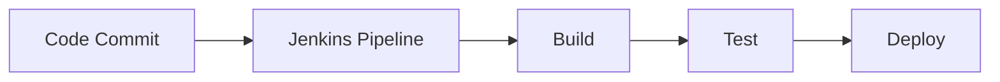

# Overview

Jenkins is an open-source automation server for continuous integration and continuous deployment (CI/CD), enabling automated building, testing, and deployment of software.

# Detailed Explanation

Jenkins uses pipelines (declarative or scripted) to define workflows. Integrates with Git, Docker, Kubernetes. Key features: plugins, agents, webhooks.

Stages: Source, Build, Test, Deploy.



# Real-world Examples & Use Cases

- Automating app builds and tests on code push.
- Deploying to staging/production environments.
- Integrating with cloud providers for scalable CI/CD.

# Code Examples

Jenkinsfile (Declarative Pipeline):

```groovy
pipeline {
    agent any
    stages {
        stage('Build') {
            steps {
                sh 'mvn clean compile'
            }
        }
        stage('Test') {
            steps {
                sh 'mvn test'
            }
        }
        stage('Deploy') {
            steps {
                sh 'kubectl apply -f deployment.yaml'
            }
        }
    }
}
```

# References

- [Jenkins Documentation](https://www.jenkins.io/doc/)
- [Jenkins Pipeline Syntax](https://www.jenkins.io/doc/book/pipeline/syntax/)

# Github-README Links & Related Topics

- [CI/CD Pipelines](./ci-cd-pipelines/README.md)
- [DevOps Infrastructure as Code](./devops-infrastructure-as-code/README.md)
- [Docker Containerization](./docker-containerization/README.md)