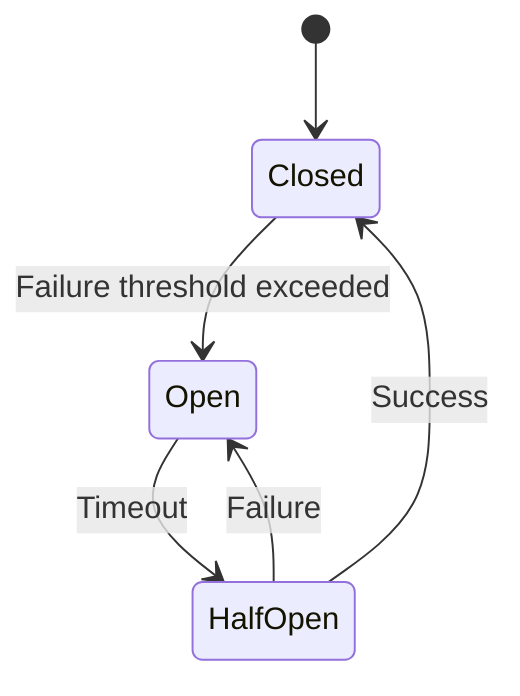

# Overview

The Circuit Breaker pattern prevents cascading failures in microservices architectures by monitoring service calls and failing fast when a downstream service is unavailable or responding slowly, allowing the system to degrade gracefully.

# Detailed Explanation

The pattern operates in three states:

- **Closed**: Normal operation, requests pass through.
- **Open**: Failure threshold exceeded, requests fail immediately without calling the service.
- **Half-Open**: Periodically allows requests to test if the service has recovered.

Benefits include improved resilience, faster failure detection, and prevention of resource exhaustion.

Implementation typically uses libraries like Hystrix, Resilience4j, or Polly.



# Real-world Examples & Use Cases

- E-commerce platforms preventing payment service failures from affecting the entire checkout process.
- API gateways protecting downstream microservices from overload.
- Financial systems isolating trading services during market volatility.

# Code Examples

```java
// Resilience4j example
CircuitBreaker circuitBreaker = CircuitBreaker.ofDefaults("backendService");

Supplier<String> decoratedSupplier = CircuitBreaker.decorateSupplier(circuitBreaker, () -> callBackendService());

String result = Try.ofSupplier(decoratedSupplier)
    .recover(throwable -> "Recovered: " + throwable.getMessage())
    .get();
```

```python
# Python with circuitbreaker library
from circuitbreaker import circuit

@circuit(failure_threshold=5, recovery_timeout=60)
def call_service():
    # Service call logic
    pass
```

# References

- [Circuit Breaker Pattern](https://microservices.io/patterns/reliability/circuit-breaker.html)
- [Resilience4j](https://resilience4j.readme.io/docs/circuitbreaker)

# Github-README Links & Related Topics

- [Fault Tolerance Patterns](./fault-tolerance-patterns/README.md)
- [Microservices Architecture](./microservices-architecture/README.md)
- [Circuit Breaker Pattern](./circuit-breaker-pattern/README.md)