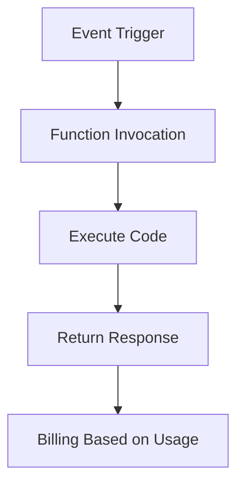

# Serverless Architecture

## Overview

Serverless architecture allows developers to build and run applications without managing servers. The cloud provider handles infrastructure, scaling, and maintenance, enabling focus on code.

## Detailed Explanation

In serverless, functions run in response to events. Key components:
- **Functions as a Service (FaaS)**: AWS Lambda, Google Cloud Functions.
- **Backend as a Service (BaaS)**: Firebase, Auth0.
- Billing based on execution time and resources used.

Benefits: Cost-effective, auto-scaling, reduced operational overhead.

Challenges: Cold starts, vendor lock-in, debugging complexity.

## Real-world Examples & Use Cases

- **API Backends**: RESTful APIs triggered by HTTP requests.
- **Data Processing**: Image resizing on upload.
- **Chatbots**: Processing user messages via webhooks.
- **IoT**: Event-driven data ingestion.

## Code Examples

### AWS Lambda with Node.js

```javascript
exports.handler = async (event) => {
    console.log('Event:', JSON.stringify(event, null, 2));
    return {
        statusCode: 200,
        body: JSON.stringify('Hello from Lambda!'),
    };
};
```

### Google Cloud Functions with Python

```python
def hello_world(request):
    return 'Hello, World!'
```

## Journey / Sequence



## Common Pitfalls & Edge Cases

- **Cold Starts**: Latency on first invocation.
- **Timeout Limits**: Functions have execution time limits.
- **State Management**: Stateless by design; use external storage.
- **Security**: Secure function permissions.

## Tools & Libraries

- AWS Lambda
- Google Cloud Functions
- Azure Functions
- Serverless Framework

## References

- [AWS Lambda Documentation](https://docs.aws.amazon.com/lambda/)
- [Google Cloud Functions](https://cloud.google.com/functions/docs)

## Github-README Links & Related Topics

- [Microservices Architecture](./microservices-architecture/README.md)
- [Event-Driven Systems](./event-driven-systems/README.md)
- [DevOps & Infrastructure as Code](./devops-infrastructure-as-code/README.md)