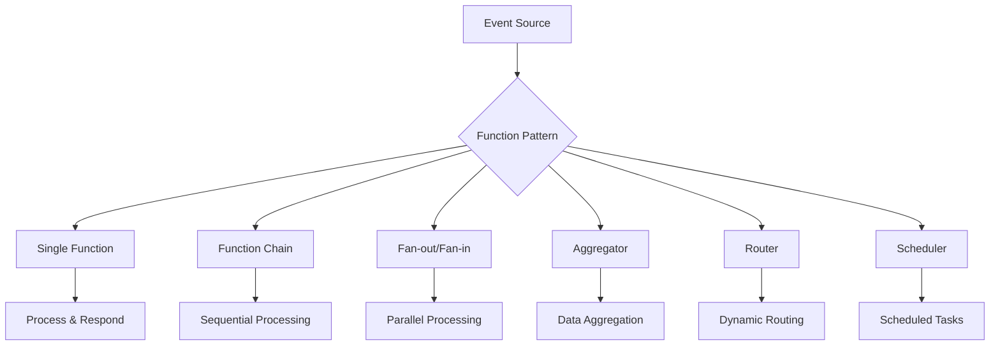

# Serverless Function Patterns

## Overview

Serverless Function Patterns are architectural approaches and best practices for designing, implementing, and orchestrating serverless functions in cloud-native applications. These patterns address common challenges like state management, error handling, performance optimization, and integration with other services in serverless environments.



## Detailed Explanation

### Core Patterns

1. **Single Function Pattern**: Simple request-response functions handling individual operations
2. **Function Chain Pattern**: Sequential execution of multiple functions for complex workflows
3. **Fan-out/Fan-in Pattern**: Parallel processing with aggregation of results
4. **Aggregator Pattern**: Collecting and processing data from multiple sources
5. **Router Pattern**: Dynamic routing based on request characteristics
6. **Scheduler Pattern**: Time-based function execution
7. **Saga Pattern**: Managing distributed transactions across functions

### Key Considerations

- **Statelessness**: Functions should be stateless to enable horizontal scaling
- **Idempotency**: Ensure functions can be safely retried
- **Cold Starts**: Optimize for initialization performance
- **Resource Limits**: Understand memory, time, and concurrency constraints
- **Event-Driven**: Design for asynchronous processing where possible
- **Cost Optimization**: Minimize execution time and resource usage

### Serverless Platforms

- **AWS Lambda**: Function as a Service with rich ecosystem
- **Google Cloud Functions**: Event-driven serverless compute
- **Azure Functions**: Serverless functions with bindings
- **Vercel/ Netlify Functions**: Frontend-focused serverless

## Real-world Examples & Use Cases

### E-commerce Order Processing

```javascript
// AWS Lambda - Order Processing Chain
// Function 1: Validate Order
exports.validateOrder = async (event) => {
    const order = JSON.parse(event.body);

    // Validate order data
    if (!order.items || order.items.length === 0) {
        return {
            statusCode: 400,
            body: JSON.stringify({ error: 'Order must contain items' })
        };
    }

    // Pass to next function
    return {
        statusCode: 200,
        body: JSON.stringify(order)
    };
};

// Function 2: Process Payment
exports.processPayment = async (event) => {
    const order = JSON.parse(event.body);

    try {
        // Integrate with payment provider
        const paymentResult = await processStripePayment(order);

        return {
            statusCode: 200,
            body: JSON.stringify({
                ...order,
                paymentId: paymentResult.id,
                status: 'paid'
            })
        };
    } catch (error) {
        // Handle payment failure
        await notifyCustomer(order, 'payment_failed');
        throw error;
    }
};

// Function 3: Update Inventory
exports.updateInventory = async (event) => {
    const order = JSON.parse(event.body);

    for (const item of order.items) {
        await decrementInventory(item.productId, item.quantity);
    }

    return {
        statusCode: 200,
        body: JSON.stringify({
            ...order,
            status: 'fulfilled'
        })
    };
};
```

### Image Processing Pipeline

```python
# Google Cloud Functions - Fan-out/Fan-in Pattern
import json
from google.cloud import pubsub_v1
from google.cloud import storage

publisher = pubsub_v1.PublisherClient()
storage_client = storage.Client()

def process_images(event, context):
    """Triggered by upload to Cloud Storage bucket."""
    bucket_name = event['bucket']
    file_name = event['name']

    # Download image
    bucket = storage_client.bucket(bucket_name)
    blob = bucket.blob(file_name)
    image_data = blob.download_as_bytes()

    # Fan-out: Create multiple processing tasks
    tasks = [
        {'operation': 'resize', 'sizes': ['thumbnail', 'medium', 'large']},
        {'operation': 'optimize', 'format': 'webp'},
        {'operation': 'extract_metadata'}
    ]

    # Publish tasks to Pub/Sub
    topic_path = publisher.topic_path('project-id', 'image-processing-tasks')

    for task in tasks:
        message = {
            'image_path': f'gs://{bucket_name}/{file_name}',
            'task': task
        }
        publisher.publish(topic_path, json.dumps(message).encode('utf-8'))

def process_image_task(event, context):
    """Process individual image tasks."""
    message = json.loads(event['data'])
    image_path = message['image_path']
    task = message['task']

    # Process based on task type
    if task['operation'] == 'resize':
        resize_image(image_path, task['sizes'])
    elif task['operation'] == 'optimize':
        optimize_image(image_path, task['format'])
    elif task['operation'] == 'extract_metadata':
        extract_metadata(image_path)

    # Publish completion event
    completion_topic = publisher.topic_path('project-id', 'processing-complete')
    publisher.publish(completion_topic, json.dumps({
        'task_id': context.event_id,
        'status': 'completed'
    }).encode('utf-8'))

def aggregate_results(event, context):
    """Aggregate processing results."""
    # Collect results from all tasks
    # Update database with processed image URLs
    # Send notification to user
    pass
```

### API Gateway Integration

```typescript
// Azure Functions - Router Pattern
import { AzureFunction, Context, HttpRequest } from "@azure/functions"

const httpTrigger: AzureFunction = async function (context: Context, req: HttpRequest): Promise<void> {
    const route = req.params.route;

    switch (route) {
        case 'users':
            await handleUsers(context, req);
            break;
        case 'products':
            await handleProducts(context, req);
            break;
        case 'orders':
            await handleOrders(context, req);
            break;
        default:
            context.res = {
                status: 404,
                body: { error: 'Route not found' }
            };
    }
};

async function handleUsers(context: Context, req: HttpRequest) {
    // User management logic
    const users = await getUsersFromDatabase();
    context.res = {
        status: 200,
        body: users
    };
}

async function handleProducts(context: Context, req: HttpRequest) {
    // Product management logic
    const products = await getProductsFromDatabase();
    context.res = {
        status: 200,
        body: products
    };
}

async function handleOrders(context: Context, req: HttpRequest) {
    // Order management logic
    const orders = await getOrdersFromDatabase();
    context.res = {
        status: 200,
        body: orders
    };
}

export default httpTrigger;
```

## Code Examples

### Saga Pattern for Distributed Transactions

```javascript
// AWS Step Functions - Saga Orchestration
const AWS = require('aws-sdk');
const stepfunctions = new AWS.StepFunctions();

class OrderSaga {
    constructor(orderId) {
        this.orderId = orderId;
        this.state = 'pending';
    }

    async startSaga() {
        const params = {
            stateMachineArn: process.env.SAGA_STATE_MACHINE_ARN,
            input: JSON.stringify({
                orderId: this.orderId,
                sagaType: 'order_processing'
            })
        };

        try {
            const result = await stepfunctions.startExecution(params).promise();
            this.executionArn = result.executionArn;
            return result;
        } catch (error) {
            console.error('Failed to start saga:', error);
            throw error;
        }
    }
}

// Lambda function for saga steps
exports.reserveInventory = async (event) => {
    const { orderId, items } = event;

    try {
        // Reserve inventory
        for (const item of items) {
            await reserveItem(item.productId, item.quantity);
        }

        return {
            status: 'inventory_reserved',
            orderId,
            reservedItems: items
        };
    } catch (error) {
        // Compensating action: release any reserved inventory
        await releaseReservedInventory(orderId);
        throw new Error('Inventory reservation failed');
    }
};

exports.processPayment = async (event) => {
    const { orderId, amount, paymentMethod } = event;

    try {
        const paymentResult = await processPayment(amount, paymentMethod);

        return {
            status: 'payment_processed',
            orderId,
            paymentId: paymentResult.id
        };
    } catch (error) {
        // Compensating action: refund payment if processed
        if (paymentResult) {
            await refundPayment(paymentResult.id);
        }
        throw new Error('Payment processing failed');
    }
};
```

### Event-Driven Function with Dead Letter Queue

```python
# AWS Lambda with SQS DLQ
import json
import boto3
from botocore.exceptions import ClientError

sqs = boto3.client('sqs')
dynamodb = boto3.resource('dynamodb')

def lambda_handler(event, context):
    for record in event['Records']:
        try:
            message_body = json.loads(record['body'])
            process_message(message_body)

        except Exception as e:
            print(f"Error processing message: {e}")

            # Send to DLQ
            dlq_url = os.environ['DEAD_LETTER_QUEUE_URL']
            sqs.send_message(
                QueueUrl=dlq_url,
                MessageBody=json.dumps({
                    'originalMessage': record['body'],
                    'error': str(e),
                    'timestamp': str(datetime.now())
                })
            )

            # Don't re-raise exception to avoid infinite retries
            continue

def process_message(message):
    # Business logic here
    table = dynamodb.Table('ProcessedMessages')
    table.put_item(Item=message)
```

### Function Optimization for Cold Starts

```java
// AWS Lambda - Provisioned Concurrency Optimization
public class OptimizedFunction implements RequestHandler<Map<String, Object>, String> {

    // Static initialization for cold start optimization
    private static final ObjectMapper objectMapper = new ObjectMapper();
    private static final DynamoDbClient dynamoDbClient;

    static {
        // Initialize expensive resources during cold start
        dynamoDbClient = DynamoDbClient.builder()
            .region(Region.US_EAST_1)
            .build();
    }

    @Override
    public String handleRequest(Map<String, Object> input, Context context) {
        try {
            // Use pre-initialized resources
            String userId = (String) input.get("userId");

            // Fetch user data
            Map<String, AttributeValue> key = Map.of("userId", AttributeValue.builder().s(userId).build());
            GetItemResponse response = dynamoDbClient.getItem(GetItemRequest.builder()
                .tableName("Users")
                .key(key)
                .build());

            if (response.item() == null) {
                return "User not found";
            }

            // Process user data
            User user = objectMapper.convertValue(response.item(), User.class);

            return "Processed user: " + user.getName();

        } catch (Exception e) {
            context.getLogger().log("Error: " + e.getMessage());
            throw new RuntimeException(e);
        }
    }
}
```

## Common Pitfalls & Edge Cases

- **Cold Start Latency**: Optimize initialization and use provisioned concurrency
- **Execution Time Limits**: Design functions to complete within platform limits
- **State Management**: Avoid storing state in function instances
- **Error Handling**: Implement proper retry and dead letter queue strategies
- **Security**: Secure function invocations and manage IAM permissions
- **Cost Monitoring**: Track function execution costs and optimize resource usage
- **Testing**: Test functions in isolation and with realistic event payloads
- **Versioning**: Manage function versions and rollbacks carefully

## Tools & Libraries

- **AWS SAM/CloudFormation**: Infrastructure as code for serverless
- **Serverless Framework**: Multi-cloud serverless deployment
- **AWS Lambda Powertools**: Utilities for Lambda functions
- **Azure Durable Functions**: Orchestration for Azure Functions
- **Google Cloud Workflows**: Workflow orchestration
- **Step Functions**: AWS visual workflow service
- **EventBridge**: AWS event bus for serverless

## References

- [AWS Lambda Best Practices](https://docs.aws.amazon.com/lambda/latest/dg/best-practices.html)
- [Google Cloud Functions Documentation](https://cloud.google.com/functions/docs)
- [Azure Functions Documentation](https://docs.microsoft.com/en-us/azure/azure-functions/)
- [Serverless Framework Documentation](https://www.serverless.com/framework/docs/)
- [AWS Step Functions Developer Guide](https://docs.aws.amazon.com/step-functions/)

## Github-README Links & Related Topics

- [Serverless Architecture](../serverless-architecture/README.md)
- [Serverless Architecture Patterns](../serverless-architecture-patterns/README.md)
- [Serverless Function Optimization](../serverless-function-optimization/README.md)
- [Serverless Functions](../serverless-functions/README.md)
- [AWS Lambda and Serverless Computing](../aws-lambda-and-serverless-computing/README.md)
- [Event-Driven Architecture](../event-driven-architecture/README.md)
