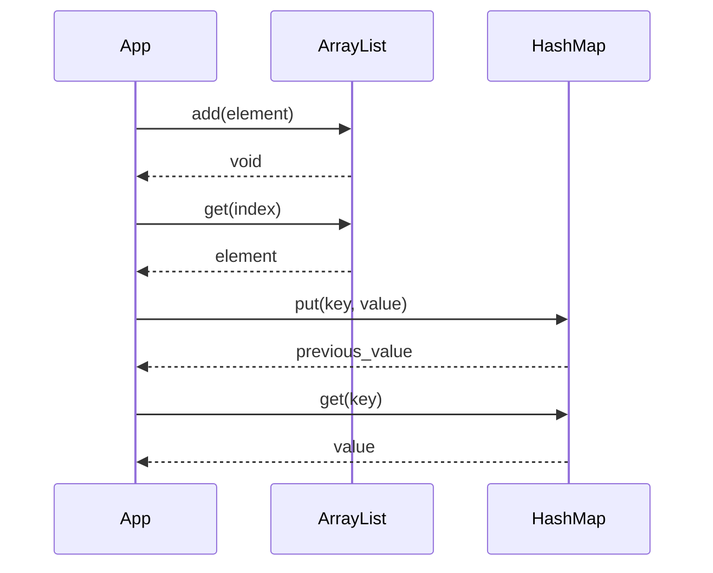
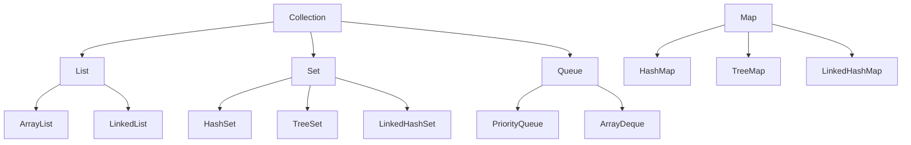

# Collections & Data Structures

## Overview
Collections and data structures in Java are essential for organizing and manipulating data efficiently. The Java Collections Framework provides interfaces and implementations for common data structures like lists, sets, maps, and queues, each optimized for specific use cases with varying time and space complexities.

## Detailed Explanation
The Collections Framework is built around interfaces (List, Set, Map, Queue) with multiple implementations offering different trade-offs.

### Core Interfaces and Implementations
- **List:** Ordered collection allowing duplicates.
  - ArrayList: Resizable array, fast random access.
  - LinkedList: Doubly-linked list, fast insertions/deletions.
  - Vector: Synchronized ArrayList (legacy).
- **Set:** Unordered collection of unique elements.
  - HashSet: Hash table, fast operations.
  - LinkedHashSet: Maintains insertion order.
  - TreeSet: Red-black tree, sorted order.
- **Map:** Key-value pairs.
  - HashMap: Hash table, fast lookups.
  - LinkedHashMap: Maintains insertion order.
  - TreeMap: Red-black tree, sorted keys.
  - Hashtable: Synchronized HashMap (legacy).
- **Queue/Deque:** FIFO/LIFO structures.
  - PriorityQueue: Heap-based, priority ordering.
  - ArrayDeque: Resizable array deque.

### Time Complexities
| Structure | Access | Insert | Delete | Search | Space |
|-----------|--------|--------|--------|--------|-------|
| ArrayList | O(1) | O(n) | O(n) | O(n) | O(n) |
| LinkedList | O(n) | O(1) | O(1) | O(n) | O(n) |
| HashSet/Map | O(1) avg | O(1) avg | O(1) avg | O(1) avg | O(n) |
| TreeSet/Map | O(log n) | O(log n) | O(log n) | O(log n) | O(n) |
| PriorityQueue | O(log n) | O(log n) | O(log n) | O(n) | O(n) |

### Choosing the Right Structure
- Use ArrayList for frequent random access.
- Use LinkedList for frequent insertions/deletions at ends.
- Use HashMap for fast key-based lookups.
- Use TreeMap for sorted key iteration.

## Real-world Examples & Use Cases
- **ArrayList:** Managing a list of products in an e-commerce cart.
- **LinkedList:** Implementing a browser's back/forward navigation history.
- **HashMap:** Storing user profiles by username in a web application.
- **TreeSet:** Maintaining a sorted set of unique IP addresses for access logs.
- **PriorityQueue:** Task scheduler prioritizing urgent jobs.
- **LinkedHashMap:** LRU cache implementation preserving access order.

## Code Examples
### ArrayList Operations
```java
import java.util.ArrayList;
import java.util.List;

List<String> fruits = new ArrayList<>();
fruits.add("Apple");
fruits.add("Banana");
fruits.add(1, "Orange");  // Insert at index
System.out.println(fruits.get(0));  // Apple
fruits.remove("Banana");
System.out.println(fruits);  // [Apple, Orange]
```

### HashMap with Custom Objects
```java
import java.util.HashMap;
import java.util.Map;

class User {
    String name;
    int age;
    User(String name, int age) { this.name = name; this.age = age; }
}

Map<String, User> userMap = new HashMap<>();
userMap.put("alice", new User("Alice", 25));
userMap.put("bob", new User("Bob", 30));
User user = userMap.get("alice");
System.out.println(user.name + " is " + user.age);  // Alice is 25
```

### PriorityQueue for Task Scheduling
```java
import java.util.PriorityQueue;
import java.util.Queue;

Queue<Task> tasks = new PriorityQueue<>((a, b) -> Integer.compare(a.priority, b.priority));

class Task {
    String name;
    int priority;
    Task(String name, int priority) { this.name = name; this.priority = priority; }
}

tasks.add(new Task("Low", 3));
tasks.add(new Task("High", 1));
tasks.add(new Task("Medium", 2));

System.out.println(tasks.poll().name);  // High
System.out.println(tasks.poll().name);  // Medium
```

### TreeSet for Sorted Unique Elements
```java
import java.util.TreeSet;
import java.util.Set;

Set<String> sortedSet = new TreeSet<>();
sortedSet.add("Zebra");
sortedSet.add("Apple");
sortedSet.add("Banana");
System.out.println(sortedSet);  // [Apple, Banana, Zebra]
System.out.println(sortedSet.first());  // Apple
System.out.println(sortedSet.last());  // Zebra
```

## Journey / Sequence


## Data Models / Message Formats
### Collections Hierarchy


### JSON Representation of a Map
```json
{
  "users": {
    "alice": {"name": "Alice", "age": 25},
    "bob": {"name": "Bob", "age": 30}
  }
}
```

## Common Pitfalls & Edge Cases
- **ConcurrentModificationException:** Modifying collection during iteration without Iterator.
- **Hash Collisions:** Poor hash functions leading to degraded performance in HashMap/HashSet.
- **Null Keys/Values:** HashMap allows one null key, TreeMap does not.
- **Capacity and Load Factor:** ArrayList resizing, HashMap rehashing.
- **Edge Case:** Empty collections, single-element operations.

## Tools & Libraries
- Java Collections Framework (java.util)
- Apache Commons Collections for utilities
- Google Guava for enhanced collections
- Eclipse Collections for high-performance alternatives

## Github-README Links & Related Topics
- [java-collections-deep-dive](../java-collections-deep-dive/)
- [algorithms-and-data-structures](../algorithms-and-data-structures/)
- [concurrent-collections](../concurrent-collections/)

## References
- Oracle Java Collections Tutorial: https://docs.oracle.com/javase/tutorial/collections/
- "Effective Java" by Joshua Bloch
- https://github.com/eugenp/tutorials/tree/master/core-java-modules/core-java-collections
- GeeksforGeeks Data Structures: https://www.geeksforgeeks.org/data-structures/