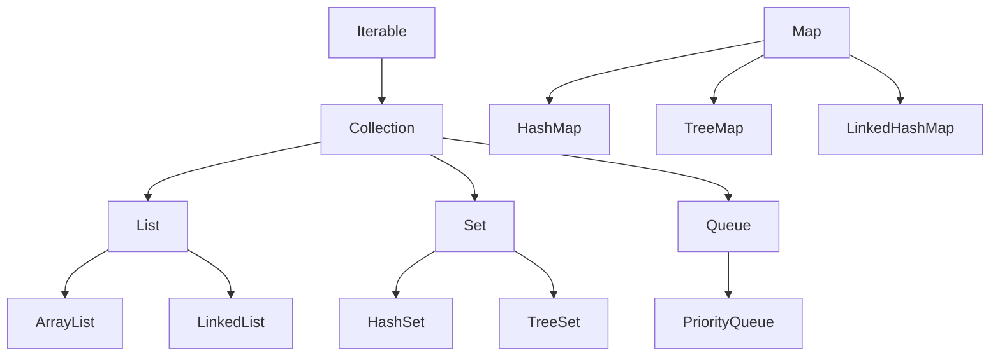

# Collections & Data Structures

## Overview

Collections in Java are a fundamental part of the Java Collections Framework (JCF), providing a unified architecture for storing, retrieving, and manipulating groups of objects. They offer reusable data structures that are more flexible and efficient than traditional arrays. Key components include interfaces (e.g., `List`, `Set`, `Map`), implementations (e.g., `ArrayList`, `HashSet`), and algorithms for operations like sorting and searching. Data structures underpin these collections, including arrays, linked lists, trees, and graphs, enabling optimized performance for various use cases. Learning DSA is crucial for software development, as it forms the foundation for applications like search engines, databases, and AI systems, and is heavily emphasized in technical interviews at top companies.

## Detailed Explanation

The Java Collections Framework is built around core interfaces that define contracts for different types of collections. `Collection` is the root interface, extended by `List` (ordered, allows duplicates), `Set` (unordered, no duplicates), and `Queue` (FIFO operations). `Map` is a separate interface for key-value pairs. Data structures provide the underlying mechanisms, with time complexities varying by operation (e.g., O(1) for array access, O(log n) for tree operations).

### Collection Hierarchy



### Key Interfaces and Implementations

| Interface | Description | Common Implementations | Use Case | Time Complexity (Average) |
|-----------|-------------|------------------------|----------|---------------------------|
| `List` | Ordered collection, allows duplicates | `ArrayList`, `LinkedList`, `Vector` | When order and random access are needed | Access: O(1) for ArrayList, O(n) for LinkedList |
| `Set` | Unordered collection, no duplicates | `HashSet`, `TreeSet`, `LinkedHashSet` | For unique elements, e.g., removing duplicates | Add/Contains: O(1) for HashSet, O(log n) for TreeSet |
| `Queue` | FIFO structure | `LinkedList`, `PriorityQueue`, `ArrayDeque` | Task scheduling, breadth-first search | Offer/Poll: O(1) for LinkedList, O(log n) for PriorityQueue |
| `Map` | Key-value pairs | `HashMap`, `TreeMap`, `LinkedHashMap`, `ConcurrentHashMap` | Caching, configuration storage | Get/Put: O(1) for HashMap, O(log n) for TreeMap |

### Basic Data Structures

- **Arrays**: Fixed-size, contiguous memory. Fast access (O(1)) but slow insertions/deletions (O(n)). Used in `ArrayList`.
- **Linked Lists**: Dynamic, nodes linked by pointers. Fast insertions/deletions (O(1) at ends) but slow access (O(n)). Used in `LinkedList`.
- **Trees**: Hierarchical, e.g., binary search trees for O(log n) operations. Used in `TreeSet`, `TreeMap`.
- **Graphs**: Nodes and edges, used in complex relationships. Not directly in JCF but foundational for advanced algorithms.
- **Hash Tables**: Key-based storage with hashing. Used in `HashMap`, `HashSet` for O(1) average operations.

## Real-world Examples & Use Cases

- **ArrayList**: Shopping cart items where order and random access are important, like displaying products in a specific sequence.
- **LinkedList**: Music playlist for frequent additions/removals at both ends, or implementing stacks/queues.
- **HashSet**: Unique user IDs in a system to prevent duplicates, or checking membership in large datasets.
- **HashMap**: User session data with user ID as key, or caching frequently accessed data.
- **PriorityQueue**: Task scheduler prioritizing urgent tasks, or Dijkstra's algorithm for shortest paths.
- **TreeMap**: Sorted leaderboard in a game, maintaining order for quick min/max retrieval.
- **ConcurrentHashMap**: Thread-safe caching in multi-threaded web servers.

## Code Examples

### Using ArrayList

```java
import java.util.ArrayList;
import java.util.List;

public class ArrayListExample {
    public static void main(String[] args) {
        List<String> fruits = new ArrayList<>();
        fruits.add("Apple");
        fruits.add("Banana");
        fruits.add("Cherry");
        System.out.println(fruits.get(1)); // Output: Banana
        fruits.remove("Banana");
        System.out.println(fruits); // Output: [Apple, Cherry]
        // Iterating
        for (String fruit : fruits) {
            System.out.println(fruit);
        }
    }
}
```

### Using HashMap

```java
import java.util.HashMap;
import java.util.Map;

public class HashMapExample {
    public static void main(String[] args) {
        Map<String, Integer> fruitCount = new HashMap<>();
        fruitCount.put("Apple", 5);
        fruitCount.put("Banana", 3);
        fruitCount.put("Cherry", 7);
        System.out.println(fruitCount.get("Apple")); // Output: 5
        fruitCount.remove("Banana");
        System.out.println(fruitCount); // Output: {Apple=5, Cherry=7}
        // Iterating over entries
        for (Map.Entry<String, Integer> entry : fruitCount.entrySet()) {
            System.out.println(entry.getKey() + ": " + entry.getValue());
        }
    }
}
```

### Custom Comparator for TreeSet

```java
import java.util.TreeSet;
import java.util.Comparator;

public class TreeSetExample {
    public static void main(String[] args) {
        TreeSet<String> set = new TreeSet<>(Comparator.reverseOrder());
        set.add("Zebra");
        set.add("Apple");
        set.add("Banana");
        System.out.println(set); // Output: [Zebra, Banana, Apple]
        System.out.println(set.first()); // Output: Zebra
        System.out.println(set.last()); // Output: Apple
    }
}
```

### PriorityQueue for Task Scheduling

```java
import java.util.PriorityQueue;
import java.util.Comparator;

class Task {
    String name;
    int priority;

    Task(String name, int priority) {
        this.name = name;
        this.priority = priority;
    }

    @Override
    public String toString() {
        return name + "(" + priority + ")";
    }
}

public class PriorityQueueExample {
    public static void main(String[] args) {
        PriorityQueue<Task> queue = new PriorityQueue<>(Comparator.comparingInt(t -> t.priority));
        queue.add(new Task("Low", 3));
        queue.add(new Task("High", 1));
        queue.add(new Task("Medium", 2));
        while (!queue.isEmpty()) {
            System.out.println(queue.poll()); // High, Medium, Low
        }
    }
}
```

## Common Pitfalls & Edge Cases

- **ConcurrentModificationException**: Occurs when modifying a collection during iteration. Use `Iterator.remove()` or concurrent collections like `CopyOnWriteArrayList`.
- **Null Keys/Values**: `HashMap` allows one null key and multiple null values; `TreeMap` does not allow null keys. Check for nulls to avoid `NullPointerException`.
- **Performance Issues**: `ArrayList` for frequent insertions at the beginning (use `LinkedList`); large datasets may require custom hashing for `HashMap` to avoid collisions.
- **Edge Cases**: Empty collections, single-element collections, thread-safety in multi-threaded environments, and handling generics with wildcards.
- **Memory Leaks**: In `HashMap`, if keys are not properly managed, they can cause memory leaks.

## Tools & Libraries

- **Java Collections Framework**: Built-in, no external dependencies. Includes utilities like `Collections.sort()`, `Arrays.asList()`.
- **Guava**: Google's library for immutable collections (`ImmutableList`), utilities like `Multimap`, and enhanced collections.
- **Apache Commons Collections**: Additional collection types (e.g., `Bag`), utilities for transformations and predicates.
- **Eclipse Collections**: High-performance collections for large-scale data processing.

## References

- [Oracle Java Collections Tutorial](https://docs.oracle.com/javase/tutorial/collections/index.html)
- [GeeksforGeeks Data Structures and Algorithms](https://www.geeksforgeeks.org/learn-data-structures-and-algorithms-dsa-tutorial/)
- [Baeldung Java Collections Series](https://www.baeldung.com/java-collections)
- [Java Collections Framework Overview](https://docs.oracle.com/javase/8/docs/technotes/guides/collections/overview.html)
- [Effective Java: Chapter on Generics and Collections](https://www.amazon.com/Effective-Java-Joshua-Bloch/dp/0134685997)
- [GeeksforGeeks Array Data Structure](https://www.geeksforgeeks.org/dsa/array-data-structure-guide/)
- [Baeldung Guide to ArrayList](https://www.baeldung.com/java-arraylist)

## Github-README Links & Related Topics

- [Java Collections Deep Dive](../java-collections-deep-dive/)
- [Concurrent Collections](../concurrent-collections/)
- [Java Multithreading and Concurrency](../java-multithreading-and-concurrency/)
- [Algorithms](../algorithms/)
- [Design Patterns](../design-patterns/)
- [Data Structures Algorithms](../algorithms/)
