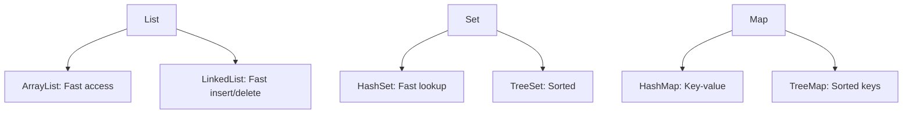

## Overview
Collections and data structures in Java provide ways to store, manipulate, and retrieve data efficiently. This includes lists, sets, maps, and trees, each with different performance characteristics for various operations.

## Detailed Explanation
- **Lists:** Ordered collections allowing duplicates. ArrayList (dynamic array), LinkedList (doubly-linked list).
- **Sets:** Unordered collections without duplicates. HashSet, TreeSet, LinkedHashSet.
- **Maps:** Key-value pairs. HashMap, TreeMap, LinkedHashMap.
- **Queues and Deques:** For FIFO operations. PriorityQueue for priority-based.
- **Time Complexities:**
  | Structure | Access | Insert | Delete | Search |
  |-----------|--------|--------|--------|--------|
  | ArrayList | O(1) | O(n) | O(n) | O(n) |
  | LinkedList | O(n) | O(1) | O(1) | O(n) |
  | HashSet | O(1) | O(1) | O(1) | O(1) |
  | TreeSet | O(log n) | O(log n) | O(log n) | O(log n) |
  | HashMap | O(1) | O(1) | O(1) | O(1) |

## Real-world Examples & Use Cases
- **ArrayList:** Storing user lists in a social app.
- **HashMap:** Caching user sessions by ID.
- **TreeSet:** Maintaining sorted unique elements like tags.
- **LinkedList:** Implementing queues for task scheduling.

## Code Examples
### Using ArrayList
```java
import java.util.ArrayList;
import java.util.List;

List<String> list = new ArrayList<>();
list.add("Apple");
list.add("Banana");
System.out.println(list.get(0)); // Apple
```

### Using HashMap
```java
import java.util.HashMap;
import java.util.Map;

Map<String, Integer> map = new HashMap<>();
map.put("Alice", 25);
map.put("Bob", 30);
System.out.println(map.get("Alice")); // 25
```

### TreeSet for Sorted Unique Elements
```java
import java.util.TreeSet;
import java.util.Set;

Set<String> set = new TreeSet<>();
set.add("Zebra");
set.add("Apple");
System.out.println(set); // [Apple, Zebra]
```

## Data Models / Message Formats


## Common Pitfalls & Edge Cases
- Concurrent modification exception when modifying during iteration.
- HashMap collisions leading to O(n) worst case.
- Tree structures can be unbalanced if not using self-balancing trees.

## Tools & Libraries
- Java Collections Framework.
- Guava for additional utilities.

## Github-README Links & Related Topics
Related: [java/collections-framework](../java/collections-framework/), [data-structures-advanced](../data-structures-advanced/)

## References
- [Oracle Java Collections Tutorial](https://docs.oracle.com/javase/tutorial/collections/)
- "Effective Java" by Joshua Bloch
- https://github.com/eugenp/tutorials/tree/master/core-java-modules/core-java-collections