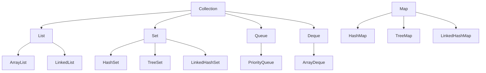
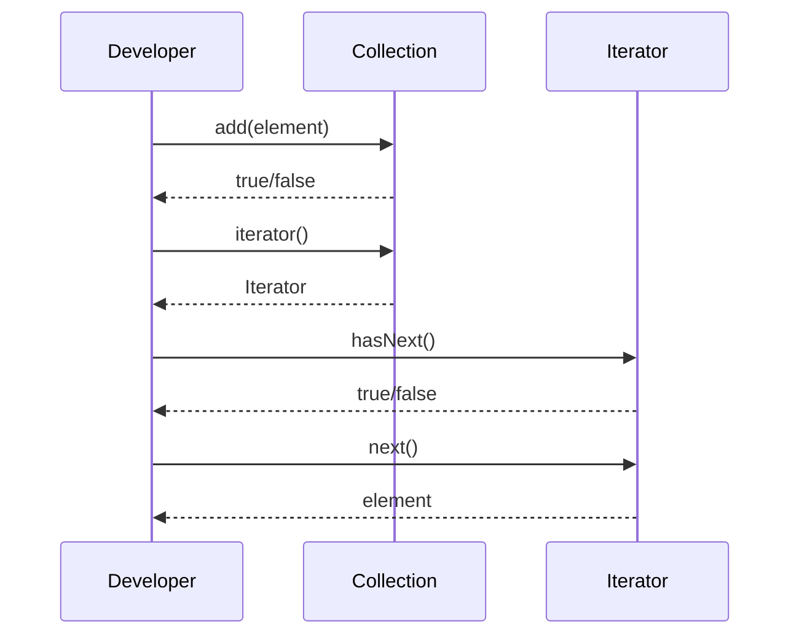

# Collections & Data Structures

## Overview
Collections and data structures in Java are essential for organizing and manipulating data efficiently. The Java Collections Framework provides interfaces and implementations for common data structures like lists, sets, maps, and queues, each optimized for specific use cases with varying time and space complexities.

## Detailed Explanation
The Collections Framework is built around interfaces (List, Set, Map, Queue) with multiple implementations offering different trade-offs.

### Core Interfaces and Implementations
- **List:** Ordered collection allowing duplicates.
  - ArrayList: Resizable array, fast random access.
  - LinkedList: Doubly-linked list, fast insertions/deletions.
  - Vector: Synchronized ArrayList (legacy).
- **Set:** Unordered collection of unique elements.
  - HashSet: Hash table, fast operations.
  - LinkedHashSet: Maintains insertion order.
  - TreeSet: Red-black tree, sorted order.
- **Map:** Key-value pairs.
  - HashMap: Hash table, fast lookups.
  - LinkedHashMap: Maintains insertion order.
  - TreeMap: Red-black tree, sorted keys.
  - Hashtable: Synchronized HashMap (legacy).
- **Queue/Deque:** FIFO/LIFO structures.
  - PriorityQueue: Heap-based, priority ordering.
  - ArrayDeque: Resizable array deque.



### Time Complexities
| Structure | Access | Insert | Delete | Search | Space |
|-----------|--------|--------|--------|--------|-------|
| ArrayList | O(1) | O(n) | O(n) | O(n) | O(n) |
| LinkedList | O(n) | O(1) | O(1) | O(n) | O(n) |
| HashSet/Map | O(1) avg | O(1) avg | O(1) avg | O(1) avg | O(n) |
| TreeSet/Map | O(log n) | O(log n) | O(log n) | O(log n) | O(n) |
| PriorityQueue | O(log n) | O(log n) | O(log n) | O(n) | O(n) |

### Choosing the Right Structure
- Use ArrayList for frequent random access.
- Use LinkedList for frequent insertions/deletions at ends.
- Use HashMap for fast key-based lookups.
- Use TreeMap for sorted key iteration.

## Real-world Examples & Use Cases

### Shopping Cart (List)
```java
import java.util.ArrayList;
import java.util.List;

public class ShoppingCart {
    private List<String> items = new ArrayList<>();

    public void addItem(String item) {
        items.add(item);
    }

    public void removeItem(String item) {
        items.remove(item);
    }

    public List<String> getItems() {
        return new ArrayList<>(items); // Defensive copy
    }
}
```

### User Session Cache (Map)
```java
import java.util.concurrent.ConcurrentHashMap;
import java.util.Map;

public class SessionManager {
    private Map<String, UserSession> sessions = new ConcurrentHashMap<>();

    public void createSession(String sessionId, UserSession session) {
        sessions.put(sessionId, session);
    }

    public UserSession getSession(String sessionId) {
        return sessions.get(sessionId);
    }

    public void invalidateSession(String sessionId) {
        sessions.remove(sessionId);
    }
}
```

### Task Queue (Queue)
```java
import java.util.concurrent.BlockingQueue;
import java.util.concurrent.LinkedBlockingQueue;

public class TaskProcessor {
    private BlockingQueue<Task> taskQueue = new LinkedBlockingQueue<>();

    public void submitTask(Task task) {
        taskQueue.offer(task);
    }

    public Task getNextTask() throws InterruptedException {
        return taskQueue.take();
    }
}
```

### Unique User IDs (Set)
```java
import java.util.HashSet;
import java.util.Set;

public class UserRegistry {
    private Set<String> userIds = new HashSet<>();

    public boolean registerUser(String userId) {
        return userIds.add(userId); // Returns false if already exists
    }

    public boolean isUserRegistered(String userId) {
        return userIds.contains(userId);
    }
}
```

## Code Examples
### ArrayList Usage
```java
import java.util.ArrayList;
import java.util.List;

List<String> list = new ArrayList<>();
list.add("Apple");
list.add("Banana");
System.out.println(list.get(0)); // Apple
```

### HashMap for Key-Value Pairs
```java
import java.util.HashMap;
import java.util.Map;

Map<String, Integer> map = new HashMap<>();
map.put("Alice", 30);
map.put("Bob", 25);
System.out.println(map.get("Alice")); // 30
```

### TreeSet for Sorted Unique Elements
```java
import java.util.TreeSet;
import java.util.Set;

Set<Integer> set = new TreeSet<>();
set.add(3);
set.add(1);
set.add(2);
System.out.println(set); // [1, 2, 3]
```

### PriorityQueue for Priority Ordering
```java
import java.util.PriorityQueue;
import java.util.Queue;

Queue<Integer> pq = new PriorityQueue<>();
pq.add(3);
pq.add(1);
pq.add(2);
System.out.println(pq.poll()); // 1
```

### LinkedList as Deque
```java
import java.util.LinkedList;
import java.util.Deque;

Deque<String> deque = new LinkedList<>();
deque.addFirst("First");
deque.addLast("Last");
System.out.println(deque.removeFirst()); // First
System.out.println(deque.removeLast()); // Last
```

## Common Pitfalls & Edge Cases
- **Concurrent Modification:** Avoid modifying collections during iteration; use iterators or concurrent collections.
- **Null Values:** HashMap allows null keys/values, but TreeMap doesn't.
- **Capacity Issues:** ArrayList resizes inefficiently; pre-size if known.
- **Synchronization:** Use Collections.synchronizedList() for thread-safety, but prefer concurrent collections.

## STAR Summary
Not applicable for this foundational topic.

## Journey / Sequence


## Data Models / Message Formats
### Collection Hierarchy JSON
```json
{
  "Collection": {
    "List": ["ArrayList", "LinkedList", "Vector"],
    "Set": ["HashSet", "LinkedHashSet", "TreeSet"],
    "Queue": ["PriorityQueue", "ArrayDeque"],
    "Map": ["HashMap", "LinkedHashMap", "TreeMap", "Hashtable"]
  }
}
```

## Tools & Libraries
- Java Collections Framework (java.util).
- Google Guava: Enhanced collections.
- Apache Commons Collections: Utilities for collections.

## References

- [Oracle Java Collections Tutorial](https://docs.oracle.com/javase/tutorial/collections/)
- [GeeksforGeeks Data Structures](https://www.geeksforgeeks.org/data-structures/)
- [Java Collections Framework Overview](https://www.javatpoint.com/collections-in-java)
- [Effective Java: Programming Language Guide](https://www.amazon.com/Effective-Java-Joshua-Bloch/dp/0134685997)

## Github-README Links & Related Topics

- [Java Collections Framework](../java/collections-framework/)
- [Concurrent Collections](../java/concurrent-collections/)
- [Algorithms](../algorithms/)
- [Design Patterns](../design-patterns/)
- [System Design Basics](../system-design-basics/)</content>
</xai:function_call ><xai:function_call name="write">
<parameter name="filePath">java-stream-api-and-functional-programming/README.md