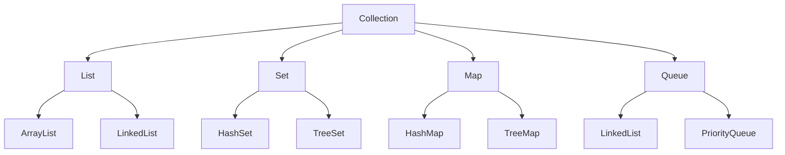

## Overview

Collections and data structures in Java provide a way to store, manipulate, and organize data efficiently. The Java Collections Framework offers interfaces like List, Set, Map, and Queue, with various implementations such as ArrayList, HashSet, HashMap, and LinkedList. Understanding these is crucial for writing efficient code, as different structures have different time and space complexities.

## Detailed Explanation

### Core Interfaces
- **List**: Ordered collection allowing duplicates. Implementations: ArrayList (fast random access), LinkedList (fast insertions/deletions).
- **Set**: Unordered collection without duplicates. Implementations: HashSet (fast lookups), TreeSet (sorted), LinkedHashSet (insertion order).
- **Map**: Key-value pairs. Implementations: HashMap (fast), TreeMap (sorted), LinkedHashMap (insertion order).
- **Queue**: FIFO structure. Implementations: LinkedList, PriorityQueue.

### Time Complexities
| Operation | ArrayList | LinkedList | HashSet | HashMap |
|-----------|-----------|------------|---------|---------|
| Add       | O(1)      | O(1)      | O(1)    | O(1)    |
| Remove    | O(n)      | O(1)      | O(1)    | O(1)    |
| Get       | O(1)      | O(n)      | O(1)    | O(1)    |



## Real-world Examples & Use Cases

- **ArrayList**: Managing a list of user inputs in a GUI application.
- **HashMap**: Storing user sessions by ID in a web server.
- **TreeSet**: Maintaining a sorted list of unique items in an inventory system.
- **PriorityQueue**: Task scheduling in an operating system.

## Code Examples

### Using ArrayList
```java
import java.util.ArrayList;
import java.util.List;

public class ArrayListExample {
    public static void main(String[] args) {
        List<String> list = new ArrayList<>();
        list.add("Apple");
        list.add("Banana");
        list.add("Cherry");
        System.out.println(list.get(1)); // Banana
        list.remove("Banana");
        System.out.println(list); // [Apple, Cherry]
    }
}
```

### Using HashMap
```java
import java.util.HashMap;
import java.util.Map;

public class HashMapExample {
    public static void main(String[] args) {
        Map<String, Integer> map = new HashMap<>();
        map.put("Alice", 25);
        map.put("Bob", 30);
        System.out.println(map.get("Alice")); // 25
        map.remove("Bob");
        System.out.println(map); // {Alice=25}
    }
}
```

## References

- [Oracle Java Collections Tutorial](https://docs.oracle.com/javase/tutorial/collections/)
- [GeeksforGeeks Data Structures](https://www.geeksforgeeks.org/data-structures/)

## Github-README Links & Related Topics

- [Java Fundamentals](../java-fundamentals/)
- [Multithreading & Concurrency in Java](../java-multithreading-and-concurrency/)
- [Java Stream API & Functional Programming](../java-stream-api-and-functional-programming/)
