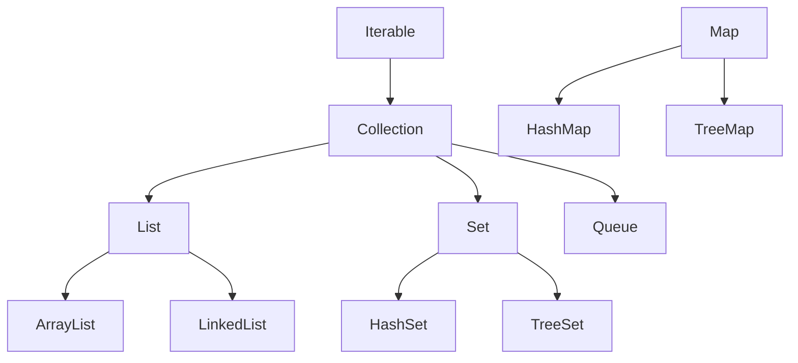

# Collections & Data Structures

## Overview

Collections in Java are a fundamental part of the Java Collections Framework (JCF), providing a unified architecture for storing, retrieving, and manipulating groups of objects. They offer reusable data structures that are more flexible and efficient than traditional arrays. Key components include interfaces (e.g., `List`, `Set`, `Map`), implementations (e.g., `ArrayList`, `HashSet`), and algorithms for operations like sorting and searching. Data structures underpin these collections, including arrays, linked lists, trees, and graphs, enabling optimized performance for various use cases.

## Detailed Explanation

The Java Collections Framework is built around core interfaces that define contracts for different types of collections. `Collection` is the root interface, extended by `List` (ordered, allows duplicates), `Set` (unordered, no duplicates), and `Queue` (FIFO operations). `Map` is a separate interface for key-value pairs.

### Collection Hierarchy



### Key Interfaces and Implementations

| Interface | Description | Common Implementations | Use Case |
|-----------|-------------|------------------------|----------|
| `List` | Ordered collection, allows duplicates | `ArrayList`, `LinkedList` | When order and random access are needed |
| `Set` | Unordered collection, no duplicates | `HashSet`, `TreeSet`, `LinkedHashSet` | For unique elements, e.g., removing duplicates |
| `Queue` | FIFO structure | `LinkedList`, `PriorityQueue` | Task scheduling, breadth-first search |
| `Map` | Key-value pairs | `HashMap`, `TreeMap`, `LinkedHashMap` | Caching, configuration storage |

### Basic Data Structures

- **Arrays**: Fixed-size, contiguous memory. Fast access (O(1)) but slow insertions/deletions (O(n)).
- **Linked Lists**: Dynamic, nodes linked by pointers. Fast insertions/deletions (O(1) at ends) but slow access (O(n)).
- **Trees**: Hierarchical, e.g., binary search trees for O(log n) operations.
- **Graphs**: Nodes and edges, used in complex relationships.

## Real-world Examples & Use Cases

- **ArrayList**: Shopping cart items where order and random access are important.
- **LinkedList**: Music playlist for frequent additions/removals.
- **HashSet**: Unique user IDs in a system.
- **HashMap**: User session data, with user ID as key.
- **PriorityQueue**: Task scheduler prioritizing urgent tasks.
- **TreeMap**: Sorted leaderboard in a game.

## Code Examples

### Using ArrayList

```java
import java.util.ArrayList;
import java.util.List;

public class ArrayListExample {
    public static void main(String[] args) {
        List<String> fruits = new ArrayList<>();
        fruits.add("Apple");
        fruits.add("Banana");
        fruits.add("Cherry");
        System.out.println(fruits.get(1)); // Output: Banana
        fruits.remove("Banana");
        System.out.println(fruits); // Output: [Apple, Cherry]
    }
}
```

### Using HashMap

```java
import java.util.HashMap;
import java.util.Map;

public class HashMapExample {
    public static void main(String[] args) {
        Map<String, Integer> fruitCount = new HashMap<>();
        fruitCount.put("Apple", 5);
        fruitCount.put("Banana", 3);
        System.out.println(fruitCount.get("Apple")); // Output: 5
        fruitCount.remove("Banana");
        System.out.println(fruitCount); // Output: {Apple=5}
    }
}
```

### Custom Comparator for TreeSet

```java
import java.util.TreeSet;
import java.util.Comparator;

public class TreeSetExample {
    public static void main(String[] args) {
        TreeSet<String> set = new TreeSet<>(Comparator.reverseOrder());
        set.add("Zebra");
        set.add("Apple");
        set.add("Banana");
        System.out.println(set); // Output: [Zebra, Banana, Apple]
        System.out.println(set.first()); // Output: Zebra
    }
}
```

## Common Pitfalls & Edge Cases

- **ConcurrentModificationException**: Occurs when modifying a collection during iteration. Use `Iterator.remove()` or concurrent collections like `CopyOnWriteArrayList`.
- **Null Keys/Values**: `HashMap` allows one null key, but `TreeMap` does not. Check for nulls to avoid `NullPointerException`.
- **Performance Issues**: `ArrayList` for frequent insertions at the beginning; prefer `LinkedList`. Large datasets may require custom hashing for `HashMap`.
- **Edge Cases**: Empty collections, single-element collections, and thread-safety in multi-threaded environments.

## Tools & Libraries

- **Java Collections Framework**: Built-in, no external dependencies.
- **Guava**: Google's library for immutable collections and utilities like `Multimap`.
- **Apache Commons Collections**: Additional collection types and utilities.

## References

- [Oracle Java Collections Tutorial](https://docs.oracle.com/javase/tutorial/collections/index.html)
- [GeeksforGeeks Data Structures](https://www.geeksforgeeks.org/data-structures/)
- [Baeldung Java Collections](https://www.baeldung.com/java-collections)
- [Java Collections Framework Overview](https://docs.oracle.com/javase/8/docs/technotes/guides/collections/overview.html)
- [Effective Java: Chapter on Generics and Collections](https://www.amazon.com/Effective-Java-Joshua-Bloch/dp/0134685997)

## Github-README Links & Related Topics

- [Java Collections Deep Dive](../java-collections-deep-dive/)
- [Concurrent Collections](../concurrent-collections/)
- [Java Multithreading and Concurrency](../java-multithreading-and-concurrency/)
- [Algorithms](../algorithms/)
- [Design Patterns](../design-patterns/)
