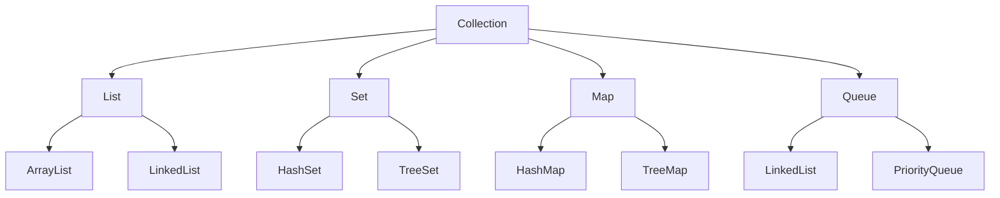
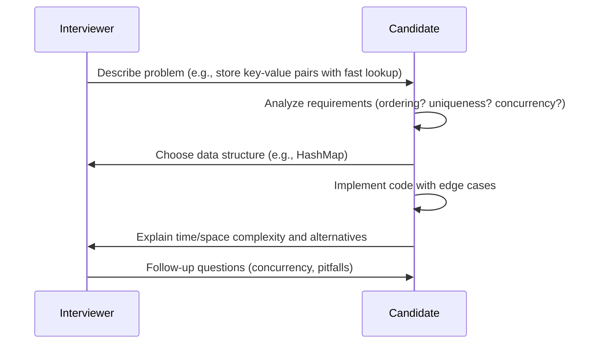

## Overview

Collections and data structures in Java provide a way to store, manipulate, and organize data efficiently. The Java Collections Framework offers interfaces like List, Set, Map, and Queue, with various implementations such as ArrayList, HashSet, HashMap, and LinkedList. Understanding these is crucial for writing efficient code, as different structures have different time and space complexities.

## Detailed Explanation

### Core Interfaces
- **List**: Ordered collection allowing duplicates. Implementations: ArrayList (fast random access), LinkedList (fast insertions/deletions).
- **Set**: Unordered collection without duplicates. Implementations: HashSet (fast lookups), TreeSet (sorted), LinkedHashSet (insertion order).
- **Map**: Key-value pairs. Implementations: HashMap (fast), TreeMap (sorted), LinkedHashMap (insertion order).
- **Queue**: FIFO structure. Implementations: LinkedList, PriorityQueue.

### Time Complexities
| Operation | ArrayList | LinkedList | HashSet | HashMap |
|-----------|-----------|------------|---------|---------|
| Add       | O(1)      | O(1)      | O(1)    | O(1)    |
| Remove    | O(n)      | O(1)      | O(1)    | O(1)    |
| Get       | O(1)      | O(n)      | O(1)    | O(1)    |



## Real-world Examples & Use Cases

- **ArrayList**: Managing a list of user inputs in a GUI application.
- **HashMap**: Storing user sessions by ID in a web server.
- **TreeSet**: Maintaining a sorted list of unique items in an inventory system.
- **PriorityQueue**: Task scheduling in an operating system.

## Code Examples

### Using ArrayList
```java
import java.util.ArrayList;
import java.util.List;

public class ArrayListExample {
    public static void main(String[] args) {
        List<String> list = new ArrayList<>();
        list.add("Apple");
        list.add("Banana");
        list.add("Cherry");
        System.out.println(list.get(1)); // Banana
        list.remove("Banana");
        System.out.println(list); // [Apple, Cherry]
    }
}
```

### Using HashMap
```java
import java.util.HashMap;
import java.util.Map;

public class HashMapExample {
    public static void main(String[] args) {
        Map<String, Integer> map = new HashMap<>();
        map.put("Alice", 25);
        map.put("Bob", 30);
        System.out.println(map.get("Alice")); // 25
        map.remove("Bob");
        System.out.println(map); // {Alice=25}
    }
}
```

### Using TreeSet
```java
import java.util.Set;
import java.util.TreeSet;

public class TreeSetExample {
    public static void main(String[] args) {
        Set<String> set = new TreeSet<>();
        set.add("Banana");
        set.add("Apple");
        set.add("Cherry");
        System.out.println(set); // [Apple, Banana, Cherry] - sorted order
        set.remove("Banana");
        System.out.println(set.contains("Apple")); // true
    }
}
```

### Using PriorityQueue
```java
import java.util.PriorityQueue;
import java.util.Queue;

public class PriorityQueueExample {
    public static void main(String[] args) {
        Queue<Integer> queue = new PriorityQueue<>();
        queue.add(30);
        queue.add(10);
        queue.add(20);
        System.out.println(queue.poll()); // 10 - smallest first
        System.out.println(queue.poll()); // 20
        System.out.println(queue.poll()); // 30
    }
}
```

## STAR Summary

- **Situation**: During a technical interview, you're presented with a problem requiring efficient data storage and retrieval, such as managing user data or processing large datasets.
- **Task**: Select and implement the appropriate collection or data structure to optimize for time/space complexity, handle operations like insertion, deletion, and search.
- **Action**: Analyze the problem requirements (e.g., need for ordering, uniqueness, fast lookups), choose a structure (e.g., HashMap for O(1) access, TreeSet for sorted unique elements), and implement with proper error handling.
- **Result**: Delivered a correct, efficient solution, explained trade-offs (e.g., HashMap vs TreeMap), and discussed scalability, impressing the interviewer with deep understanding.

## Journey / Sequence



## Common Pitfalls & Edge Cases

- **ConcurrentModificationException**: Occurs when modifying a collection during iteration; use Iterator.remove() or concurrent collections like ConcurrentHashMap.
- **Null Keys/Values**: HashMap allows one null key and multiple null values; TreeMap does not allow null keys.
- **Infinite Loops**: In custom comparators for TreeSet/TreeMap, ensure consistency to avoid exceptions.
- **Memory Leaks**: WeakHashMap can help with garbage collection, but be cautious with strong references.
- **Performance Degradation**: HashMap/HashSet can degrade to O(n) if hashCode is poor; ensure good distribution.
- **Edge Cases**: Empty collections, single-element operations, large datasets causing OutOfMemoryError.

## Tools & Libraries

- **Java Collections Framework**: Built-in interfaces and classes (List, Set, Map, Queue).
- **Guava**: Google's library with enhanced collections (Multimap, BiMap, Table).
- **Apache Commons Collections**: Additional utilities for collections manipulation.
- **Eclipse Collections**: High-performance collections for Java.
- **JMH (Java Microbenchmarking Harness)**: For benchmarking collection performance.

## References

- [Oracle Java Collections Tutorial](https://docs.oracle.com/javase/tutorial/collections/)
- [GeeksforGeeks Data Structures](https://www.geeksforgeeks.org/data-structures/)
- [Effective Java: Programming Language Guide](https://www.amazon.com/Effective-Java-Joshua-Bloch/dp/0134685997) - Chapter on Generics and Collections.
- [Wikipedia: Data Structure](https://en.wikipedia.org/wiki/Data_structure)

## Github-README Links & Related Topics

- [Java Fundamentals](../java-fundamentals/)
- [Multithreading & Concurrency in Java](../java-multithreading-and-concurrency/)
- [Java Stream API & Functional Programming](../java-stream-api-and-functional-programming/)
- [Algorithms](../algorithms/)
- [Design Patterns in Java](../design-patterns-in-java/)