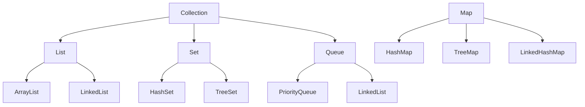

# Collections & Data Structures

## Overview

Collections in Java are frameworks that provide architectures for storing and manipulating groups of objects. Data structures are the underlying implementations that enable efficient storage, retrieval, and manipulation of data. This topic covers the Java Collections Framework (JCF), common data structures, their implementations, and best practices.

## Detailed Explanation

The Java Collections Framework (JCF) is a unified architecture for representing and manipulating collections. It consists of interfaces, implementations, and algorithms that provide reusable data structures.

### Key Components

- **Interfaces**: Define the abstract data types (e.g., List, Set, Queue, Map).
- **Implementations**: Concrete classes that implement the interfaces (e.g., ArrayList, HashSet).
- **Algorithms**: Utility methods in the Collections class for operations like sorting, searching, and shuffling.

### Collection Hierarchy



### Data Structures and Their Implementations

| Data Structure | Interface | Implementations | Time Complexity (Average) |
|----------------|-----------|-----------------|---------------------------|
| Array | List | ArrayList | O(1) access, O(n) insert/delete |
| Linked List | List/Deque | LinkedList | O(n) access, O(1) insert/delete at ends |
| Hash Table | Set/Map | HashSet/HashMap | O(1) operations |
| Tree | Set/Map | TreeSet/TreeMap | O(log n) operations |
| Stack | Deque | ArrayDeque | O(1) push/pop |
| Queue | Queue/Deque | LinkedList/ArrayDeque | O(1) enqueue/dequeue |

### Data Structures Covered

- **Arrays**: Fixed-size, contiguous memory.
- **Linked Lists**: Dynamic, node-based.
- **Stacks**: LIFO structure.
- **Queues**: FIFO structure.
- **Trees**: Hierarchical, balanced for efficiency.
- **Graphs**: Complex relationships (not directly in JCF, but can be implemented).
- **Hash Tables**: Key-value pairs with fast lookup.

## Real-world Examples & Use Cases

- **E-commerce**: Using HashMap for product catalogs.
- **Social Networks**: Graphs for friend connections.
- **Task Scheduling**: PriorityQueue for job queues.
- **Caching**: LinkedHashMap for LRU cache.

## Code Examples

### ArrayList Example

```java
import java.util.ArrayList;
import java.util.List;

public class ArrayListExample {
    public static void main(String[] args) {
        List<String> list = new ArrayList<>();
        list.add("Apple");
        list.add("Banana");
        System.out.println(list.get(0)); // Apple
    }
}
```

### HashMap Example

```java
import java.util.HashMap;
import java.util.Map;

public class HashMapExample {
    public static void main(String[] args) {
        Map<String, Integer> map = new HashMap<>();
        map.put("Alice", 25);
        map.put("Bob", 30);
        System.out.println(map.get("Alice")); // 25
    }
}
```

### Custom Data Structure: Stack

```java
import java.util.Stack;

public class StackExample {
    public static void main(String[] args) {
        Stack<Integer> stack = new Stack<>();
        stack.push(1);
        stack.push(2);
        System.out.println(stack.pop()); // 2
    }
}
```

### TreeMap Example

```java
import java.util.TreeMap;
import java.util.Map;

public class TreeMapExample {
    public static void main(String[] args) {
        Map<String, Integer> map = new TreeMap<>();
        map.put("Banana", 2);
        map.put("Apple", 1);
        map.put("Cherry", 3);
        // Prints in sorted order: Apple=1, Banana=2, Cherry=3
        map.forEach((k, v) -> System.out.println(k + "=" + v));
    }
}
```

### PriorityQueue Example

```java
import java.util.PriorityQueue;
import java.util.Queue;

public class PriorityQueueExample {
    public static void main(String[] args) {
        Queue<Integer> pq = new PriorityQueue<>();
        pq.add(3);
        pq.add(1);
        pq.add(2);
        System.out.println(pq.poll()); // 1 (smallest)
        System.out.println(pq.poll()); // 2
    }
}
```

## Common Pitfalls & Edge Cases

- **Concurrent Modification Exception**: Modifying a collection while iterating over it without an Iterator.
- **Null Keys/Values**: HashMap allows null keys/values, but TreeMap does not allow null keys.
- **Performance Issues**: Choosing wrong implementation (e.g., ArrayList for frequent insertions/deletions).
- **Memory Leaks**: Not clearing references in collections like HashMap.
- **Thread Safety**: Using non-thread-safe collections in multi-threaded environments without synchronization.

## References

- [Oracle Java Collections Tutorial](https://docs.oracle.com/javase/tutorial/collections/)
- [GeeksforGeeks Data Structures](https://www.geeksforgeeks.org/data-structures/)
- [Effective Java by Joshua Bloch](https://www.amazon.com/Effective-Java-Joshua-Bloch/dp/0134685997)

## Github-README Links & Related Topics

- [Java Fundamentals](java-fundamentals/)
- [Multithreading & Concurrency in Java](concurrency-and-parallelism/)
- [Algorithms](algorithms/)