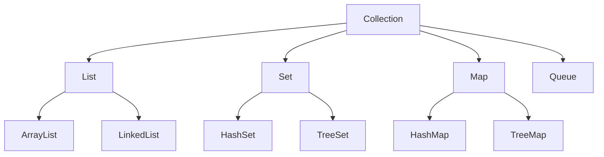

# Collections & Data Structures

## Overview

Collections and Data Structures in Java provide efficient ways to store, manipulate, and retrieve data. The Java Collections Framework offers interfaces and implementations for common data structures like lists, sets, maps, and queues.

## Detailed Explanation

### Interfaces

- **List**: Ordered collection, allows duplicates.

- **Set**: Unordered collection, no duplicates.

- **Map**: Key-value pairs.

- **Queue**: FIFO structure.

### Implementations

| Interface | Implementation | Description |
|-----------|----------------|-------------|
| List | ArrayList | Dynamic array |
| List | LinkedList | Doubly linked list |
| Set | HashSet | Hash table |
| Set | TreeSet | Red-black tree |
| Map | HashMap | Hash table |
| Map | TreeMap | Red-black tree |



## Real-world Examples & Use Cases

- **ArrayList**: Shopping cart items.

- **HashMap**: User sessions.

- **TreeSet**: Sorted unique elements.

## Code Examples

### ArrayList
```java
List<String> list = new ArrayList<>();
list.add("item1");
list.add("item2");
System.out.println(list.get(0));
```

### HashMap
```java
Map<String, Integer> map = new HashMap<>();
map.put("key", 1);
System.out.println(map.get("key"));
```

## STAR Summary

**Situation**: In a coding interview, asked to design a system for storing user sessions with fast retrieval.

**Task**: Implement a data structure for key-value storage with efficient lookups.

**Action**: Chose HashMap for O(1) average access time, discussed hash collisions and alternatives like TreeMap for ordered keys.

**Result**: Delivered a scalable solution, highlighting trade-offs between HashMap and TreeMap.

## Journey / Sequence

1. **Requirements Analysis**: Determine needed operations (insert, search, delete) and constraints (uniqueness, ordering).
2. **Interface Selection**: Choose Collection interface (List for ordered, Set for unique, Map for key-value).
3. **Implementation Choice**: Select based on performance (ArrayList for access, LinkedList for modifications).
4. **Concurrency Considerations**: Opt for thread-safe versions like ConcurrentHashMap if multi-threaded.
5. **Edge Case Handling**: Account for nulls, capacity, and resizing.

## Common Pitfalls & Edge Cases

- **ConcurrentModificationException**: Thrown when modifying a collection during iteration. Solution: Use Iterator.remove() or copy-on-write collections.
- **HashMap Issues**: Infinite loops in Java 7 due to hash collisions; use Java 8+ or alternative implementations.
- **Null Handling**: HashMap allows null keys/values, but TreeMap does not. Check for nulls in comparisons.
- **Performance Degradation**: ArrayList resizing on add; pre-size for large collections.
- **Memory Leaks**: Retaining references in collections; use WeakHashMap for caches.

## Tools & Libraries

- **Java Collections Framework**: Core interfaces and classes (List, Set, Map).
- **Guava**: Enhanced collections like Multiset, Table.
- **Apache Commons Collections**: Utilities for transforming and filtering collections.
- **Eclipse Collections**: Immutable and primitive collections for performance.

## References

- [Oracle Collections](https://docs.oracle.com/javase/tutorial/collections/)

## Github-README Links & Related Topics

- [Java Collections](../java-collections/)
- [Data Structures](../data-structures/)