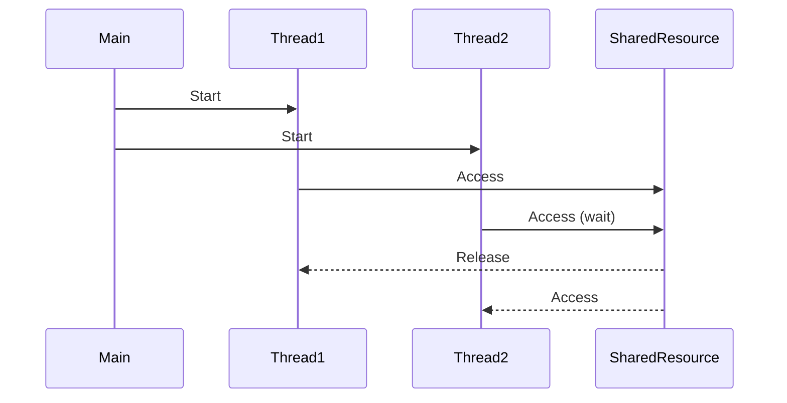

## Overview

Concurrency and parallelism are fundamental concepts in computer science that deal with executing multiple tasks simultaneously or seemingly simultaneously. While often used interchangeably, they represent different approaches to handling multiple computations.

## Detailed Explanation

### Concurrency vs Parallelism

- **Concurrency**: Managing multiple tasks that may or may not run simultaneously. It's about structure and coordination of tasks. A single processor can achieve concurrency through time-slicing.

- **Parallelism**: Executing multiple tasks literally at the same time, typically requiring multiple processors or cores.

### Key Concepts

- **Processes**: Independent execution units with their own memory space.
- **Threads**: Lightweight processes that share memory within a process.
- **Asynchronous Programming**: Non-blocking execution where tasks can start, pause, and resume.
- **Synchronization**: Coordinating access to shared resources to prevent race conditions.
- **Deadlocks**: Situations where processes are waiting for each other indefinitely.

### Concurrency Models

- **Shared Memory**: Threads communicate via shared variables (e.g., Java threads).
- **Message Passing**: Processes communicate by sending messages (e.g., Go goroutines, Erlang).
- **Actor Model**: Actors process messages asynchronously.

### Parallelism Patterns

- **Data Parallelism**: Same operation on different data subsets.
- **Task Parallelism**: Different operations on the same or different data.
- **Pipeline Parallelism**: Dividing a task into stages that can run concurrently.

## Real-world Examples & Use Cases

- **Web Servers**: Handling multiple client requests concurrently (e.g., Nginx, Apache).
- **Database Systems**: Processing multiple queries simultaneously.
- **Video Processing**: Encoding/decoding frames in parallel.
- **Scientific Computing**: Running simulations across multiple cores.
- **Real-time Systems**: Processing sensor data from IoT devices.

## Code Examples

### Java Thread Concurrency

```java
public class ConcurrencyExample {
    public static void main(String[] args) {
        Thread thread1 = new Thread(() -> {
            for (int i = 0; i < 5; i++) {
                System.out.println("Thread 1: " + i);
                try {
                    Thread.sleep(100);
                } catch (InterruptedException e) {
                    e.printStackTrace();
                }
            }
        });

        Thread thread2 = new Thread(() -> {
            for (int i = 0; i < 5; i++) {
                System.out.println("Thread 2: " + i);
                try {
                    Thread.sleep(100);
                } catch (InterruptedException e) {
                    e.printStackTrace();
                }
            }
        });

        thread1.start();
        thread2.start();
    }
}
```

### Python Async/Await

```python
import asyncio

async def task1():
    for i in range(5):
        print(f"Task 1: {i}")
        await asyncio.sleep(0.1)

async def task2():
    for i in range(5):
        print(f"Task 2: {i}")
        await asyncio.sleep(0.1)

async def main():
    await asyncio.gather(task1(), task2())

asyncio.run(main())
```

### Go Goroutines

```go
package main

import (
    "fmt"
    "time"
)

func task(id int) {
    for i := 0; i < 5; i++ {
        fmt.Printf("Task %d: %d\n", id, i)
        time.Sleep(100 * time.Millisecond)
    }
}

func main() {
    go task(1)
    go task(2)
    time.Sleep(1 * time.Second) // Wait for goroutines to finish
}
```

## Journey / Sequence



## Data Models / Message Formats

### Concurrency Patterns Table

| Pattern | Description | Use Case | Language Support |
|---------|-------------|----------|------------------|
| Producer-Consumer | Producers create items, consumers process them | Message queues | Java BlockingQueue |
| Reader-Writer | Multiple readers, exclusive writers | Caches | Java ReadWriteLock |
| Dining Philosophers | Resource allocation problem | Deadlock prevention | Academic example |
| Barrier | Synchronize at a point | Parallel algorithms | Java CyclicBarrier |

## Common Pitfalls & Edge Cases

- **Race Conditions**: Unpredictable results from unsynchronized access.
- **Deadlocks**: Circular waiting for resources.
- **Starvation**: A thread never gets access to resources.
- **Context Switching Overhead**: Too many threads can hurt performance.
- **Edge Cases**: Priority inversion, livelocks, thread leaks.

## Tools & Libraries

- **Java**: java.util.concurrent package
- **Python**: asyncio, threading
- **Go**: goroutines, channels
- **C++**: std::thread, OpenMP
- **Frameworks**: Akka (Scala/Java), RxJava

## References

- [Concurrency in Go](https://golang.org/doc/effective_go.html#concurrency)
- [Java Concurrency in Practice](https://www.amazon.com/Java-Concurrency-Practice-Brian-Goetz/dp/0321349601)
- [The Art of Multiprocessor Programming](https://www.amazon.com/Art-Multiprocessor-Programming-Revised-Reprint/dp/0123973376)
- [Concurrency vs Parallelism](https://www.youtube.com/watch?v=cN_DpYBzKso)

## Github-README Links & Related Topics

- [Java Multithreading & Concurrency](../java-multithreading-and-concurrency/README.md)
- [Concurrent Programming Patterns](../concurrent-programming-patterns/README.md)
- [Distributed Locks](../distributed-locks/README.md)
- [Async Logging](../async-logging/README.md)