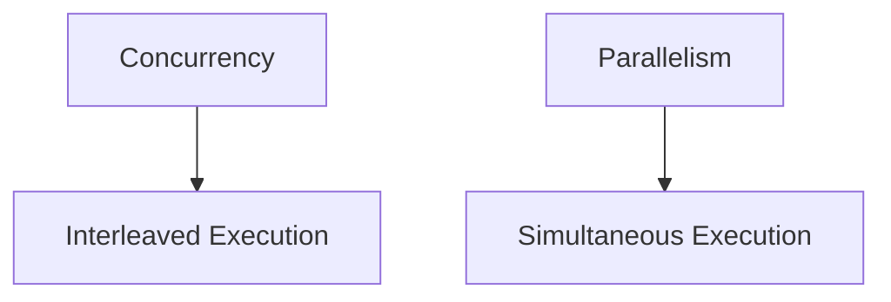

# Concurrency & Parallelism

## Overview

Concurrency and parallelism are techniques to execute multiple tasks simultaneously or seemingly so, improving performance and responsiveness. Concurrency involves managing multiple tasks that may not run at the same time, while parallelism executes tasks simultaneously using multiple processors.

## Detailed Explanation

### Concurrency

Concurrency is about dealing with multiple tasks at the same time, even if they are not executing simultaneously. It involves interleaving execution of processes or threads.

**Key Concepts:**
- Threads and processes
- Synchronization (locks, semaphores)
- Race conditions and deadlocks

### Parallelism

Parallelism is the simultaneous execution of multiple tasks, typically on multi-core systems.

**Key Concepts:**
- Multi-threading
- Distributed computing
- SIMD (Single Instruction, Multiple Data)

## Real-world Examples & Use Cases

- **Web Servers:** Handling multiple client requests concurrently.
- **Video Processing:** Parallel encoding of frames.
- **Database Queries:** Concurrent access to data.

## Code Examples

### Java Concurrency Example

```java
import java.util.concurrent.ExecutorService;
import java.util.concurrent.Executors;

public class ConcurrencyExample {
    public static void main(String[] args) {
        ExecutorService executor = Executors.newFixedThreadPool(4);
        for (int i = 0; i < 10; i++) {
            executor.submit(() -> {
                System.out.println("Task executed by " + Thread.currentThread().getName());
            });
        }
        executor.shutdown();
    }
}
```

## References

- [Concurrency vs Parallelism](https://www.geeksforgeeks.org/concurrency-vs-parallelism/)

## Github-README Links & Related Topics

- [Multithreading & Concurrency in Java](./java/multithreading-concurrency/)
- [Distributed Systems](./distributed-systems/)

## Diagram

