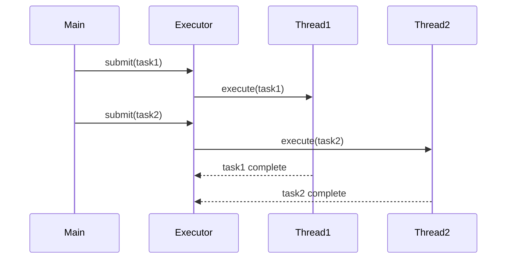
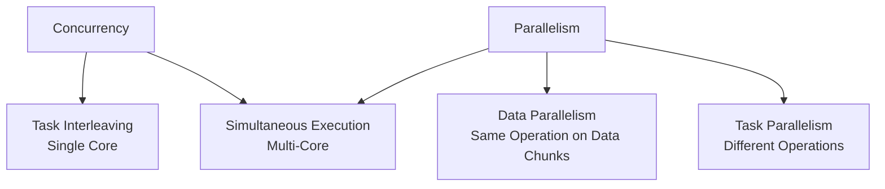
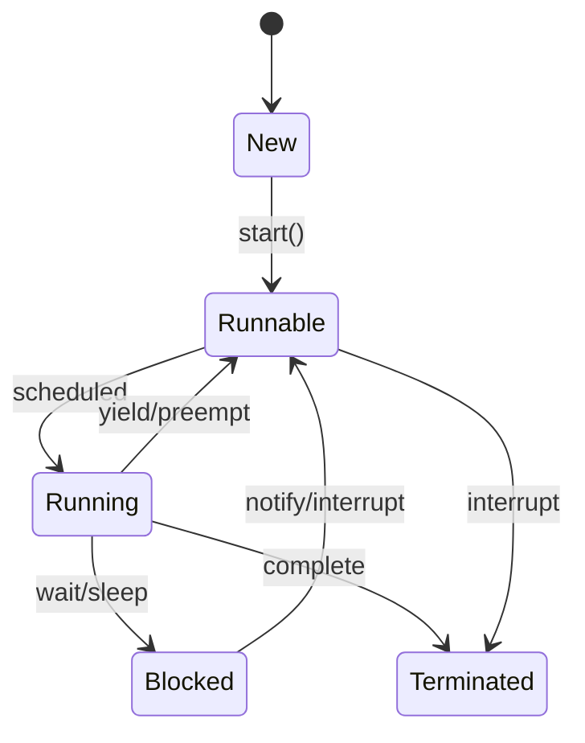

## Overview
Concurrency and parallelism are fundamental concepts for executing multiple tasks efficiently. Concurrency manages multiple tasks that may interleave in time, improving responsiveness and resource utilization. Parallelism executes tasks simultaneously, typically on multi-core systems, to achieve faster computation.

## Detailed Explanation
Concurrency is about dealing with multiple things at once, often through task switching on a single processor. Parallelism is about doing multiple things at once, requiring multiple processors.

### Concurrency
- **Definition:** Multiple tasks make progress over time, possibly interleaved.
- **Benefits:** Better resource utilization, responsiveness (e.g., UI remains interactive during I/O).
- **Java Mechanisms:** Threads, Executors, CompletableFuture, Reactive Streams.
- **Use Case:** Handling multiple user requests in a web server.

### Parallelism
- **Definition:** Simultaneous execution of tasks on multiple cores.
- **Benefits:** Reduced execution time for CPU-bound tasks.
- **Java Mechanisms:** Parallel streams, ForkJoinPool, Project Loom (virtual threads).
- **Types:** Data parallelism (same operation on different data), Task parallelism (different operations).

### Key Differences
- Concurrency: Structure and coordination.
- Parallelism: Speed through simultaneous execution.
- Concurrency can exist without parallelism (single core), but parallelism implies concurrency.

### Amdahl's Law
Speedup = 1 / ((1 - P) + P/N), where P is parallelizable fraction, N is cores. Limits maximum speedup.

## Real-world Examples & Use Cases
- **Web Servers:** Concurrent handling of HTTP requests using thread pools.
- **Big Data Processing:** Parallel map-reduce operations on distributed datasets (e.g., Hadoop, Spark).
- **Video Rendering:** Parallel processing of frames or pixels.
- **Scientific Simulations:** Parallel computation of physics models.
- **Mobile Apps:** Concurrent UI updates and background data fetching.
- **Database Queries:** Parallel execution of subqueries.

## Code Examples
### Basic Concurrency with Threads
```java
public class ThreadExample {
    public static void main(String[] args) {
        Runnable task = () -> {
            System.out.println("Running in: " + Thread.currentThread().getName());
            try { Thread.sleep(1000); } catch (InterruptedException e) {}
        };

        Thread t1 = new Thread(task, "Thread-1");
        Thread t2 = new Thread(task, "Thread-2");
        t1.start();
        t2.start();

        try {
            t1.join();
            t2.join();
        } catch (InterruptedException e) {}
    }
}
```

### Parallel Streams for Data Processing
```java
import java.util.Arrays;
import java.util.List;

public class ParallelStreamExample {
    public static void main(String[] args) {
        List<Integer> numbers = Arrays.asList(1, 2, 3, 4, 5, 6, 7, 8, 9, 10);

        // Sequential
        int seqSum = numbers.stream().mapToInt(Integer::intValue).sum();
        System.out.println("Sequential Sum: " + seqSum);

        // Parallel
        int parSum = numbers.parallelStream().mapToInt(Integer::intValue).sum();
        System.out.println("Parallel Sum: " + parSum);

        // Parallel with custom operation
        double avg = numbers.parallelStream()
                            .mapToDouble(n -> n * n)
                            .average()
                            .orElse(0.0);
        System.out.println("Average of squares: " + avg);
    }
}
```

### ExecutorService for Thread Pool
```java
import java.util.concurrent.ExecutorService;
import java.util.concurrent.Executors;

public class ExecutorExample {
    public static void main(String[] args) {
        ExecutorService executor = Executors.newFixedThreadPool(3);

        for (int i = 0; i < 5; i++) {
            final int taskId = i;
            executor.submit(() -> {
                System.out.println("Task " + taskId + " in " + Thread.currentThread().getName());
                try { Thread.sleep(500); } catch (InterruptedException e) {}
            });
        }

        executor.shutdown();
    }
}
```

## Journey / Sequence


## Data Models / Message Formats
### Concurrency vs Parallelism Diagram


### Thread State Model


## Common Pitfalls & Edge Cases
- **Race Conditions:** Unprotected shared state access.
- **Deadlocks:** Circular wait for resources.
- **Starvation:** Threads unable to progress.
- **Overhead:** Too many threads reduce performance.
- **Edge Case:** Single-core system where parallelism degrades to concurrency.

## Tools & Libraries
- Java Concurrency Utilities (java.util.concurrent)
- Project Loom for virtual threads
- RxJava/Reactor for reactive programming
- Akka for actor-based concurrency
- JMH for benchmarking parallel code

## Github-README Links & Related Topics
- [multithreading-and-concurrency-in-java](../multithreading-and-concurrency-in-java/)
- [java-memory-model-and-concurrency](../java/java-memory-model-and-concurrency/)
- [concurrent-programming-patterns](../concurrent-programming-patterns/)

## References
- "Java Concurrency in Practice" by Brian Goetz
- Oracle Java Concurrency Tutorial: https://docs.oracle.com/javase/tutorial/essential/concurrency/
- Parallel Streams: https://docs.oracle.com/en/java/javase/17/docs/api/java.base/java/util/stream/package-summary.html
- Amdahl's Law: https://en.wikipedia.org/wiki/Amdahl%27s_law