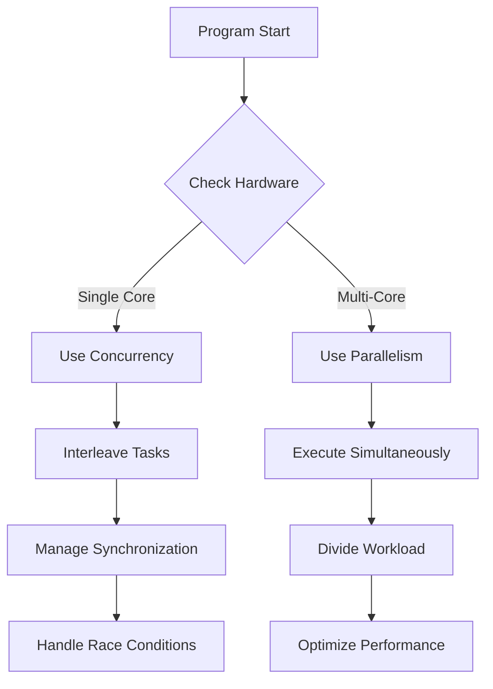
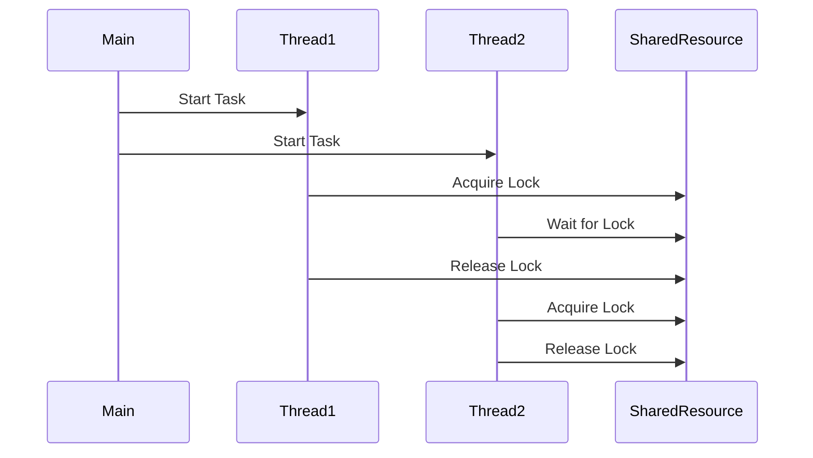

# Concurrency & Parallelism

## Overview

Concurrency and parallelism are fundamental concepts in computer science for executing multiple tasks efficiently. Concurrency refers to the ability to handle multiple tasks that may overlap in time, often through interleaving, while parallelism involves executing multiple tasks simultaneously, typically leveraging multiple processors or cores. These concepts are crucial for building responsive, high-performance systems, especially in multi-threaded and distributed environments.

## Detailed Explanation

### Concurrency

Concurrency allows a program to be decomposed into units that can run independently, potentially overlapping in execution. It doesn't necessarily mean simultaneous execution; instead, it manages the coordination of multiple tasks.

**Key Concepts:**
- **Threads and Processes:** Threads are lightweight units within a process sharing memory, while processes are independent with their own memory space.
- **Synchronization Mechanisms:** Tools like locks, semaphores, and monitors prevent race conditions by controlling access to shared resources.
- **Non-blocking I/O:** Asynchronous operations that allow tasks to proceed without waiting for I/O completion.
- **Event Loops:** Common in languages like JavaScript for handling concurrent events.

### Parallelism

Parallelism focuses on dividing a problem into subproblems that can be solved simultaneously, often requiring hardware support like multiple CPU cores.

**Key Concepts:**
- **Task Parallelism:** Different tasks run on different processors.
- **Data Parallelism:** The same operation is applied to multiple data elements concurrently (e.g., SIMD).
- **Pipeline Parallelism:** Stages of a process run in parallel, each handling different parts of the data.
- **Distributed Parallelism:** Tasks distributed across multiple machines in a cluster.

### Concurrency vs Parallelism

| Aspect | Concurrency | Parallelism |
|--------|-------------|-------------|
| Execution | Interleaved or simultaneous | Strictly simultaneous |
| Hardware | Single or multi-core | Multi-core required |
| Goal | Responsiveness and resource sharing | Speed and throughput |
| Example | Web server handling requests | Matrix multiplication on GPU |

## Real-world Examples & Use Cases

- **Web Servers:** Apache or Nginx handle thousands of concurrent connections using thread pools or event-driven models.
- **Video Game Engines:** Concurrent rendering, physics simulation, and AI processing for smooth gameplay.
- **Big Data Processing:** Frameworks like Apache Spark use parallelism to process large datasets across clusters.
- **Mobile Apps:** UI threads remain responsive while background tasks (e.g., network calls) run concurrently.
- **Database Systems:** Concurrent transactions with ACID properties, using locking or optimistic concurrency control.

## Code Examples

### Java Concurrency with ExecutorService

```java
import java.util.concurrent.ExecutorService;
import java.util.concurrent.Executors;
import java.util.concurrent.TimeUnit;

public class ConcurrencyExample {
    public static void main(String[] args) throws InterruptedException {
        ExecutorService executor = Executors.newFixedThreadPool(4);
        
        for (int i = 0; i < 10; i++) {
            final int taskId = i;
            executor.submit(() -> {
                System.out.println("Task " + taskId + " executed by " + Thread.currentThread().getName());
                try {
                    Thread.sleep(1000); // Simulate work
                } catch (InterruptedException e) {
                    Thread.currentThread().interrupt();
                }
            });
        }
        
        executor.shutdown();
        executor.awaitTermination(5, TimeUnit.SECONDS);
    }
}
```

### Python Parallelism with Multiprocessing

```python
import multiprocessing
import time

def worker(num):
    print(f'Worker {num} starting')
    time.sleep(2)
    print(f'Worker {num} finished')

if __name__ == '__main__':
    processes = []
    for i in range(4):
        p = multiprocessing.Process(target=worker, args=(i,))
        processes.append(p)
        p.start()
    
    for p in processes:
        p.join()
```

### Go Concurrency with Goroutines

```go
package main

import (
    "fmt"
    "time"
)

func worker(id int, jobs <-chan int, results chan<- int) {
    for j := range jobs {
        fmt.Println("worker", id, "started job", j)
        time.Sleep(time.Second)
        fmt.Println("worker", id, "finished job", j)
        results <- j * 2
    }
}

func main() {
    const numJobs = 5
    jobs := make(chan int, numJobs)
    results := make(chan int, numJobs)

    for w := 1; w <= 3; w++ {
        go worker(w, jobs, results)
    }

    for j := 1; j <= numJobs; j++ {
        jobs <- j
    }
    close(jobs)

    for a := 1; a <= numJobs; a++ {
        <-results
    }
}
```

## Common Pitfalls & Edge Cases

- **Race Conditions:** Unpredictable results from unsynchronized access to shared data.
- **Deadlocks:** Threads waiting indefinitely for resources held by each other.
- **Starvation:** A thread unable to gain access to required resources.
- **Context Switching Overhead:** Excessive switching can degrade performance in high-concurrency scenarios.
- **Memory Consistency Issues:** Ensuring changes are visible across threads (e.g., using volatile in Java).
- **Edge Case:** Single-core systems where parallelism isn't possible, forcing reliance on concurrency.

## Tools & Libraries

- **Java:** `java.util.concurrent` package, including `ExecutorService`, `ConcurrentHashMap`, `AtomicInteger`.
- **Python:** `multiprocessing`, `threading`, `concurrent.futures`.
- **Go:** Built-in goroutines and channels.
- **C++:** Standard library threads, OpenMP for parallelism.
- **Frameworks:** Akka (Scala/Java), RxJava for reactive concurrency.

## References

- [Concurrency vs Parallelism - GeeksforGeeks](https://www.geeksforgeeks.org/concurrency-vs-parallelism/)
- [Java Concurrency in Practice](https://www.amazon.com/Java-Concurrency-Practice-Brian-Goetz/dp/0321349601)
- [Go Concurrency Patterns](https://talks.golang.org/2012/concurrency.slide)
- [Python Multiprocessing Documentation](https://docs.python.org/3/library/multiprocessing.html)

## Github-README Links & Related Topics

- [Multithreading & Concurrency in Java](../java-multithreading-and-concurrency/README.md)
- [Distributed Systems](../cap-theorem-and-distributed-systems/README.md)
- [Java ConcurrentHashMap](../java-concurrenthashmap/README.md)
- [Java ExecutorService](../java-executorservice/README.md)



